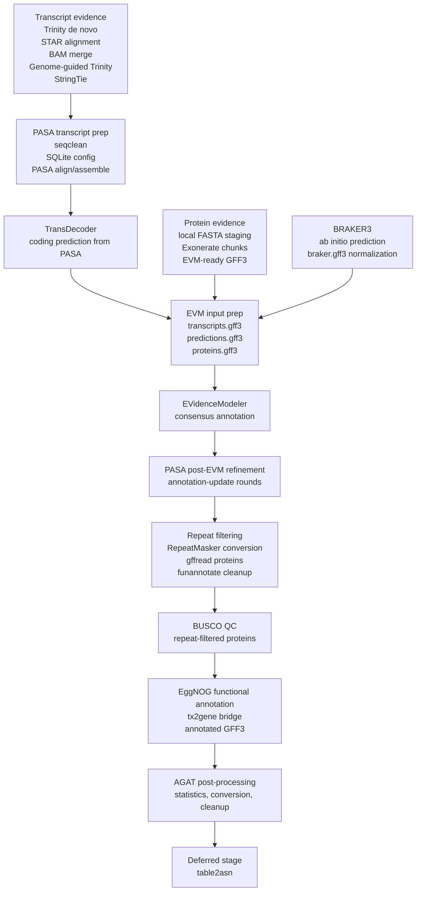

# FLyteTest

FLyteTest is a prompt-driven Flyte v2 project for turning bioinformatics
pipelines into reusable biology-facing tasks and workflows. The long-term goal
is for users to describe an analysis in natural language, have the system select
or generate a replayable workflow from registered biological stages, and run it
locally or in HPC environments, including Slurm-oriented deployments when the
required runtime context is available.

Current implementation is narrower and intentionally reproducible: the repo
implements genome-annotation workflows through EggNOG functional annotation
after BUSCO-based QC, PASA-based post-EVM gene-model refinement, and repeat
filtering, plus the AGAT statistics, conversion, and cleanup slices around the
EggNOG-annotated and AGAT-converted GFF3 bundles. `table2asn` submission
preparation and broad Slurm orchestration remain deferred.

Current artifact handling is local-path-only: task and workflow boundaries wrap
filesystem paths directly, and ordinary execution does not depend on remote
artifact upload semantics.

## Current Status

### Implemented Now

- Biological scope: transcript evidence, PASA align/assemble, TransDecoder,
  protein evidence, tutorial-backed BRAKER3, corrected pre-EVM contract
  assembly, deterministic EVM execution, PASA post-EVM refinement, repeat
  filtering cleanup, BUSCO-based annotation QC, EggNOG functional annotation,
  and the AGAT statistics, conversion, and cleanup slices
- Registry-constrained workflow composition (Milestone 15): the planner can
  discover and gate multi-stage workflow compositions from registered stages
  for broad biology workflow intents that don't match hardcoded patterns;
  compositions require explicit user approval before execution (Milestone 19
  caching pending)
- Active biological milestone: `AGAT post-processing after EggNOG`
- Active architecture milestone: `realtime` refactor Milestones 0 through 14,
  16, 17, 18a-18c, and 15 Phase 2 are complete

### Deferred

- Optional `table2asn` submission preparation
- Resumability, remote/indexed discovery, and arbitrary Python task-code
  generation
- Milestone 19 approval-gating caching/resumability to finalize composed DAG execution

### Roadmap

- Milestone 19 caching/resumability to make composed DAG execution safe and resumable

Important terminology:

- `Deterministic` means reproducible, typed, inspectable, and replayable.
- `Dynamic` workflow creation is still a project goal when the generated result
  is a saved `WorkflowSpec` / `BindingPlan` artifact or a composition from
  registered stages with explicit assumptions.

## How To Navigate

Use this README for the project story, current scope, and runnable entrypoints.
Use the more specific docs when you need detail:

- [AGENTS.md](AGENTS.md): repo rules, biological pipeline constraints, and agent behavior
- [DESIGN.md](DESIGN.md): architecture target and terminology
- [docs/braker3_evm_notes.md](docs/braker3_evm_notes.md): biological source notes and stage ordering
- [docs/capability_maturity.md](docs/capability_maturity.md): current platform capability snapshot
- [docs/refactor_completion_checklist.md](docs/refactor_completion_checklist.md): notes-faithful pipeline milestone gate
- [docs/realtime_refactor_checklist.md](docs/realtime_refactor_checklist.md): architecture-refactor completion gate
- [docs/realtime_refactor_submission_prompt.md](docs/realtime_refactor_submission_prompt.md): handoff prompt for future architecture work
- [docs/realtime_refactor_plans/README.md](docs/realtime_refactor_plans/README.md): plan-history workspace, not current implementation status
- [docs/tool_refs/README.md](docs/tool_refs/README.md): tool-stage context for implementation and prompt planning
- [docs/tool_refs/stage_index.md](docs/tool_refs/stage_index.md): stage-oriented entrypoint into tool references
- [docs/tutorial_context.md](docs/tutorial_context.md): Galaxy-backed fixture and smoke-test context
- [src/flytetest/registry.py](src/flytetest/registry.py): exact supported task and workflow names

Reading rule for agents: the notes define biological order and stage
boundaries; the tool refs define tool-level command and input/output context;
the registry and current code define what is actually implemented and runnable.

## Pipeline Story

The working biological source notes describe the genome-annotation path below:



The corrected pre-EVM contract is a key boundary:

- `transcripts.gff3` comes from PASA assemblies GFF3
- `predictions.gff3` comes from `braker.gff3` plus the PASA-derived
  TransDecoder genome GFF3
- `proteins.gff3` comes from Exonerate-derived protein evidence GFF3

The repo currently implements through EggNOG functional annotation after
repeat filtering and the AGAT statistics, conversion, and cleanup slices around
the EggNOG-annotated and AGAT-converted GFF3 bundles. `table2asn` remains
intentionally out of scope.

## Current Workflows

The original [flyte_rnaseq_workflow.py](flyte_rnaseq_workflow.py)
file remains the compatibility entrypoint for `flyte run`. The implementation
now lives under [src/flytetest/](src/flytetest).

| Workflow | Biological role | Current boundary |
| --- | --- | --- |
| `rnaseq_qc_quant` | Legacy FastQC + Salmon baseline | Separate from the active annotation pipeline |
| `transcript_evidence_generation` | Trinity, STAR, BAM merge, genome-guided Trinity, StringTie | Single paired-end sample, not full multi-sample notes path |
| `pasa_transcript_alignment` | PASA transcript preparation and align/assemble | Consumes transcript-evidence bundle |
| `transdecoder_from_pasa` | Coding prediction from PASA assemblies | Inferred TransDecoder command shape |
| `protein_evidence_alignment` | Local protein evidence with Exonerate | Local protein FASTAs only, no automatic UniProt/RefSeq download |
| `ab_initio_annotation_braker3` | BRAKER3 ab initio prediction | Tutorial-backed local BRAKER3 runtime model |
| `consensus_annotation_evm_prep` | Assemble `transcripts.gff3`, `predictions.gff3`, and `proteins.gff3` | Stops before EVM execution |
| `consensus_annotation_evm` | Deterministic EVM execution and recombination | Consumes existing pre-EVM bundle |
| `annotation_refinement_pasa` | PASA post-EVM update rounds | Consumes PASA and EVM result bundles |
| `annotation_repeat_filtering` | RepeatMasker/funannotate cleanup | Consumes PASA update bundle plus explicit RepeatMasker `.out` |
| `annotation_qc_busco` | BUSCO QC on repeat-filtered proteins | Final implemented QC boundary |
| `annotation_functional_eggnog` | EggNOG functional annotation on repeat-filtered proteins | Consumes BUSCO-ready protein boundary and a local EggNOG data directory |
| `annotation_postprocess_agat` | AGAT statistics on the EggNOG-annotated GFF3 bundle | Consumes the EggNOG-annotated GFF3 boundary |
| `annotation_postprocess_agat_conversion` | AGAT conversion on the EggNOG-annotated GFF3 bundle | Consumes the EggNOG-annotated GFF3 boundary |
| `annotation_postprocess_agat_cleanup` | Notes-backed AGAT cleanup on the converted GFF3 bundle | Consumes the AGAT conversion results; `table2asn` stays deferred |

## Quick Start

Use the repo-local virtualenv commands when possible:

```bash
python3 -m venv .venv
. .venv/bin/activate
python -m pip install -U pip
python -m pip install -r requirements-cluster.txt
```

Local and Slurm runs keep task scratch inside the checkout by default. Final
bundles are written under `results/`, and intermediate task work directories
created by FLyteTest use `results/.tmp` rather than host `/tmp`. FLyteTest also
sets Python's `TMPDIR` to that project-local scratch root when its shared config
loads, so generic local `tempfile` users follow the same convention. Set
`FLYTETEST_TMPDIR=/path/inside/the/project` only when you need to override the
scratch root explicitly.

Legacy QC and quantification baseline:

```bash
.venv/bin/flyte run --local flyte_rnaseq_workflow.py rnaseq_qc_quant \
  --ref data/transcriptomics/ref-based/transcriptome.fa \
  --left data/transcriptomics/ref-based/reads_1.fq.gz \
  --right data/transcriptomics/ref-based/reads_2.fq.gz
```

BRAKER3 tutorial-backed smoke shape:

```bash
.venv/bin/flyte run --local flyte_rnaseq_workflow.py ab_initio_annotation_braker3 \
  --genome data/braker3/reference/genome.fa \
  --rnaseq_bam_path data/braker3/rnaseq/RNAseq.bam \
  --protein_fasta_path data/braker3/protein_data/fastas/proteins.fa
```

Protein-evidence smoke shape:

```bash
.venv/bin/flyte run --local flyte_rnaseq_workflow.py protein_evidence_alignment \
  --genome data/braker3/reference/genome.fa \
  --protein_fastas data/braker3/protein_data/fastas/proteins.fa
```

BUSCO QC after repeat filtering:

```bash
.venv/bin/flyte run --local flyte_rnaseq_workflow.py annotation_qc_busco \
  --repeat_filter_results /path/to/results/repeat_filter_results_YYYYMMDD_HHMMSS \
  --busco_lineages_text eukaryota_odb10,metazoa_odb10,insecta_odb10,arthropoda_odb10,diptera_odb10
```

EggNOG functional annotation:

```bash
.venv/bin/flyte run --local flyte_rnaseq_workflow.py annotation_functional_eggnog \
  --repeat_filter_results /path/to/results/repeat_filter_results_YYYYMMDD_HHMMSS \
  --eggnog_data_dir /path/to/eggnog_data \
  --eggnog_database Diptera \
  --eggnog_cpu 24
```

AGAT statistics:

```bash
.venv/bin/flyte run --local flyte_rnaseq_workflow.py annotation_postprocess_agat \
  --eggnog_results /path/to/results/eggnog_results_YYYYMMDD_HHMMSS \
  --annotation_fasta_path /path/to/repeatmasked.fa
```

AGAT conversion:

```bash
.venv/bin/flyte run --local flyte_rnaseq_workflow.py annotation_postprocess_agat_conversion \
  --eggnog_results /path/to/results/eggnog_results_YYYYMMDD_HHMMSS
```

AGAT cleanup:

```bash
.venv/bin/flyte run --local flyte_rnaseq_workflow.py annotation_postprocess_agat_cleanup \
  --agat_conversion_results /path/to/results/agat_conversion_results_YYYYMMDD_HHMMSS
```

Most workflows require external bioinformatics tools or `*_sif` container image
paths. Synthetic tests remain the normal validation path when those binaries are
not installed.

## Architecture Status

The `realtime` refactor keeps the project resolver-first and manifest-first,
not database-first. The implemented planning path is:

```text
natural-language prompt
  -> biology-level goal
  -> planner-facing types
  -> local manifest-backed resolver
  -> registry compatibility metadata
  -> WorkflowSpec / BindingPlan preview or saved artifact
  -> controlled local saved-spec execution through explicit handlers
```

Implemented architecture layers:

- [planner_types.py](src/flytetest/planner_types.py): biology-facing planner dataclasses
- [planner_adapters.py](src/flytetest/planner_adapters.py): adapters from current assets and manifests into planner-facing types
- [types/assets.py](src/flytetest/types/assets.py): local asset dataclasses with generic compatibility names and legacy aliases for replay
- [specs.py](src/flytetest/specs.py): `TaskSpec`, `WorkflowSpec`, `BindingPlan`, runtime, resource, and generated-entity metadata
- [resolver.py](src/flytetest/resolver.py): local manifest-backed resolution from explicit bindings, result directories, and result bundles
- [registry.py](src/flytetest/registry.py): static registry plus additive compatibility metadata for current workflows
- [planning.py](src/flytetest/planning.py): typed prompt planning plus explicit-path and explicit recipe input bindings
- [spec_artifacts.py](src/flytetest/spec_artifacts.py): saved replayable `WorkflowSpec` plus `BindingPlan` JSON artifacts
- [spec_executor.py](src/flytetest/spec_executor.py): local saved-spec execution through caller-provided registered handlers

Current architecture limits:

- the runnable MCP surface executes only its explicit local handler targets
- dynamic workflow creation currently stops at typed spec previews, saved spec
  artifacts, and controlled local saved-spec execution
- the resolver is local and file-based; task and workflow artifact boundaries
  stay local-path-only, and remote or indexed discovery remains future work
- saved-spec execution is local and handler-based; it does not auto-load every
  checked-in Flyte workflow
- Slurm/HPC support now has a deterministic `sbatch` submission path for frozen
  Slurm-profile recipes, with lifecycle reconciliation, explicit manual retry,
  and cancellation recorded under `.runtime/runs/`. Resumability remains
  future work.

## MCP Recipe Surface

The MCP server is a stdio tool provider, not a chat agent. It now prepares
saved `WorkflowSpec` recipes before local execution or Slurm submission.
Current local MCP execution is intentionally limited to these individual
targets:

- workflow: `ab_initio_annotation_braker3`
- workflow: `protein_evidence_alignment`
- task: `exonerate_align_chunk`
- task: `busco_assess_proteins`
- workflow: `annotation_qc_busco`
- workflow: `annotation_functional_eggnog`
- workflow: `annotation_postprocess_agat`
- workflow: `annotation_postprocess_agat_conversion`
- workflow: `annotation_postprocess_agat_cleanup`

Supported tools:

- `list_entries`
- `plan_request`
- `prepare_run_recipe`
- `run_local_recipe`
- `run_slurm_recipe`
- `monitor_slurm_job`
- `retry_slurm_job`
- `cancel_slurm_job`
- `prompt_and_run`

The Slurm tools are supported only when the MCP server is running inside an
already-authenticated scheduler-capable environment with `sbatch`, `squeue`,
`scontrol`, `sacct`, and `scancel` available on `PATH`. Outside that boundary,
the tools return explicit unsupported-environment limitations instead of
guessing or silently falling back.

Launch command:

```bash
env PYTHONPATH=src .venv/bin/python -m flytetest.server
```

## MCP Server And Client Setup

The MCP server is a stdio process. A client such as Codex CLI or OpenCode
launches it as a child command instead of attaching to an already-running
interactive shell.

Example Codex CLI setup:

```bash
codex mcp add flytetest \
  --env FLYTETEST_REPO_ROOT=/path/to/flyteTest \
  --env PYTHONPATH=/path/to/flyteTest/src \
  -- bash -lc 'cd /path/to/flyteTest && module load python/3.11.9 && source .venv/bin/activate && python -m flytetest.server'
```

OpenCode uses either the default config path
`~/.config/opencode/opencode.json` or an explicit shell export such as
`OPENCODE_CONFIG=/path/to/opencode.json`.
The full setup example in the MCP runbook uses `OPENCODE_INSTALL_DIR` for the
installer so the `curl | bash` flow lands in the intended user-local bin path.

Client examples and the full HPC runbook live in:

- [docs/mcp_client_config.example.json](docs/mcp_client_config.example.json)
- [docs/opencode.config.example.json](docs/opencode.config.example.json)
- [docs/mcp_showcase.md](docs/mcp_showcase.md)

Current MCP behavior:

- `list_entries` returns each runnable target's supported execution profiles
  so clients can filter for Slurm-capable entries before preparing a recipe
- `plan_request` returns the typed planning payload used for recipe preparation
- `prepare_run_recipe` saves a frozen recipe under `.runtime/specs/`
- `run_local_recipe` executes a previously saved recipe through explicit local
  handlers
- `run_slurm_recipe` submits a previously saved Slurm-profile recipe with
  `sbatch`, writes the generated script and a durable run record under
  `.runtime/runs/`, and records the accepted Slurm job ID when the server is
  running inside an already-authenticated scheduler-capable environment
- `monitor_slurm_job` reconciles the durable Slurm run record with `squeue`,
  `scontrol show job`, and `sacct`, then persists observed scheduler state,
  stdout/stderr paths, exit code, final state, and conservative retry
  classification when available; if the server is started outside that
  scheduler boundary, it returns an explicit unsupported-environment
  limitation
- `retry_slurm_job` manually resubmits a failed Slurm run only when the durable
  run record shows a retryable scheduler failure, the explicit attempt limit
  has not been reached, and the frozen saved recipe is still present; each
  retry writes a new child run record linked back to the source failure
- `cancel_slurm_job` requests cancellation with `scancel` from the durable run
  record and records the cancellation request for later reconciliation when the
  same authenticated scheduler boundary is available
- `prompt_and_run` remains available as a compatibility alias over prepare then
  run
- `prepare_run_recipe` and `prompt_and_run` accept optional `manifest_sources`,
  `explicit_bindings`, `runtime_bindings`, `resource_request`,
  `execution_profile`, and `runtime_image` arguments
- when MCP clients pass `explicit_bindings`, `runtime_bindings`,
  `resource_request`, or `runtime_image` directly, those values must be real
  JSON/object mappings rather than stringified pseudo-dictionaries
- if an LLM-driven MCP client does not preserve optional tool arguments
  reliably, put critical execution policy such as `execution profile slurm`,
  queue, CPU, memory, walltime, and account directly in the prompt text and
  then verify the returned frozen recipe before submission
- when freezing a Slurm recipe through an LLM-driven MCP client, check that the
  returned `typed_plan.execution_profile` and
  `typed_plan.binding_plan.execution_profile` are both `slurm` before calling
  `run_slurm_recipe`; if those fields still read `local`, the client likely did
  not pass the structured argument through to the tool call
- the M18 BUSCO eukaryota fixture can be prepared through `prepare_run_recipe`
  by asking for the Milestone 18 BUSCO fixture on Slurm; the planner freezes
  the fixture FASTA, `auto-lineage`, genome mode, and any supplied `busco_sif`
  or `busco_cpu` runtime bindings before submission
- `manifest_sources` must be `run_manifest.json` paths or result directories
  containing one
- BUSCO and EggNOG recipe preparation can resolve a
  `QualityAssessmentTarget` from a repeat-filtering or compatible QC manifest,
  or accept one directly as a serialized planner binding
- AGAT statistics and conversion recipe preparation can resolve a
  `QualityAssessmentTarget` from an EggNOG result manifest
- AGAT cleanup recipe preparation can resolve a `QualityAssessmentTarget` from
  an AGAT conversion result manifest
- BUSCO runtime settings such as `busco_lineages_text`, `busco_sif`, and
  `busco_cpu`, EggNOG settings such as `eggnog_data_dir`, `eggnog_sif`,
  `eggnog_cpu`, and `eggnog_database`, and AGAT settings such as
  `annotation_fasta_path` and `agat_sif` are frozen into the saved recipe
  rather than inferred from prompt text
- resource settings such as `cpu`, `memory`, `queue`, and `walltime`, the
  selected execution profile, and optional runtime image policy are frozen into
  the saved recipe as structured metadata; `local` recipes run through local
  handlers, and `slurm` recipes can be submitted through `run_slurm_recipe`
  and retried later through `retry_slurm_job` without reinterpreting the
  original prompt
- the runnable MCP surface currently includes
  `ab_initio_annotation_braker3`, `protein_evidence_alignment`,
  `exonerate_align_chunk`, `annotation_qc_busco`,
  `annotation_functional_eggnog`, `annotation_postprocess_agat`,
  `annotation_postprocess_agat_conversion`, and
  `annotation_postprocess_agat_cleanup`
- EggNOG and AGAT remain individual MCP recipe targets in this slice; a
  composed EggNOG-plus-AGAT pipeline, `table2asn`, resumability, and
  database-backed asset discovery remain deferred
- additional registered workflows require explicit local handlers before they
  are exposed as runnable MCP targets

For the machine-readable server contract, see
[mcp_contract.py](src/flytetest/mcp_contract.py)
and [docs/mcp_showcase.md](docs/mcp_showcase.md).

## Fixtures And Tests

Canonical lightweight fixture roots:

- `data/transcriptomics/ref-based/reads_1.fq.gz`
- `data/transcriptomics/ref-based/reads_2.fq.gz`
- `data/transcriptomics/ref-based/transcriptome.fa`
- `data/braker3/reference/genome.fa`
- `data/braker3/rnaseq/RNAseq.bam`
- `data/braker3/protein_data/fastas/proteins.fa`
- `data/braker3/protein_data/fastas/proteins_extra.fa`
- `data/images/trinity_2.13.2.sif`
- `data/images/star_2.7.10b.sif`
- `data/images/stringtie_2.2.3.sif`
- `data/images/pasa_2.5.3.sif`
- `data/images/braker3.sif`
- `data/images/busco_v6.0.0_cv1.sif`

Image provenance:

- `data/images/trinity_2.13.2.sif` was pulled from `docker://quay.io/biocontainers/trinity:2.13.2--h15cb65e_2`
- `data/images/star_2.7.10b.sif` was pulled from `docker://quay.io/biocontainers/star:2.7.10b--h9ee0642_0`
- `data/images/stringtie_2.2.3.sif` was pulled from `docker://quay.io/biocontainers/stringtie:2.2.3--h43eeafb_0`
- `data/images/pasa_2.5.3.sif` was pulled from `docker://pasapipeline/pasapipeline:2.5.3`
- `data/images/braker3.sif` was built from `teambraker/braker3:latest`
- `data/images/busco_v6.0.0_cv1.sif` was built from `ezlabgva/busco:v6.0.0_cv1`

Use [scripts/rcc/download_minimal_fixtures.sh](scripts/rcc/download_minimal_fixtures.sh)
to restore the lightweight tutorial-backed smoke files on a cluster checkout.

Fixture and smoke-test helpers:

- [scripts/rcc/download_minimal_images.sh](scripts/rcc/download_minimal_images.sh)
  - restore the core local smoke images under `data/images/`
- `data/images/braker3.sif` and `data/images/busco_v6.0.0_cv1.sif`
  - are still expected to be staged separately when those stages are exercised
- RCC cluster defaults
  - keep using the shared `/project/rcc/hyadav/genomes` image paths for
    Trinity and STAR
  - keep using the shared StringTie binary at
    `/project/rcc/hyadav/genomes/software/stringtie/stringtie`
  - can use `PASA_SIF` to point at a PASA image path copied onto the cluster
- [scripts/rcc/build_pasa_image.sh](scripts/rcc/build_pasa_image.sh)
  - build the experimental PASA image recipe when you need to inspect the
    container itself
  - uses [containers/pasa/Dockerfile](containers/pasa/Dockerfile) as the
    preferred maintenance source and exports it through Apptainer when possible
- [scripts/rcc/check_minimal_images.sh](scripts/rcc/check_minimal_images.sh)
  - verify that the smoke images exist under `data/images/`
  - verify that the shared Trinity/STAR/StringTie defaults exist under
    `/project/rcc/hyadav/genomes/software` when that mount is available
  - respects `PASA_SIF` if you want to validate a copied PASA image path
- [scripts/rcc/run_minimal_pasa_align_smoke.sh](scripts/rcc/run_minimal_pasa_align_smoke.sh)
  - run the wiki-shaped PASA align/assemble smoke from the tiny Trinity FASTA
    and genome fixture on the host-installed PASA pipeline
  - uses `sbatch` when available and otherwise runs locally
- [scripts/rcc/check_minimal_pasa_align_smoke.sh](scripts/rcc/check_minimal_pasa_align_smoke.sh)
  - verify the PASA align/assemble smoke artifacts after the job finishes
- [scripts/rcc/run_minimal_pasa_image_smoke.sh](scripts/rcc/run_minimal_pasa_image_smoke.sh)
  - run the Apptainer-backed PASA image smoke against the same Trinity FASTA
    and genome fixture pair
  - uses `sbatch` when available and otherwise runs locally
  - does not currently support the legacy `seqclean` path; see
    <https://github.com/PASApipeline/PASApipeline/issues/73>
- [scripts/rcc/check_minimal_pasa_image_smoke.sh](scripts/rcc/check_minimal_pasa_image_smoke.sh)
  - verify the PASA image smoke artifacts after the job finishes
- [docs/tutorial_context.md](docs/tutorial_context.md)
  - Galaxy tutorial mappings, fixture provenance, and smoke-test planning
- synthetic tests
  - use these when external binaries or lineage datasets are unavailable

## HPC And Containers

Container execution:

- implemented workflows support optional Apptainer/Singularity execution
- stage-specific `*_sif` arguments include:

- `fastqc_sif`
- `salmon_sif`
- `star_sif`
- `samtools_sif`
- `trinity_sif`
- `stringtie_sif`
- `pasa_sif`
- `repeat_filter_sif`
- `transdecoder_sif`
- `exonerate_sif`
- `braker3_sif`
- `evm_sif`
- `busco_sif`
- `eggnog_sif`
- `agat_sif`

- if a `*_sif` path is empty, tasks use native binaries
- if a `*_sif` path is provided, tasks use `apptainer exec` or
  `singularity exec`
- container runs use deterministic bind mounts for the relevant input and
  output parent directories

HPC and Slurm execution:

- Slurm support currently starts with a filesystem-backed `sbatch` submission path
- prepare a recipe with execution profile `slurm`, then call
  `run_slurm_recipe` on the saved artifact
- the submission record captures:
  - Slurm job ID
  - generated script path
  - stdout and stderr log patterns
  - selected execution profile
  - resource spec
  - durable run-record state under `.runtime/runs/`
- `monitor_slurm_job`
  - reconciles the durable record with `squeue`, `scontrol show job`, and
    `sacct`
- `cancel_slurm_job`
  - records explicit `scancel` requests
- `retry_slurm_job`
  - resubmits a terminal, retryable Slurm failure from its frozen run record
    while preserving parent/child retry lineage
- local-to-Slurm resumability is available for the focused Milestone 19 smoke
  path, while broader workflow-family resumability remains milestone-scoped
- on RCC, the frozen Slurm recipe carries the account setting through to the
  generated script so submission does not depend on a manual
  `sbatch --account=...` override
- these Slurm tools are intended to run from an already-authenticated
  scheduler session such as a login-node shell, `tmux`, or `screen`
- outside that environment, they return an explicit access limitation instead
  of pretending the scheduler is reachable
- generated `sbatch` scripts currently load both `python/3.11.9` and
  `apptainer/1.4.1` before invoking the frozen local-recipe runner on RCC
- `scripts/rcc/` includes protein-evidence Slurm lifecycle wrappers for
  submit, monitor, and cancel with the same default account and queue policy
- `scripts/rcc/` also includes Milestone 18 BUSCO fixture wrappers that submit,
  monitor, synthesize a retryable `NODE_FAIL` seed record, and submit a retry
  child; the retry child is validated by monitoring its durable run record to
  `COMPLETED` with scheduler exit code `0:0`

## Assumptions

- The current SDK in this repo is `flyte==2.0.10`, and `TaskEnvironment`
  exposes `@env.task`; shared task defaults and a few family-specific runtime
  overrides are centralized in `src/flytetest/config.py`.
- `flyte_rnaseq_workflow.py` remains a thin compatibility module for
  `flyte run`.
- `src/flytetest/types/` is a local modeling layer, not a full remote asset
  platform. It now exposes generic compatibility names such as
  `AbInitioResultBundle`, `RnaSeqAlignmentResult`, and
  `CleanedTranscriptDataset` while keeping legacy names readable.
- The planner-facing public contract starts in
  `src/flytetest/planner_types.py`.
- Tool references are concise repo-local planning references, not replacements
  for official tool manuals.
- The next biological milestone should stay downstream of AGAT cleanup, keep
  `table2asn` separate from post-processing, and avoid reopening the validated
  transcript-to-PASA-to-EVM-to-post-EVM-to-repeat-filter contracts.
