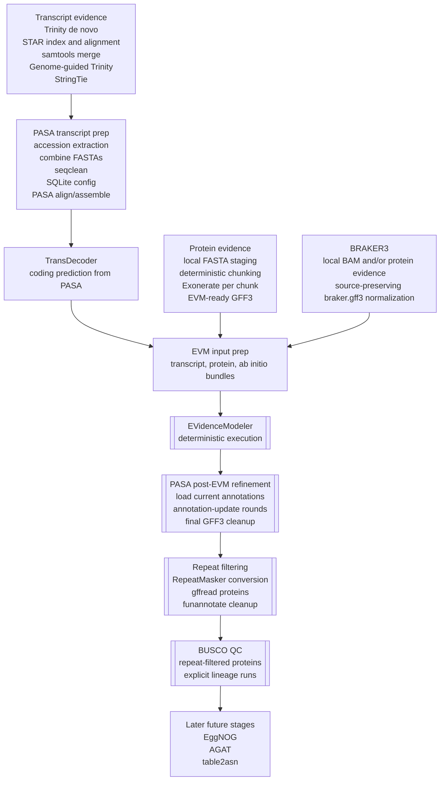

# FLyteTest

This repository currently implements several deterministic Flyte v2 workflows through BUSCO-based annotation QC after PASA-based post-EVM gene-model refinement and repeat filtering, while keeping later post-PASA functional and submission stages deferred.

## Active Milestone

- Active implementation milestone: `annotation QC with BUSCO after repeat filtering`
- Source of truth for this milestone: [docs/braker3_evm_notes.md](/home/rmeht/Projects/flyteTest/docs/braker3_evm_notes.md)
- Milestone changelog: [CHANGELOG.md](/home/rmeht/Projects/flyteTest/CHANGELOG.md)
- Refactor completion checklist: [docs/refactor_completion_checklist.md](/home/rmeht/Projects/flyteTest/docs/refactor_completion_checklist.md)
- Capability maturity snapshot: [docs/capability_maturity.md](/home/rmeht/Projects/flyteTest/docs/capability_maturity.md)
- Milestones 0 through 7 in that checklist remain the canonical upstream gate that the BUSCO milestone builds on without reopening earlier stage contracts
- Refactor handoff prompt: [docs/refactor_submission_prompt.md](/home/rmeht/Projects/flyteTest/docs/refactor_submission_prompt.md)
- BUSCO milestone handoff prompt: [docs/busco_submission_prompt.md](/home/rmeht/Projects/flyteTest/docs/busco_submission_prompt.md)
- Implemented scope: transcript evidence through PASA align/assemble, TransDecoder, protein evidence, tutorial-backed BRAKER3, corrected pre-EVM contract assembly, deterministic EVM execution, PASA post-EVM refinement, repeat filtering plus cleanup, and BUSCO-based annotation QC
- Current scope boundary: after notes-faithful pre-EVM contract assembly, deterministic EVidenceModeler execution, PASA update rounds, repeat filtering cleanup, and BUSCO QC, but before EggNOG, AGAT, and `table2asn`
- Stop rule: do not start EggNOG, AGAT, or `table2asn` work in this milestone

## Corrected Pre-EVM Contract

The Milestone 1 upstream contract consumed by Milestone 2 explicitly produces:

- `transcripts.gff3` from PASA assemblies GFF3
- `predictions.gff3` from `braker.gff3` plus the PASA-derived TransDecoder genome GFF3
- `proteins.gff3` from Exonerate-derived protein evidence GFF3

The working notes define those sources as:

- `transcripts.gff3` copied from `${db}.pasa_assemblies.gff3`
- `predictions.gff3` created by concatenating `braker.gff3` with `${db}.assemblies.fasta.transdecoder.genome.gff3`
- `proteins.gff3` created by concatenating Exonerate-derived RefSeq and UniProt GFF3 evidence

## Notes Alignment

The table below tracks the repo against the stage order in the working Markdown companion in [docs/braker3_evm_notes.md](/home/rmeht/Projects/flyteTest/docs/braker3_evm_notes.md).

Status labels used below:

- `Implemented faithfully from notes`
- `Implemented with documented simplifications`
- `Inferred and still provisional`
- `Not implemented`

| Pipeline stage | Repo status | Notes |
| --- | --- | --- |
| Trinity de novo transcriptome assembly | Implemented with documented simplifications | Covered by `transcript_evidence_generation` for one paired-end sample. The notes show a multi-sample Trinity `--samples_file` run, so the repo keeps a single-sample de novo Trinity boundary rather than the full all-sample transcript branch. |
| STAR genome index and RNA-seq alignment | Implemented with documented simplifications | Covered by `transcript_evidence_generation`, but only for one paired-end sample. The notes describe aligning all RNA-seq samples, so this is a constrained subset rather than the full transcript branch. |
| BAM merge for transcriptome support | Implemented with documented simplifications | Covered by `transcript_evidence_generation`, but the current merge boundary merges only the one staged STAR BAM. The notes-backed all-sample merge contract is not implemented yet. |
| Trinity genome-guided assembly | Implemented with documented simplifications | Covered by `transcript_evidence_generation` downstream of the constrained single-sample STAR/BAM path. |
| StringTie assembly | Implemented with documented simplifications | Covered by `transcript_evidence_generation` from the current merged BAM boundary, with fixed note-aligned `-l STRG -f 0.10 -c 3 -j 3` settings. |
| PASA transcript preparation and align/assemble | Implemented with documented simplifications | Covered by `pasa_transcript_alignment`, which now consumes the internally produced de novo Trinity FASTA plus Trinity-GG and StringTie evidence from the transcript bundle. The remaining simplification is still the upstream single-sample STAR/BAM path rather than the notes-backed all-sample version. |
| TransDecoder coding prediction from PASA assemblies | Inferred and still provisional | Covered by `transdecoder_from_pasa`; the notes require the PASA-derived genome GFF3 output, but the exact TransDecoder command sequence is inferred. |
| Protein evidence alignment with Exonerate | Implemented with documented simplifications | Covered by `protein_evidence_alignment`; local protein FASTAs are explicit inputs and the repo stops at deterministic Exonerate-derived GFF3 preparation. |
| BRAKER3 ab initio predictions producing `braker.gff3` | Implemented with tutorial-backed runtime and explicit repo policy | Covered by `ab_initio_annotation_braker3`; the notes clearly require `braker.gff3`, the Galaxy tutorial supplies the concrete BRAKER3 runtime model used by this milestone, and repo-local normalization now preserves upstream BRAKER source values for later EVM reviewability. |
| Pre-EVM contract assembly for `transcripts.gff3`, `predictions.gff3`, and `proteins.gff3` | Implemented with documented simplifications | `consensus_annotation_evm_prep` now assembles the corrected filename-level contract from PASA, TransDecoder, protein evidence, and BRAKER3 results; the notes-backed filenames are preserved while tutorial-backed BRAKER runtime details and repo-policy EVM weight defaults remain documented explicitly. |
| EVidenceModeler consensus annotation | Implemented with documented simplifications | `consensus_annotation_evm` now consumes the existing pre-EVM bundle, writes an explicit or inferred `evm.weights`, partitions deterministically, generates EVM commands, executes them sequentially, and recombines the final GFF3 outputs. |
| PASA update rounds to add UTRs and alternative transcripts | Implemented with documented simplifications | `annotation_refinement_pasa` now consumes the EVM results bundle plus the PASA align/assemble bundle, stages explicit PASA update configs, loads `EVM.all.sort.gff3`, runs deterministic local update rounds, and finalizes stable sorted GFF3 outputs. |
| RepeatMasker and funannotate repeat filtering | Implemented with documented simplifications | `annotation_repeat_filtering` now starts from `post_pasa_updates.sort.gff3` plus an external RepeatMasker `.out` file, converts RepeatMasker output to GFF3/BED, extracts proteins with gffread, runs funannotate overlap filtering and repeat blasting through explicit library-wrapper tasks, applies deterministic removal transforms, and finalizes repeat-free GFF3 plus protein FASTA outputs. |
| BUSCO assessment | Implemented with documented simplifications | Covered by `annotation_qc_busco`, which runs BUSCO in protein mode on the final repeat-filtered protein FASTA across an explicit lineage list that defaults to the note-backed eukaryota, metazoa, insecta, arthropoda, and diptera databases. |
| EggNOG functional annotation and name propagation | Not implemented | Explicitly deferred until after the BUSCO milestone. |
| AGAT statistics and format conversions | Not implemented | Explicitly deferred until after the BUSCO milestone. |
| Optional NCBI submission preparation | Not implemented | Explicitly deferred until after the BUSCO milestone. |

The Markdown companion preserves the per-stage command examples and `sbatch` snippets in a searchable form. It is the source of truth for day-to-day repo updates, while the pipeline image remains as the visual companion.

## Pipeline Diagram



Current implemented scope:

- `rnaseq_qc_quant`: legacy FastQC + Salmon baseline outside the active notes-faithful pre-EVM milestone
- `transcript_evidence_generation`: single-sample transcript evidence staging that now includes de novo Trinity, STAR, one-BAM merge, Trinity-GG, and note-aligned StringTie upstream of PASA
- `pasa_transcript_alignment`: PASA transcript preparation and align/assemble that now consumes the internally produced de novo Trinity FASTA from the transcript-evidence bundle
- `transdecoder_from_pasa`: provisional inferred TransDecoder stage producing the PASA-derived genome GFF3 candidate needed later for `predictions.gff3`
- `protein_evidence_alignment`: simplified local protein evidence alignment and Exonerate-derived GFF3 preparation
- `ab_initio_annotation_braker3`: tutorial-backed BRAKER3 stage resolving `braker.gff3` and applying source-preserving normalization
- `consensus_annotation_evm_prep`: note-faithful pre-EVM contract assembly from PASA, TransDecoder, protein evidence, and BRAKER3 results
- `consensus_annotation_evm`: deterministic EVM execution downstream of the existing pre-EVM bundle, including weights staging, partitioning, command generation, sequential execution, and final GFF3 recombination
- `annotation_refinement_pasa`: deterministic PASA post-EVM refinement that loads the current EVM annotation into PASA, runs explicit annotation-update rounds, and finalizes stable post-PASA GFF3 outputs
- `annotation_repeat_filtering`: deterministic post-PASA repeat filtering that converts a RepeatMasker `.out` file, extracts proteins with gffread, runs explicit funannotate cleanup stages, and finalizes repeat-free GFF3 plus protein FASTA outputs
- `annotation_qc_busco`: deterministic BUSCO-based QC that consumes the repeat-filtered protein FASTA boundary and collects one lineage run per selected BUSCO database

The code now lives in a small package layout under `src/flytetest/`, while the original `flyte_rnaseq_workflow.py` remains as a compatibility entrypoint for `flyte run`.

## Minimal MCP Showcase

The repo now exposes a deliberately narrow stdio MCP server for exactly three
runnable showcase targets:

- workflow: `ab_initio_annotation_braker3`
- workflow: `protein_evidence_alignment`
- task: `exonerate_align_chunk`

The MCP server is a tool provider, not a chat agent. An MCP-capable client such
as OpenCode, Codex, or Claude Code owns the conversation, then calls the server
tools when it wants FLyteTest to plan or run one of the supported targets.
The narrow MCP surface is centralized in
[src/flytetest/mcp_contract.py](/home/rmeht/Projects/flyteTest/src/flytetest/mcp_contract.py)
so the server, planner, tests, and docs stay aligned on the same showcase contract.

Supported MCP tools:

- `list_entries`
- `plan_request`
- `prompt_and_run`

Read-only MCP resources:

- `flytetest://scope`
- `flytetest://supported-targets`
- `flytetest://example-prompts`
- `flytetest://prompt-and-run-contract`

The primary showcase flow is `prompt_and_run(prompt)`. The prompt itself must
contain the explicit local file paths needed to run the selected target.

`prompt_and_run` now returns the existing structured planning and execution
payload plus a compact additive `result_summary` block for client presentation.
That summary reports the matched target, whether execution was attempted,
whether the result succeeded, failed, or was declined, the explicit prompt
inputs used, key output paths when available, and a short message that preserves
the same showcase boundary. It now also includes additive machine-readable
`result_code` and `reason_code` fields so MCP clients can branch on stable
codes instead of parsing the free-text `message`.

Those resources are intentionally small and static. They exist only so MCP
clients can discover the current showcase contract before calling tools:

- `flytetest://scope`: stdio transport, primary tool, explicit-path requirement, and the hard downstream decline list
- `flytetest://supported-targets`: the exact runnable workflow and task metadata exposed by this showcase
- `flytetest://example-prompts`: one BRAKER3 workflow prompt, one Exonerate task prompt, and one declined downstream example
- `flytetest://prompt-and-run-contract`: the small machine-readable `prompt_and_run` response contract, including stable `result_summary` fields and result-code categories

Server launch command:

```bash
env PYTHONPATH=src .venv/bin/python -m flytetest.server
```

Example MCP client configuration pattern:

- command: `python3`
- args: `-m flytetest.server`
- env: `PYTHONPATH=src`

Checked-in example config:

- [docs/mcp_client_config.example.json](/home/rmeht/Projects/flyteTest/docs/mcp_client_config.example.json)

That example uses the repo-local virtualenv interpreter plus an absolute
`PYTHONPATH` so clients do not need to rely on a separate `cwd` setting.

What the MCP showcase supports:

- list the supported showcase targets and explain the hard scope limit
- expose a few small read-only MCP resources for current scope discovery
- classify a natural-language prompt as either the BRAKER3 workflow, the protein-evidence workflow, or the Exonerate task
- extract only the explicit local file paths written in that prompt
- run `ab_initio_annotation_braker3` through `flyte run --local ...`
- run `protein_evidence_alignment` through `flyte run --local ...`
- run `exonerate_align_chunk` through the direct Python task call used by this showcase

What it does not support:

- any workflow or task beyond `ab_initio_annotation_braker3`, `protein_evidence_alignment`, and `exonerate_align_chunk`
- automatic path discovery outside explicit paths written in the prompt
- `sbatch`, `*_sif` planning, remote storage, or generic orchestration
- downstream stages such as EVM, PASA refinement, repeat filtering, BUSCO, EggNOG, AGAT, or `table2asn`

Example workflow prompt:

```text
Annotate the genome sequence of a small eukaryote using BRAKER3 with genome data/genome.fa, RNA-seq evidence data/RNAseq.bam, and protein evidence data/proteins.fa
```

Example task prompt:

```text
Experiment with Exonerate protein-to-genome alignment using genome data/genome.fa and protein chunk data/proteins.fa
```

Example protein-evidence workflow prompt:

```text
Run protein evidence alignment with genome data/genome.fa and protein evidence data/proteins.fa
```

The expected positive workflow plan should report:

- `supported: true`
- `matched_entry_name: "ab_initio_annotation_braker3"`
- extracted input `genome: "data/genome.fa"`
- extracted evidence inputs from the explicit prompt paths
- explicit limitations that later downstream stages are not implied

The corresponding `prompt_and_run` result should also include `result_summary`
with:

- `status: "succeeded"`
- `result_code: "succeeded"`
- `reason_code: "completed"`
- `target_name: "ab_initio_annotation_braker3"`
- `execution_attempted: true`
- `used_inputs` reflecting the explicit prompt paths
- `output_paths` when the run reports them
- a short `message` suitable for client display

The expected positive task plan should report:

- `supported: true`
- `matched_entry_name: "exonerate_align_chunk"`
- extracted inputs `genome: "data/genome.fa"` and `protein_chunk: "data/proteins.fa"`
- explicit limitations that this is one Exonerate chunk-alignment task, not the full protein-evidence workflow

The expected positive protein-evidence workflow plan should report:

- `supported: true`
- `matched_entry_name: "protein_evidence_alignment"`
- extracted input `genome: "data/genome.fa"`
- extracted input `protein_fastas: ["data/proteins.fa"]`
- explicit limitations that this covers only the protein-evidence stage and not EVM or later downstream stages

Declined or failed `prompt_and_run` results should keep the same surrounding
payload and switch `result_summary.status` to `"declined"` or `"failed"`,
while also emitting stable additive codes:

- `result_code: "declined_downstream_scope"` with `reason_code: "requested_downstream_stage"` for explicit downstream-stage requests
- `result_code: "declined_missing_inputs"` with `reason_code: "missing_required_inputs"` when a supported target is matched but explicit runnable paths are missing
- `result_code: "declined_unsupported_request"` with `reason_code: "unsupported_or_ambiguous_request"` when the prompt does not cleanly map to the narrow showcase
- `result_code: "failed_execution"` with `reason_code: "nonzero_exit_status"` when execution runs but returns a non-zero status

The current MCP surface is intentionally narrower than the repo's broader
workflow implementation. Repo-wide docs such as `docs/tutorial_context.md` and
`docs/tool_refs/stage_index.md` remain useful implementation references, but
they are not the MCP-exposed workflow catalog for this showcase.

## Source References

This milestone is anchored to the repository-local figure and notes that define the intended annotation ordering:

- [BRAKER3 + Evidence Modeler pipeline figure](/home/rmeht/Projects/flyteTest/braker3.png)
- [Working Markdown companion](/home/rmeht/Projects/flyteTest/docs/braker3_evm_notes.md)

The figure shows transcript evidence, protein evidence, and BRAKER3 feeding EVM, followed by PASA updates, repeat filtering, BUSCO, eggNOG-mapper, and AGAT. The repo now implements the BUSCO boundary after repeat filtering, while EggNOG, AGAT, and submission-prep stages remain deferred. The notes explicitly use `braker.gff3` as the ab initio input to EVM, and the Galaxy BRAKER3 tutorial now serves as the documented runtime model for the local BRAKER3 milestone.

## Tutorial Fixture Data

For prompt-ready tutorial usage guidance, Apptainer-planning context, and
reusable prompt patterns, see `docs/tutorial_context.md`.

For a stage-oriented entrypoint into the per-tool prompt templates, see `docs/tool_refs/stage_index.md`.

The repository now includes lightweight local fixture files derived from Galaxy Training Network tutorials for future validation work. When we refresh the fixtures, we download the linked GTN/Zenodo datasets once and keep the local copies under `data/`:

- `data/genome.fa`: small reference genome FASTA adapted from the tutorial genome input
- `data/RNAseq.bam`: tutorial-style RNA-seq alignment evidence for BRAKER3 smoke tests
- `data/proteins.fa`: tutorial-style protein FASTA for protein-evidence and BRAKER3 smoke tests

These files are intended for lightweight local validation and milestone-scoped smoke testing, not for production-scale benchmarking. They complement, rather than replace, the existing synthetic tests already used for deterministic collectors and manifest shaping.

Legacy baseline files such as `data/reads_1.fq.gz`, `data/reads_2.fq.gz`, `data/transcriptome.fa`, and `data/truth.tsv` remain part of the older FastQC + Salmon baseline and are not the canonical fixtures for the active EVM annotation milestone.

Restored future-stage fixture directories:

- `data/repeatmasker/`: RepeatMasker inputs for repeat-filtering tests and optional upstream `.out` smoke generation when the relevant binaries are available
- `data/functional/`: protein FASTA inputs for later EggNOG and functional-annotation tests
- `data/transcriptomics/ref-based/`: GTN RNA-seq inputs for later transcript-evidence smoke tests

## Galaxy Tutorial Test Matrix

The test suite should use local copies of Galaxy tutorial data as the canonical real-data fixtures for stage-specific smoke tests. The table below maps each workflow or task family to the tutorial dataset that should drive its validation.

Additional GTN tool-level references for future prompting and implementation planning are collected in `docs/tutorial_context.md`, including extra references for `STAR`, `StringTie`, `Trinity`, `TransDecoder`, and `eggNOG-mapper`, plus a list of pipeline tools that currently rely more on repo-local notes than on GTN coverage.

| Repo area | Workflow or task | Galaxy tutorial source | Dataset(s) to use | Test intent | Status |
| --- | --- | --- | --- | --- | --- |
| RNA-seq QC and quantification | `rnaseq_qc_quant`, `fastqc`, `salmon_index`, `salmon_quant` | [Reference-based RNA-Seq data analysis](https://training.galaxyproject.org/training-material/topics/transcriptomics/tutorials/ref-based/tutorial.html) | Pasilla FASTQs from the tutorial, or the older local baseline files in `data/` | QC, transcriptome indexing, quantification, and manifest wiring | Existing baseline |
| Transcript evidence generation | `transcript_evidence_generation`, `star_align_sample`, `samtools_merge_bams`, `trinity_genome_guided_assemble`, `stringtie_assemble` | [De novo transcriptome reconstruction with RNA-Seq](https://training.galaxyproject.org/training-material/topics/transcriptomics/tutorials/de-novo/tutorial.html) | Tutorial FASTQs plus the tutorial reference genome | STAR alignment, BAM handling, Trinity genome-guided assembly, and StringTie smoke tests | Future-stage fixture set |
| Protein evidence alignment | `protein_evidence_alignment`, `stage_protein_fastas`, `chunk_protein_fastas`, `exonerate_align_chunk`, `exonerate_to_evm_gff3` | [Genome annotation with Braker3](https://training.galaxyproject.org/training-material/topics/genome-annotation/tutorials/braker3/tutorial.html) | `genome.fasta`, `RNASeq.bam`, `protein_sequences.fasta`; local mirrors in `data/genome.fa` and `data/proteins.fa` | Stage, chunk, align, and convert Exonerate evidence | Currently covered |
| BRAKER3 ab initio annotation | `ab_initio_annotation_braker3` | [Genome annotation with Braker3](https://training.galaxyproject.org/training-material/topics/genome-annotation/tutorials/braker3/tutorial.html), with [Masking repeats with RepeatMasker](https://training.galaxyproject.org/training-material/topics/genome-annotation/tutorials/repeatmasker/tutorial.html) as the soft-masking prerequisite | `genome.fasta`, `RNASeq.bam`, `protein_sequences.fasta`; masked genome from the RepeatMasker tutorial when testing the upstream assumption; local mirror `data/braker3/reference/genome_masked_braker3.fasta` | BRAKER3 staging and source-preserving `braker.gff3` normalization | Tutorial-backed runtime; fixture-backed |
| EVM pre-assembly contract | `consensus_annotation_evm_prep` and the supporting EVM input assembly tasks | Upstream outputs from the Braker3, PASA, TransDecoder, and protein-evidence stages | Stage outputs that resolve to `transcripts.gff3`, `predictions.gff3`, and `proteins.gff3` | Exact assembly of the notes-faithful pre-EVM contract | Currently covered |
| EVM execution | `consensus_annotation_evm`, `prepare_evm_execution_inputs`, `evm_partition_inputs`, `evm_write_commands`, `evm_execute_commands`, `evm_recombine_outputs` | The repo-local notes plus the staged pre-EVM contract from Milestone 1 | Synthetic pre-EVM bundles resolving to `transcripts.gff3`, `predictions.gff3`, `proteins.gff3`, and `reference/genome.fa` | Deterministic weights staging, partitioning, command generation, sequential execution, and final GFF3 collection | Currently covered synthetically |
| PASA post-EVM refinement | `annotation_refinement_pasa`, `prepare_pasa_update_inputs`, `pasa_load_current_annotations`, `pasa_update_gene_models`, `finalize_pasa_update_outputs`, `collect_pasa_update_results` | The repo-local notes plus the staged PASA and EVM bundles | Synthetic PASA results bundles, synthetic EVM bundles resolving to `EVM.all.sort.gff3`, and an explicit PASA annotCompare template | Deterministic PASA update staging, round-by-round command assembly, final GFF3 cleanup, and result collection | Currently covered synthetically |
| Repeat filtering and cleanup | `annotation_repeat_filtering`, `repeatmasker_out_to_bed`, `gffread_proteins`, `funannotate_remove_bad_models`, `remove_overlap_repeat_models`, `funannotate_repeat_blast`, `remove_repeat_blast_hits`, `collect_repeat_filter_results` | The repo-local notes plus [Masking repeats with RepeatMasker](https://training.galaxyproject.org/training-material/topics/genome-annotation/tutorials/repeatmasker/tutorial.html) for fixture context | Synthetic PASA-update bundles, synthetic RepeatMasker `.out` files, and the local `data/repeatmasker/` fixture directory when the upstream RepeatMasker binaries are available | Deterministic RepeatMasker conversion, protein extraction, overlap cleanup, repeat blasting, final repeat-free GFF3/protein collection | Currently covered synthetically; fixture-backed inputs staged |
| BUSCO assessment | `annotation_qc_busco`, `busco_assess_proteins`, `collect_busco_results` | [Genome annotation with Braker3](https://training.galaxyproject.org/training-material/topics/genome-annotation/tutorials/braker3/tutorial.html) plus the dedicated [BUSCO tutorial](https://training.galaxyproject.org/training-material/by-tool/iuc/busco/busco.html) | Synthetic repeat-filter bundles and the final repeat-free protein FASTA, with local BUSCO lineage datasets when available | Completeness assessment of the final predicted protein set across explicit lineage runs | Currently covered synthetically |
| Functional annotation | Future EggNOG-mapper stage | [Functional annotation of protein sequences](https://training.galaxyproject.org/training-material/topics/genome-annotation/tutorials/functional/tutorial.html) | `proteins.fasta` from the tutorial, or local protein FASTA fixtures in future milestone work | EggNOG-based functional annotation and name propagation | Future-stage fixture set |

## Milestone Test Roadmap

The active BUSCO milestone carries an explicit testing track tied to the local tutorial-derived fixtures above plus synthetic repeat-filter and BUSCO workspaces.

- Existing coverage: the Exonerate protein-evidence suite remains the model for explicit stage-boundary tests and manifest checks.
- Milestone expectation: each consensus-stage milestone should land at least one new validation layer for the stage it changes, using synthetic tests when tool binaries are unavailable and fixture-backed smoke tests when they are available.
- Transcript and BRAKER3 milestones should keep using the tutorial-backed fixtures listed in the Galaxy tutorial matrix above, with `data/genome.fa`, `data/RNAseq.bam`, and `data/proteins.fa` as the current local smoke-test copies where practical.
- The consensus suite now verifies exact pre-EVM contract assembly plus deterministic EVM weights staging, partitioning, command generation, sequential execution order, and final GFF3 collection from synthetic partition outputs.
- The PASA suite now verifies deterministic post-EVM input staging, explicit round-by-round PASA update assembly, stable promotion of new round outputs, and stable final GFF3 collection.
- The repeat-filtering suite now verifies RepeatMasker conversion, protein FASTA sanitization, overlap-removal staging, repeat-blast-hit filtering, final repeat-free GFF3/protein collection, and the presence of the local `data/repeatmasker/` fixture set for optional smoke runs.
- The BUSCO suite now verifies lineage parsing, note-backed BUSCO command wiring, repeat-filter boundary resolution, and stable multi-lineage QC result collection from synthetic runs.
- Later post-BUSCO testing remains out of scope for this milestone because EggNOG, AGAT, and submission preparation are still deferred.

## Module Layout

```text
src/flytetest/
  config.py
  planning.py
  server.py
  registry.py
  types/
    assets.py
  tasks/
    annotation.py
    consensus.py
    filtering.py
    qc.py
    quant.py
    pasa.py
    protein_evidence.py
    transdecoder.py
    transcript_evidence.py
  workflows/
    annotation.py
    consensus.py
    filtering.py
    pasa.py
    protein_evidence.py
    rnaseq_qc_quant.py
    transdecoder.py
    transcript_evidence.py
flyte_rnaseq_workflow.py
docs/tool_refs/
```

- `src/flytetest/config.py`: shared Flyte environment, runtime constants, and local/HPC execution helpers
- `src/flytetest/types/assets.py`: local-first typed bioinformatics assets for future task signatures
- `src/flytetest/tasks/qc.py`: `fastqc`
- `src/flytetest/tasks/quant.py`: `salmon_index`, `salmon_quant`, `collect_results`
- `src/flytetest/tasks/annotation.py`: BRAKER3 input staging, raw BRAKER3 run boundary, source-preserving later-EVM normalization, and BRAKER3 result collection
- `src/flytetest/tasks/consensus.py`: note-faithful pre-EVM assembly tasks plus deterministic EVM input staging, partitioning, command generation, execution, recombination, and final result collection
- `src/flytetest/tasks/filtering.py`: RepeatMasker conversion, gffread protein extraction, explicit funannotate cleanup stages, deterministic removal transforms, and repeat-filter result collection
- `src/flytetest/tasks/pasa.py`: PASA transcript preparation, SQLite config preparation, PASA align/assemble, PASA post-EVM annotation loading, explicit update rounds, and PASA result collection
- `src/flytetest/tasks/transdecoder.py`: TransDecoder coding-region prediction from PASA assemblies and TransDecoder result collection
- `src/flytetest/tasks/protein_evidence.py`: local protein evidence staging, chunking, Exonerate alignment, conversion, and collection
- `src/flytetest/tasks/transcript_evidence.py`: STAR, BAM merge, genome-guided Trinity, StringTie, and transcript-evidence result collection
- `src/flytetest/workflows/pasa.py`: composed PASA transcript preparation/align-assemble and post-EVM refinement entrypoints
- `src/flytetest/workflows/annotation.py`: composed BRAKER3-only ab initio annotation entrypoint
- `src/flytetest/workflows/consensus.py`: composed pre-EVM contract assembly and downstream deterministic EVM execution workflow entrypoints
- `src/flytetest/workflows/filtering.py`: composed repeat-filtering entrypoint downstream of PASA post-EVM refinement
- `src/flytetest/workflows/rnaseq_qc_quant.py`: composed RNA-seq QC + quant entrypoint
- `src/flytetest/workflows/transdecoder.py`: composed TransDecoder-from-PASA entrypoint
- `src/flytetest/workflows/protein_evidence.py`: composed local protein evidence alignment entrypoint
- `src/flytetest/workflows/transcript_evidence.py`: composed transcript evidence generation entrypoint
- `src/flytetest/registry.py`: minimal static registry describing supported tasks and workflows
- `flyte_rnaseq_workflow.py`: compatibility wrapper that re-exports the runnable entrypoint and task components
- `docs/tool_refs/`: local tool references for planning and future task authoring
- `docs/tool_refs/stage_index.md`: stage-oriented landing page that groups the tool references by biological intent and links to prompt-ready tool docs

## Typed Asset Layer

This repo now includes a small typed asset layer in `src/flytetest/types/`:

- `ReferenceGenome`
- `TranscriptomeReference`
- `ReadPair`
- `QcReport`
- `SalmonIndexAsset`
- `SalmonQuantResult`
- `StarGenomeIndexAsset`
- `StarAlignmentResult`
- `MergedBamAsset`
- `TrinityGenomeGuidedAssemblyResult`
- `StringTieAssemblyResult`
- `TrinityDeNovoTranscriptAsset`
- `CombinedTrinityTranscriptAsset`
- `PasaCleanedTranscriptAsset`
- `PasaSqliteConfigAsset`
- `PasaAlignmentAssemblyResult`
- `TransDecoderPredictionResult`
- `ProteinReferenceDatasetAsset`
- `ChunkedProteinFastaAsset`
- `ExonerateChunkAlignmentResult`
- `EvmProteinEvidenceGff3Asset`
- `ProteinEvidenceResultBundle`
- `Braker3InputBundleAsset`
- `Braker3RawRunResultAsset`
- `Braker3NormalizedGff3Asset`
- `Braker3ResultBundle`
- `EvmTranscriptInputBundleAsset`
- `EvmProteinInputBundleAsset`
- `EvmPredictionInputBundleAsset`
- `EvmInputPreparationBundle`
- `PasaGeneModelUpdateInputBundleAsset`
- `PasaGeneModelUpdateRoundResult`
- `PasaGeneModelUpdateResultBundle`

These dataclasses are intentionally lightweight and local-first:

- they wrap local filesystem paths and basic biological metadata
- they do not add remote storage behavior
- they do not implement content addressing, CIDs, or fetch/update/query APIs
- they do not replace the current Flyte `File` and `Dir` task signatures yet

This is a staged adoption, not a full reimplementation of a Stargazer-style asset system.

## Migration Path

The intended migration path from raw `File`/`Dir` usage to typed assets is:

1. Keep existing working tasks and workflows unchanged.
2. Use typed assets in planning, binding, docs, and future task design.
3. Introduce conversion helpers or wrapper layers that map dataclass path fields onto Flyte `File` and `Dir` inputs.
4. Move new task families to richer typed signatures only when the boundary is clear and behavior remains deterministic.

For this milestone, the working FastQC + Salmon pipeline remains exactly as before.

## Supported Registry Entries

The minimal registry currently describes these entities:

- tasks: `star_genome_index`, `star_align_sample`, `samtools_merge_bams`, `trinity_genome_guided_assemble`, `stringtie_assemble`, `collect_transcript_evidence_results`, `pasa_accession_extract`, `combine_trinity_fastas`, `pasa_seqclean`, `pasa_create_sqlite_db`, `pasa_align_assemble`, `collect_pasa_results`, `prepare_pasa_update_inputs`, `pasa_load_current_annotations`, `pasa_update_gene_models`, `finalize_pasa_update_outputs`, `collect_pasa_update_results`, `repeatmasker_out_to_bed`, `gffread_proteins`, `funannotate_remove_bad_models`, `remove_overlap_repeat_models`, `funannotate_repeat_blast`, `remove_repeat_blast_hits`, `collect_repeat_filter_results`, `busco_assess_proteins`, `collect_busco_results`, `transdecoder_train_from_pasa`, `collect_transdecoder_results`, `stage_protein_fastas`, `chunk_protein_fastas`, `exonerate_align_chunk`, `exonerate_to_evm_gff3`, `exonerate_concat_results`, `stage_braker3_inputs`, `braker3_predict`, `normalize_braker3_for_evm`, `collect_braker3_results`, `prepare_evm_transcript_inputs`, `prepare_evm_prediction_inputs`, `prepare_evm_protein_inputs`, `collect_evm_prep_results`, `prepare_evm_execution_inputs`, `evm_partition_inputs`, `evm_write_commands`, `evm_execute_commands`, `evm_recombine_outputs`, `collect_evm_results`, `salmon_index`, `fastqc`, `salmon_quant`, `collect_results`
- workflows: `transcript_evidence_generation`, `pasa_transcript_alignment`, `annotation_refinement_pasa`, `annotation_repeat_filtering`, `annotation_qc_busco`, `transdecoder_from_pasa`, `protein_evidence_alignment`, `ab_initio_annotation_braker3`, `consensus_annotation_evm_prep`, `consensus_annotation_evm`, `rnaseq_qc_quant`

Each registry entry includes:

- `name`
- `category`
- `description`
- `inputs`
- `outputs`
- `tags`

Example inspection:

```bash
./flytetest/bin/python - <<'PY'
import sys
sys.path.insert(0, "src")
from flytetest.registry import list_entries

for entry in list_entries():
    print(entry.to_dict())
PY
```

## Local Run

1. Create or activate a Python environment and install dependencies:

```bash
pip install -r requirements.txt
```

2. Run the existing workflow entrypoint locally:

```bash
flyte run --local flyte_rnaseq_workflow.py rnaseq_qc_quant \
  --ref data/transcriptome.fa \
  --left data/reads_1.fq.gz \
  --right data/reads_2.fq.gz
```

This preserves the current runnable behavior while the implementation lives under `src/flytetest/`.

## Transcript Evidence Workflow

The repo now includes a transcript-evidence workflow that reaches the PASA-ready
Trinity boundary for the current single-sample path:

```bash
flyte run --local flyte_rnaseq_workflow.py transcript_evidence_generation \
  --genome /path/to/genome.fa \
  --left /path/to/reads_1.fq.gz \
  --right /path/to/reads_2.fq.gz \
  --sample-id sampleA
```

The task graph is:

1. `trinity_denovo_assemble`
2. `star_genome_index`
3. `star_align_sample`
4. `samtools_merge_bams`
5. `trinity_genome_guided_assemble`
6. `stringtie_assemble`
7. `collect_transcript_evidence_results`

Expected results bundle contents:

- `trinity_denovo/`: de novo Trinity output directory, including the assembled transcript FASTA
- `star_index/`: STAR genome index directory
- `star_alignment/`: STAR alignment directory with sorted BAM and logs
- `merged_bam/`: merged BAM stage output
- `trinity_gg/`: genome-guided Trinity output directory, including the assembled transcript FASTA
- `stringtie/`: StringTie output directory, including `transcripts.gtf` and `gene_abund.tab`
- `run_manifest.json`: structured manifest including typed transcript-evidence asset summaries

Current simplifications from the original notes:

- this workflow now includes both Trinity branches required upstream of PASA, but it still keeps the repo's single-sample shape rather than the notes-backed all-sample transcript branch
- the notes show de novo Trinity with `--samples_file`; this implementation keeps one paired-end read set and maps that boundary to Trinity `--left/--right`
- the notes describe aligning all RNA-seq samples and then merging all BAMs; this implementation accepts one paired-end read set and merges only that sample's BAM
- the workflow always builds a fresh STAR index instead of reusing a prebuilt one
- StringTie is run with the note-backed fixed flags `-l STRG -f 0.10 -c 3 -j 3` in addition to `-A` and the requested thread count
- gzip-compressed FASTQs are handled by adding `--readFilesCommand zcat` when both mates end in `.gz`
- Trinity FASTA discovery is based on common output filenames inside the de novo and genome-guided Trinity output directories

Runtime/tooling notes:

- native local execution requires `STAR`, `samtools`, `Trinity`, and `stringtie` to be installed
- optional container paths are supported through `star_sif`, `samtools_sif`, `trinity_sif`, and `stringtie_sif`
- the included Dockerfile is still oriented around the existing FastQC + Salmon workflow and does not yet provision the full transcript-evidence toolchain

## PASA Transcript Alignment Workflow

The repo now includes a PASA transcript-preparation and align/assemble workflow:

```bash
flyte run --local flyte_rnaseq_workflow.py pasa_transcript_alignment \
  --genome /path/to/genome.fa \
  --transcript-evidence-results /path/to/results/transcript_evidence_results_YYYYMMDD_HHMMSS \
  --univec-fasta /path/to/UniVec.txt \
  --pasa-config-template /path/to/pasa.alignAssembly.TEMPLATE.txt
```

Transcript evidence inputs consumed by this workflow:

- `trinity_denovo/Trinity.fasta` or equivalent de novo Trinity FASTA from the transcript-evidence results bundle
- `trinity_gg/Trinity-GG.fasta` from the transcript-evidence results bundle
- `stringtie/transcripts.gtf` from the transcript-evidence results bundle

The task graph is:

1. `combine_trinity_fastas`
2. `pasa_accession_extract`
3. `pasa_seqclean`
4. `pasa_create_sqlite_db`
5. `pasa_align_assemble`
6. `collect_pasa_results`

Expected results bundle contents:

- `combined_trinity/`: concatenated Trinity transcript FASTA used as PASA input
- `accessions/`: `tdn.accs` extracted from the internally produced de novo Trinity FASTA
- `seqclean/`: PASA `seqclean` outputs, including `trinity_transcripts.fa.clean`
- `config/`: SQLite database plus the rewritten `pasa.alignAssembly.config`
- `pasa/`: PASA align/assemble outputs such as assemblies and alignment products
- `run_manifest.json`: structured manifest including typed PASA asset summaries

Pipeline-faithful notes from the attached document:

- the notes describe PASA preparation as accession extraction, concatenation of de novo and genome-guided Trinity FASTAs, `seqclean`, SQLite-backed config editing, and `Launch_PASA_pipeline.pl`
- the PASA invocation in this repo mirrors the note flags for aligners, max intron length, `--create`, `--run`, `--ALT_SPLICE`, `--CPU`, `--stringent_alignment_overlap 30.0`, and `-T`
- `StringTie` evidence is passed through `--trans_gtf`
- the PASA template config must be supplied from a PASA installation because the full config content is environment-specific in the notes

Current simplifications and assumptions:

- the transcript-evidence bundle now supplies both de novo Trinity and Trinity-GG inputs to PASA, so this workflow no longer requires an external de novo Trinity FASTA
- the upstream transcript-evidence bundle still keeps the notes-backed all-sample STAR alignment and BAM merge contract simplified to one paired-end sample
- the SQLite file is created locally with Python's `sqlite3` library, but the workflow still expects PASA to use a SQLite-backed config as described in the notes
- this workflow stops at PASA align/assemble; downstream TransDecoder, protein evidence alignment, BRAKER3, EVM, PASA post-EVM refinement, and repeat filtering are implemented separately, while BUSCO, EggNOG, AGAT, and submission-prep remain future milestones

Runtime/tooling notes:

- native local execution requires `seqclean`, `accession_extractor.pl`, and `Launch_PASA_pipeline.pl`, plus PASA's external aligner/runtime dependencies
- optional container execution is supported through `pasa_sif`
- the PASA notes explicitly call out SQLite or MySQL, samtools, BioPerl, minimap2, BLAT, and gmap as real external dependencies

## TransDecoder Workflow

The repo now includes a TransDecoder coding-prediction workflow that consumes the PASA results bundle:

```bash
flyte run --local flyte_rnaseq_workflow.py transdecoder_from_pasa \
  --pasa-results /path/to/results/pasa_results_YYYYMMDD_HHMMSS
```

Inputs consumed by this workflow:

- `pasa/<db>.assemblies.fasta` from the PASA results bundle
- `pasa/<db>.pasa_assemblies.gff3` or `pasa/<db>.assemblies.gff3` from the PASA results bundle
- `config/<db>.sqlite` or equivalent SQLite filename to recover the PASA database stem

The task graph is:

1. `transdecoder_train_from_pasa`
2. `collect_transdecoder_results`

Expected results bundle contents:

- `transdecoder/`: staged PASA assemblies plus TransDecoder outputs
- `run_manifest.json`: structured manifest including a typed TransDecoder asset summary and the resolved PASA source inputs

Expected TransDecoder outputs inside `transdecoder/` include:

- `<assemblies>.transdecoder_dir/`: intermediate directory created by `TransDecoder.LongOrfs`
- `<assemblies>.transdecoder.gff3`: transcript-level coding predictions
- `<assemblies>.transdecoder.genome.gff3`: genome-coordinate coding predictions for later EVM input
- `<assemblies>.transdecoder.cds`: predicted coding sequences
- `<assemblies>.transdecoder.pep`: predicted peptide sequences
- `<assemblies>.transdecoder.mRNA`: predicted transcript sequences
- `<assemblies>.transdecoder.bed`: transcript-coordinate BED output when emitted by TransDecoder

Current simplifications and assumptions:

- the design notes specify the desired PASA-derived TransDecoder genome GFF3, but they do not spell out the exact TransDecoder command sequence
- this implementation therefore infers a standard `TransDecoder.LongOrfs` followed by `TransDecoder.Predict`
- genome-coordinate ORF lifting is performed with `cdna_alignment_orf_to_genome_orf.pl` by default; if your environment uses a different script location, pass `--transdecoder-genome-orf-script`
- this workflow stops at coding-region prediction and does not itself perform protein evidence alignment, BRAKER3 execution, EVM, PASA update rounds, repeat filtering, BUSCO, EggNOG, AGAT, or submission-prep

Runtime/tooling notes:

- native local execution requires `TransDecoder.LongOrfs`, `TransDecoder.Predict`, and the genome-lift helper script to be installed and callable
- optional container execution is supported through `transdecoder_sif`

## Protein Evidence Workflow

The repo now includes a local protein-evidence alignment workflow:

```bash
flyte run --local flyte_rnaseq_workflow.py protein_evidence_alignment \
  --genome data/genome.fa \
  --protein_fastas data/proteins.fa
```

Inputs consumed by this workflow:

- one reference genome FASTA
- one or more local protein FASTA files

The workflow is intentionally local-first for this milestone:

- protein FASTA inputs are staged from local paths
- no automatic UniProt or RefSeq download behavior is implemented yet
- the workflow does not assume any upstream protein database preprocessing beyond what is explicitly provided on disk

The task graph is expected to be:

1. `stage_protein_fastas`
2. `chunk_protein_fastas`
3. `exonerate_align_chunk`
4. `exonerate_to_evm_gff3`
5. `exonerate_concat_results`

Expected results bundle contents:

- `staged_proteins/`: staged local protein FASTA inputs plus the combined protein FASTA
- `protein_chunks/`: deterministically chunked protein FASTAs
- `raw_exonerate_chunks/`: raw Exonerate outputs per chunk
- `evm_protein_gff3_chunks/`: converted GFF3 evidence suitable for downstream EVM input
- `all_chunks.exonerate.out`: stable concatenation of raw chunk outputs
- `protein_evidence.evm.gff3`: stable concatenation of converted chunk GFF3 outputs
- `run_manifest.json`: structured manifest including the resolved inputs, chunk layout, and output locations

Current simplifications and assumptions:

- chunking is deterministic and based on the staged protein inputs rather than runtime discovery order
- raw Exonerate outputs and converted downstream-ready outputs should both be preserved when practical
- the notes describe chunked Exonerate execution before consensus annotation, but they do not spell out any specific UniProt or RefSeq staging protocol, so this milestone keeps protein inputs local and explicit
- this workflow stops at protein evidence generation and does not itself implement EVM, PASA update rounds, repeat filtering, BUSCO, EggNOG, AGAT, or submission-prep

Runtime/tooling notes:

- native local execution requires `exonerate` to be installed and callable
- optional container execution is supported through `exonerate_sif`
- the local fixture file `data/proteins.fa` is small enough for quick smoke tests; in this environment a 5-protein real-data subset aligned in a few seconds

## BRAKER3 Workflow

The repo now includes a BRAKER3-only ab initio annotation workflow:

```bash
flyte run --local flyte_rnaseq_workflow.py ab_initio_annotation_braker3 \
  --genome data/genome.fa \
  --rnaseq_bam_path data/RNAseq.bam \
  --protein_fasta_path data/proteins.fa
```

This workflow accepts:

- one reference genome FASTA
- at least one local evidence input:
  - `--rnaseq_bam_path`
  - and/or `--protein_fasta_path`

The task graph is:

1. `stage_braker3_inputs`
2. `braker3_predict`
3. `normalize_braker3_for_evm`
4. `collect_braker3_results`

Expected results bundle contents:

- `staged_inputs/`: staged genome and explicitly provided local BRAKER3 evidence files
- `braker3_raw/`: preserved raw BRAKER3 output directory
- `braker3_normalized/`: deterministic later-EVM-ready normalized BRAKER3 GFF3 with preserved upstream source values
- `run_manifest.json`: structured manifest including separated notes-backed, tutorial-backed, and repo-policy sections plus input provenance, resolved `braker.gff3`, and normalized output locations

Current simplifications and assumptions:

- notes-backed contract: `braker.gff3` is the required downstream ab initio handoff into EVM
- tutorial-backed runtime model: the repo follows the Galaxy BRAKER3 tutorial shape based on `braker.pl`, `--gff3`, and optional local `--bam` / `--prot_seq` evidence inputs
- repo policy: this milestone requires at least one explicit local evidence input so the repo does not overclaim unsupported BRAKER3 runtime configurations
- repo policy: normalization stays intentionally narrow by resolving `braker.gff3`, writing one canonical GFF3 header, and preserving upstream source-column values for later EVM compatibility review
- this workflow does not yet implement EVM, PASA update rounds, repeat filtering, BUSCO, EggNOG, AGAT, or submission-prep

Runtime/tooling notes:

- native local execution requires `braker.pl` to be installed and callable
- optional container execution is supported through `braker3_sif`
- this repo does not currently automate BRAKER3 installation because the exact environment contract is setup-specific, even though the Galaxy tutorial now defines the runtime shape we model here
- the local fixture example uses the smaller tutorial-derived files staged under `data/` so future smoke tests can stay lightweight

## Current Pre-EVM Contract Assembly Workflow

The `consensus_annotation_evm_prep` workflow now sits directly after the four upstream evidence channels and before EVidenceModeler itself:

- PASA results bundle from `pasa_transcript_alignment`
- TransDecoder results bundle from `transdecoder_from_pasa`
- protein evidence bundle from `protein_evidence_alignment`
- normalized BRAKER3 bundle from `ab_initio_annotation_braker3`

This workflow does not run EVidenceModeler. It assembles the corrected filename-level pre-EVM contract and stops there.

Example:

```bash
flyte run --local flyte_rnaseq_workflow.py consensus_annotation_evm_prep \
  --pasa-results /path/to/results/pasa_results_YYYYMMDD_HHMMSS \
  --transdecoder-results /path/to/results/transdecoder_results_YYYYMMDD_HHMMSS \
  --protein-evidence-results /path/to/results/protein_evidence_results_YYYYMMDD_HHMMSS \
  --braker3-results /path/to/results/braker3_results_YYYYMMDD_HHMMSS
```

The task graph is expected to be:

1. `prepare_evm_transcript_inputs`
2. `prepare_evm_protein_inputs`
3. `prepare_evm_prediction_inputs`
4. `collect_evm_prep_results`

Current results bundle contents:

- `transcripts.gff3`: copied from PASA assemblies GFF3
- `predictions.gff3`: assembled from staged `braker.gff3` plus the PASA-derived TransDecoder genome GFF3
- `proteins.gff3`: copied from the downstream-ready Exonerate-derived protein evidence GFF3
- `reference/genome.fa`: authoritative reference genome copied from the BRAKER3 staged-input bundle
- `prepared_inputs/`: staged per-channel prep directories with their task manifests
- `source_manifests/`: copied manifests from the PASA, TransDecoder, protein-evidence, and BRAKER3 source bundles
- `run_manifest.json`: structured provenance for the source bundles, exact filename-level contract outputs, staged prediction component order, and separated notes-backed, tutorial-backed, and repo-policy sections

Stop rule:

- do not start EVM execution in this workflow even though the corrected pre-EVM contract now exists
- do not start PASA update rounds, repeat filtering, BUSCO, EggNOG, AGAT, or `table2asn` work from this workflow

Runtime/tooling notes:

- the workflow is local-first and deterministic at the bundle-preparation boundary
- notes-backed contract: the workflow matches the corrected pre-EVM filenames exactly
- tutorial-backed runtime model: the upstream BRAKER3 bundle comes from the repo's Galaxy tutorial-backed local BRAKER stage
- repo policy: the staged `braker.gff3` copy preserves native BRAKER source labels, while the upstream TransDecoder command sequence remains an inferred contract documented in its source bundle
- no additional EVM binary or container is required for this milestone because the workflow stops at bundle preparation

## PASA Annotation Refinement Workflow

The `annotation_refinement_pasa` workflow now runs strictly downstream of both `pasa_transcript_alignment` and `consensus_annotation_evm`.

Example:

```bash
flyte run --local flyte_rnaseq_workflow.py annotation_refinement_pasa \
  --pasa-results /path/to/results/pasa_results_YYYYMMDD_HHMMSS \
  --evm-results /path/to/results/evm_results_YYYYMMDD_HHMMSS \
  --pasa-annot-compare-template /path/to/pasa.annotCompare.TEMPLATE.txt \
  --pasa-update-rounds 2 \
  --load-current-annotations-script /path/to/scripts/Load_Current_Gene_Annotations.dbi \
  --pasa-update-script /path/to/Launch_PASA_pipeline.pl \
  --gff3sort-script /path/to/gff3sort.pl
```

The task graph is expected to be:

1. `prepare_pasa_update_inputs`
2. `pasa_load_current_annotations`
3. `pasa_update_gene_models`
4. `pasa_load_current_annotations`
5. `pasa_update_gene_models`
6. `finalize_pasa_update_outputs`
7. `collect_pasa_update_results`

Current results bundle contents:

- `staged_inputs/`: copied PASA align/assemble assets, copied EVM assets, rewritten PASA configs, and the current annotation initialized from `EVM.all.sort.gff3`
- `load_rounds/round_01/` and later `load_rounds/round_*`: per-round workspaces showing the explicit `Load_Current_Gene_Annotations.dbi` boundary
- `update_rounds/round_01/` and later `update_rounds/round_*`: per-round PASA update workspaces with stable manifests and promoted `current_annotations.gff3`
- `finalized/`: final cleanup workspace with `post_pasa_updates.gff3`, `post_pasa_updates.removed.gff3`, and `post_pasa_updates.sort.gff3`
- root-level `post_pasa_updates.gff3`, `post_pasa_updates.removed.gff3`, and `post_pasa_updates.sort.gff3`
- `source_manifests/`: copied manifests from the PASA align/assemble and EVM source bundles
- `run_manifest.json`: structured provenance describing consumed upstream bundles, explicit or inferred PASA update assumptions, round manifests, and final outputs

Pipeline-faithful notes from the attached document:

- the notes load the current EVM annotation into PASA with `Load_Current_Gene_Annotations.dbi` before running PASA annotation updates
- the notes call for at least two PASA annotation-update rounds, with the next round loading the previous round's updated GFF3
- the notes remove blank lines from the final PASA-updated GFF3 and then sort it with `gff3sort.pl`

Current simplifications and assumptions:

- the workflow consumes the existing PASA align/assemble bundle and the existing EVM results bundle directly; it does not re-derive transcript, protein, prediction, or consensus inputs
- the notes mention both `pasa.alignAssembly.config` and `pasa.annotCompare.config`, but the repo only preserves the alignAssembly config from the earlier PASA workflow, so this milestone requires an explicit `--pasa-annot-compare-template` input and rewrites only the database line deterministically
- the notes show cluster-oriented PASA execution details and environment-specific helper workarounds such as a `fasta36` symlink; this workflow keeps the update boundary local-first and records any optional `--fasta36-binary-path` usage explicitly as an inferred environment adaptation
- the workflow rejects `--pasa-update-rounds` values below `2` because the notes-backed milestone contract requires at least two update rounds; values above `2` are still treated as user overrides rather than claims from the notes
- this workflow stops at PASA-updated, blank-line-filtered, sorted GFF3 production; repeat filtering now consumes this bundle separately downstream, while BUSCO, EggNOG, AGAT, and `table2asn` remain out of scope

Runtime/tooling notes:

- native local execution requires `Load_Current_Gene_Annotations.dbi`, `Launch_PASA_pipeline.pl`, `gff3sort.pl`, and the PASA runtime/toolchain dependencies already required by the earlier PASA workflow
- optional container execution is supported through `pasa_sif`

## Repeat Filtering Workflow

The `annotation_repeat_filtering` workflow now runs strictly downstream of `annotation_refinement_pasa`.

Example:

```bash
flyte run --local flyte_rnaseq_workflow.py annotation_repeat_filtering \
  --pasa-update-results /path/to/results/pasa_update_results_YYYYMMDD_HHMMSS \
  --repeatmasker-out /path/to/repeatmasker/genome.fasta.out \
  --funannotate-db-path /path/to/funannotate_db \
  --rmout-to-gff3-script /path/to/rmOutToGFF3.pl \
  --gffread-binary /path/to/gffread \
  --funannotate-python /path/to/python3
```

The task graph is expected to be:

1. `repeatmasker_out_to_bed`
2. `gffread_proteins`
3. `funannotate_remove_bad_models`
4. `remove_overlap_repeat_models`
5. `gffread_proteins`
6. `funannotate_repeat_blast`
7. `remove_repeat_blast_hits`
8. `gffread_proteins`
9. `collect_repeat_filter_results`

Current results bundle contents:

- `reference/genome.fa`: reference genome copied from the PASA-update bundle
- `source_boundary/post_pasa_updates.sort.gff3`: the explicit upstream annotation boundary consumed by this workflow
- `repeatmasker.gff3` and `repeatmasker.bed`: RepeatMasker conversion outputs derived from the supplied `.out` file
- `post_pasa_updates.proteins.fa` and `post_pasa_updates.proteins.no_periods.fa`: the initial gffread protein extraction plus the period-stripped FASTA used for overlap filtering
- `post_pasa_updates.clean.gff3`: the clean GFF3 emitted by the note-shaped funannotate overlap stage
- `genome.repeats.to.remove.gff` or `genome.repeats.to.remove.gff3`: the overlap-removal list emitted by funannotate, copied under its exact emitted filename
- `bed_repeats_removed.gff3`: the annotation after deterministic removal of RepeatMasker-overlap models
- `bed_repeats_removed.proteins.fa` and `bed_repeats_removed.proteins.no_periods.fa`: the gffread protein extraction used for repeat blasting
- `repeat.dmnd.blast.txt`: the repeat-blast hits emitted by the note-shaped funannotate RepeatBlast wrapper
- `all_repeats_removed.gff3`, `all_repeats_removed.proteins.fa`, and `all_repeats_removed.proteins.no_periods.fa`: the final repeat-free annotation and protein FASTA outputs
- copied stage directories for RepeatMasker conversion, overlap filtering, blast filtering, and all three gffread extraction rounds
- `source_manifests/pasa_update.run_manifest.json`: the copied upstream PASA-update manifest
- `run_manifest.json`: structured provenance describing the PASA source boundary, explicit or inferred repeat-filter assumptions, and final outputs

Pipeline-faithful notes from the attached document:

- the notes start this stage from an existing RepeatMasker `.out` file rather than re-running RepeatMasker inside the downstream cleanup stage
- the notes convert RepeatMasker output with `rmOutToGFF3.pl`, then extract a three-column BED with a simple `awk` command
- the notes use `gffread` to derive proteins from the current annotation and remove periods from the protein FASTA before repeat blasting
- the notes show funannotate overlap filtering and repeat blasting through Python library wrappers rather than a fully specified standalone CLI
- the notes remove overlap-marked and blast-marked models with separate helper scripts before regenerating the final protein FASTA

Current simplifications and assumptions:

- the workflow consumes the existing PASA-update bundle directly and does not reopen transcript, protein, BRAKER3, EVM, or PASA-update execution
- the upstream RepeatMasker `.out` file remains an explicit input because RepeatMasker execution itself is not implemented in this milestone
- the RepeatMasker BED preserves the notes' raw `$1/$4/$5` extraction from converted GFF3 and does not attempt an additional BED coordinate normalization pass
- the repo calls `funannotate.library.RemoveBadModels` and `funannotate.library.RepeatBlast` through deterministic Python wrapper tasks because that is the concrete interface shown in the notes; that wrapper choice is therefore documented as inferred behavior rather than claimed as an official funannotate CLI contract
- the notes' shell helper scripts for overlap removal and blast-hit removal are implemented here as deterministic local file transforms so the removal logic remains inspectable and testable
- this workflow stops at repeat-filtered GFF3 and protein FASTA creation; BUSCO, EggNOG, AGAT, and `table2asn` remain out of scope

Runtime/tooling notes:

- native local execution requires `perl`, `rmOutToGFF3.pl`, `gffread`, a Python environment with `funannotate` importable, and a local `funannotate_db_path` for repeat blasting
- optional container execution is supported through `repeat_filter_sif`, but the repo treats a single-image repeat-filter runtime as a local deployment choice rather than as a notes-backed guarantee
- the local `data/repeatmasker/` fixtures are intended for bounded smoke tests when the upstream RepeatMasker binaries are available to generate a `.out` file; otherwise synthetic tests remain the primary safety net for this milestone

## BUSCO Annotation QC Workflow

The `annotation_qc_busco` workflow now runs strictly downstream of `annotation_repeat_filtering`.

Example:

```bash
/home/rmeht/Projects/flyteTest/.venv/bin/flyte run --local flyte_rnaseq_workflow.py annotation_qc_busco \
  --repeat_filter_results /path/to/results/repeat_filter_results_YYYYMMDD_HHMMSS \
  --busco_lineages_text eukaryota_odb10,metazoa_odb10,insecta_odb10,arthropoda_odb10,diptera_odb10
```

Validated Apptainer example:

```bash
/home/rmeht/Projects/flyteTest/.venv/bin/flyte run --local flyte_rnaseq_workflow.py annotation_qc_busco \
  --repeat_filter_results /home/rmeht/Projects/flyteTest/results/repeat_filter_results_20260403_120000 \
  --busco_sif /home/rmeht/Projects/flyteTest/tools/busco/busco_v6.0.0_cv1.sif \
  --busco_cpu 8 \
  --busco_lineages_text /home/rmeht/Projects/flyteTest/data/busco_downloads/lineages/diptera_odb12,/home/rmeht/Projects/flyteTest/data/busco_downloads/lineages/insecta_odb12,/home/rmeht/Projects/flyteTest/data/busco_downloads/lineages/arthropoda_odb12,/home/rmeht/Projects/flyteTest/data/busco_downloads/lineages/metazoa_odb12,/home/rmeht/Projects/flyteTest/data/busco_downloads/lineages/eukaryota_odb12
```

The task graph is expected to be:

1. `busco_assess_proteins` for each selected lineage
2. `collect_busco_results`

Current results bundle contents:

- `source_boundary/all_repeats_removed.proteins.fa`: the explicit repeat-filtered protein FASTA boundary consumed by BUSCO
- `busco_runs/<lineage>/`: copied BUSCO output directory for each selected lineage, including its per-lineage `run_manifest.json`
- `busco_summary.tsv`: deterministic summary table listing each lineage run, copied summary paths, and any BUSCO notation line recovered from the short summary text
- `source_manifests/repeat_filter.run_manifest.json`: the copied upstream repeat-filter manifest
- `run_manifest.json`: structured provenance describing the repeat-filter source boundary, selected lineages, and collected BUSCO outputs

Pipeline-faithful notes from the attached document:

- the notes run BUSCO on the final repeat-filtered protein FASTA with `-m prot`
- the notes explicitly recommend several lineage databases: `eukaryota`, `metazoa`, `insecta`, `arthropoda`, and `diptera`
- this repo keeps lineage choice explicit and runs one BUSCO task per lineage instead of hiding multiple assessments inside one opaque step

Current simplifications and assumptions:

- the workflow consumes the final repeat-filter bundle directly and does not reopen repeat filtering, PASA updates, EVM, or earlier upstream stages
- lineage inputs are passed as a comma-separated string so the current `flyte run` surface stays simple; each item may be a BUSCO lineage name or a local lineage path depending on the runtime environment
- the repo keeps the notes-faithful `_odb10` lineage names as defaults in code and docs, but a fresh real BUSCO runtime may instead use explicit newer dataset paths such as `_odb12`
- the workflow records BUSCO summary files and notation lines when they are emitted; synthetic tests remain the primary safety net for no-binary environments, and the repo has now also been smoke-tested locally with a real BUSCO 6.0.0 Apptainer image plus explicit `_odb12` lineage directories
- this workflow stops after BUSCO-based QC; EggNOG, AGAT, and `table2asn` remain out of scope

Runtime/tooling notes:

- native local execution requires `busco` plus locally available lineage datasets or a BUSCO installation configured to resolve the selected lineage names
- optional container execution is supported through `busco_sif`
- the current repo-local validated container path is `/home/rmeht/Projects/flyteTest/tools/busco/busco_v6.0.0_cv1.sif`
- the current repo-local validated lineage cache path is `/home/rmeht/Projects/flyteTest/data/busco_downloads/lineages/`
- the repo keeps BUSCO in protein mode for this milestone because that is the exact mode shown in the notes for annotation QC

## Current EVM Execution Workflow

The `consensus_annotation_evm` workflow now runs strictly downstream of `consensus_annotation_evm_prep` and consumes the existing pre-EVM bundle as its sole upstream workflow input.

Example:

```bash
flyte run --local flyte_rnaseq_workflow.py consensus_annotation_evm \
  --evm-prep-results /path/to/results/evm_prep_results_YYYYMMDD_HHMMSS \
  --evm-partition-script /path/to/EvmUtils/partition_EVM_inputs.pl \
  --evm-write-commands-script /path/to/EvmUtils/write_EVM_commands.pl \
  --evm-recombine-script /path/to/EvmUtils/recombine_EVM_partial_outputs.pl \
  --evm-convert-script /path/to/EvmUtils/convert_EVM_outputs_to_GFF3.pl \
  --gff3sort-script /path/to/gff3sort.pl
```

The task graph is expected to be:

1. `prepare_evm_execution_inputs`
2. `evm_partition_inputs`
3. `evm_write_commands`
4. `evm_execute_commands`
5. `evm_recombine_outputs`
6. `collect_evm_results`

Current results bundle contents:

- `pre_evm_bundle/`: copied Milestone 1 pre-EVM bundle used as the authoritative upstream contract
- `evm_execution_inputs/`: staged EVM workspace with `genome.fa`, `transcripts.gff3`, `predictions.gff3`, `proteins.gff3`, and `evm.weights`
- `evm_partitioned/`: copied partition workspace with `Partitions/` and `partitions_list.out`
- `evm_commands/`: copied command-generation workspace with `commands.list`
- `evm_executed/`: copied execution workspace with sequential command logs
- `evm_recombined/`: copied recombination workspace with `EVM.all.gff3`, `EVM.all.removed.gff3`, and `EVM.all.sort.gff3`
- root-level `evm.weights`, `partitions_list.out`, `commands.list`, `EVM.all.gff3`, `EVM.all.removed.gff3`, and `EVM.all.sort.gff3`
- `run_manifest.json`: structured provenance describing the consumed pre-EVM bundle, inferred or explicit weights, stage manifests, and final outputs

Current simplifications and assumptions:

- the upstream `transcripts.gff3`, `predictions.gff3`, and `proteins.gff3` contract is preserved exactly from Milestone 1 and is not re-derived inside the EVM workflow
- notes-backed contract: `evm.weights` source names must match the staged GFF3 source columns
- repo policy: when `--evm-weights-text` is omitted, `evm.weights` is inferred from the notes example and adapted to the staged per-channel source fields, preserving upstream BRAKER source labels while treating non-TransDecoder prediction sources as the repo's default ab initio channel
- the notes describe generating submission scripts and calling `sbatch` per partition, but this milestone executes the generated EVM commands sequentially and locally for deterministic reviewable behavior
- final blank-line removal and `gff3sort` support follow the notes; if `--gff3sort-script` is empty, the workflow records that sorting was skipped explicitly
- this workflow stops at EVM output recombination and sorted GFF3 production; downstream PASA update rounds now consume this bundle, repeat filtering sits one stage later, and BUSCO, EggNOG, AGAT, and `table2asn` remain out of scope

Runtime/tooling notes:

- native local execution requires the EVM Perl utilities named in the notes plus `perl`
- optional container execution is supported through `evm_sif`
- the workflow is deterministic and local-first, but it does not claim that the inferred weights adaptation or sequential execution model are authoritative reproductions of every cluster-specific detail in the notes

## Outputs

The workflow still materializes a timestamped `results/rnaseq_results_<timestamp>/` directory containing:

- `qc/`
- `quant/`
- `run_manifest.json`

The manifest format is preserved:

- `workflow`
- `outputs.qc_dir`
- `outputs.quant_dir`
- `outputs.salmon_quant_file`
- `qc_files`
- `quant_files`

## HPC + Container Support

Implemented workflows support optional Apptainer/Singularity execution through stage-specific image arguments:

- `fastqc_sif`
- `salmon_sif`
- `star_sif`
- `samtools_sif`
- `trinity_sif`
- `stringtie_sif`
- `pasa_sif`
- `repeat_filter_sif`
- `transdecoder_sif`
- `exonerate_sif`
- `braker3_sif`
- `evm_sif`

If these are empty, native binaries are used. If provided, tasks use either `apptainer exec` or `singularity exec`, with deterministic bind mounts for the relevant input and output parent directories.

Example:

```bash
flyte run --local flyte_rnaseq_workflow.py rnaseq_qc_quant \
  --ref /path/to/project/data/transcriptome.fa \
  --left /path/to/project/data/reads_1.fq.gz \
  --right /path/to/project/data/reads_2.fq.gz \
  --salmon_sif /path/to/containers/salmon.sif \
  --fastqc_sif /path/to/containers/fastqc.sif
```

## Assumptions

- The current SDK in this repo is `flyte==2.0.10`, and `TaskEnvironment` exposes `@env.task` but not `@env.workflow`.
- To preserve runnable behavior without introducing packaging metadata changes, `flyte_rnaseq_workflow.py` is kept as a thin compatibility module that imports the code from `src/flytetest/`.
- The new `types/` package is a local modeling layer for staged adoption and is not a full Stargazer asset platform.
- The `docs/tool_refs/` files are concise repo-local planning references, not a replacement for official tool manuals.
- Transcript evidence generation is now implemented through STAR, samtools merge, genome-guided Trinity, and StringTie for one paired-end sample.
- PASA transcript preparation and align/assemble plus downstream TransDecoder coding prediction are now implemented as separate task families and workflows.
- Local protein evidence alignment is now implemented as its own upstream evidence family before consensus annotation.
- Local BRAKER3-only support, deterministic EVM execution, PASA post-EVM refinement, repeat filtering, and BUSCO QC are now implemented, but EggNOG, AGAT, and submission preparation remain future milestones.
- The next implementation milestone should stay strictly downstream of BUSCO and build the EggNOG functional-annotation boundary without reopening the validated transcript-to-PASA-to-EVM-to-post-EVM-to-repeat-filter-to-BUSCO contracts.
