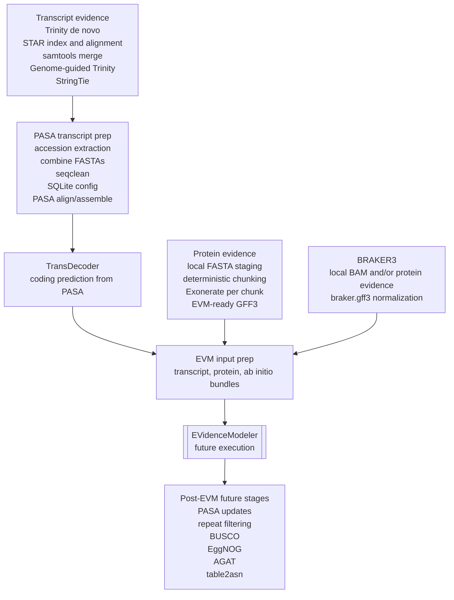

**BRAKER3 \+ Evidence Modeler pipeline** \- Ayse Tenger-Trolander  
Adapted into Markdown for FLyteTest from the original annotation notes

This Markdown file is the canonical reference for repo work; the pipeline
figure remains the visual companion.

## Pipeline Diagram

**![][image1]**  
**Directory Structure**  
First, let’s set up our directory structure. Within some working directory (e.g. annotation/), set up the following directories. The example commands laid out in this document assume this structure, and all scripts are executed from the top level. Copy your raw RNA-seq data to transcript\_data/fastqs/, your reference genome assembly to reference/, and all scripts to scripts/:

abinitio\_data/  
	braker/  
protein\_data/  
	fastas/  
	uniprot\_results/  
	refseq\_results/  
reference/  
scripts/  
transcript\_data/  
	fastqs/  
	bams/  
stringtie/  
	trinity\_denovo/  
	trinity\_gg/  
	pasa/

[**Trinity**](https://github.com/trinityrnaseq/trinityrnaseq/wiki) **(transcript assembler)**  
Trinity assembles transcript sequences from Illumina RNA-Seq data. It can do de novo assembly or it can do genome-guided. I will do both.

**Denovo**  
Create de novo transcriptome assemblies using Trinity. I used the following script. Also need to load jellyfish (genomescope) and samtools to run trinity. This job needs a long run time. I tried 30 hrs first and that was not nearly enough. Trying 200 hrs second time which worked. You can find the script I ran in my folder. The script is trinity\_denovo.sh.

Trinity \--seqType fq \--samples\_file samples.txt \--max\_memory 64G \--CPU 8 \--output transcript\_data/trinity\_denovo

Trinity completed de novo assembly of RNA Seq reads. Output file is “trinity\_denovo.Trinity.fasta” in transcript\_data directory 

**Genome-Guided Assembly \-** you will need to map your fastqs to reference genome before you can run trinity genome guided mode.

[**STAR**](https://github.com/alexdobin/STAR)  
Use star to map RNAseq fastqs to genome and produce BAM files. The BAM files created from mapping RNA seq reads to the reference genome with STAR are then used by stringtie and trinity to build transcript assemblies. You can find my scripts star\_index.sh and star\_map.sh in my folder. The commands are also included here.

At the same time that you are assembling your fastqs with Trinity denovo. You can use STAR to create an index for your reference genome using this command:

STAR \--runThreadN 4 \--runMode genomeGenerate \--genomeDir reference/output.star \--genomeFastaFiles reference/your\_reference.fa 

Now we will align all the fastqs to the reference using STAR. 

For each sample, map to the reference. For one sample $S:

STAR \--runThreadN 16 \--genomeDir ./reference/${ref}.star \\  
    \--readFilesIn ./transcript\_data/fastqs/${S}.r1.fq.gz \\ ./transcript\_data/fastqs/${S}.r2.fq.gz \\  
     \--outFileNamePrefix transcript\_data/bams/${S}\_ \\  
     \--outSAMtype BAM SortedByCoordinate

Next we need to merge all the bams using samtools merge command. This results in an output file called that I called merged.bam. This is now stored in ./transcript\_data/. The merged bam file is also what we will use for Stringtie.  
But first, let’s run the genome-guided trinity.

Taking the bam output from STAR, we use these as input for Trinity’s genome-guided mapping command:

Trinity \--genome\_guided\_bam merged\_sorted\_bam\_file.bam \\  
   \--max\_memory 64G \\  
   \--CPU 8 \\  
   \--output transcript\_data/trinity\_gg \\  
   \--genome\_guided\_max\_intron 100000

Trinity\_GG.fasta file stored in./transcript\_data/trinity\_gg.

[**Stringtie**](https://github.com/gpertea/stringtie)  
assembles and quantifies transcript isoforms from RNA-Seq data. It is compatible with multiple aligners including STAR. It takes the aligned read data as input and processes it to perform transcript assembly and quantification. Stringtie will use the merged.bam file generated by STAR to perform the following step.

Script to run Stringtie:

stringtie merged.bam \-o transcript\_data/stringtie/stringtie.gtf \-p 16  \-l STRG \-f 0.10 \-A \-c 3 \-j 3

Stringtie outputs two files (if you include the \-A option). 

1. The first file is your GTF (genome feature file)  
2. The second is a text file that reports of coverage, FPKM, and TPM for each “gene”.   
* Coverage is the number of reads supporting each gene call  
* FPKM (Fragments Per Kilobase Million) represents the expression level of a gene or transcript. It is a measure of gene expression normalized by the length of the gene and the total number of reads.   
* TPM (Transcripts Per Million) is also a measure of gene or transcript expression, but it uses a different normalization method. In TPM normalization, the expression level of each transcript is divided by its effective length (accounting for read distribution along the transcript) and then multiplied by a scaling factor to convert the values to the number of transcripts per million in the library. 

Output \- The stringtie.gtf file you have created will be used later with the PASA software. PASA section below. 

[**PASA**](https://github.com/PASApipeline/PASApipeline)   
PASA stands for "Program to Assemble Spliced Alignments." It is a bioinformatics software package used for genome annotation and transcriptome analysis. PASA is designed to integrate and improve gene structure annotations by leveraging RNA-Seq data and existing gene predictions.

Dependencies:

Pasa requires the relational database mySQL or SQLite to be installed in order to store and manage its data (think big blast searches). It also requires samtools, BioPerl, minimap2, BLAT, and gmap.

Setting up data for a PASA run:

1. Run ‘accession\_extract\_Pasa.sh’ to get de novo transcript accessions. You will need this file to run pasa (step 5).  
     
   perl /apps/software/gcc-12.1.0/pasapipeline/2.5.3/misc\_utilities/accession\_extractor.pl \<./your\_denovo\_trinity\_fasta\_file.fasta/ \> tdn.accs

     
2. Cat together your denovo and genome-guided trinity fastas. You will need this file to run pasa (step 5).  
     
   cat ../trinity\_denovo/Trinity.fasta ../trinity\_gg/Trinity-GG.fasta \> \\  
   trinity\_transcripts.fa

     
3. Clean transcripts with seqclean perl file in the PASA directory (see command below). Use the UniVec_Core fasta file from ftp://ftp.ncbi.nlm.nih.gov/pub/UniVec/UniVec_Core or get it from my ./scripts folder. **UniVec** is a non-redundant database of sequences commonly attached to cDNA or genomic DNA during the cloning process. It was developed by staff at NCBI. UniVec\_Core is a subset of the full UniVec database. UniVec primarily consists of unique segments from a large number of vectors but also includes many linker, adapter, and primer sequences. Redundant sub-sequences have been eliminated from the database to make searches more efficient and to simplify the interpretation of the results.

   Run the seqclean\_pasa.sh script:

   /apps/software/gcc-12.1.0/pasapipeline/2.5.3/bin/seqclean trinity\_transcripts.fa \-v UniVec\_Core \-c 16

   Note: the original PASA notes call for `seqclean`, but the current FLyteTest
   wiki-shaped smoke can run directly from Trinity FASTA inputs. The PASA
   Apptainer image smoke does not currently support the legacy `seqclean`
   path; see
   https://github.com/PASApipeline/PASApipeline/issues/73. Use
   `scripts/rcc/minimal_pasa_align_smoke.sh` for the host-installed
   `Launch_PASA_pipeline.pl` smoke, or
   `scripts/rcc/minimal_pasa_image_smoke.sh` for the Apptainer-backed image
   smoke.

   This should leave you with a trimmed FASTA file called
   `trinity_transcripts.fa.clean`. You will need this file to run PASA in step
   5. You can find my files in `/transcript_data/pasa/trinity_combined`.

4. You will now need to edit the config file supplied with PASA for alignment and assembly, found in $PASA/pasa\_conf/pasa.alignAssembly.TEMPLATE.txt. To point it to the correct database. I created the database with the program sqlite which is installed under gcc/12.1.0. Below I describe how to create the database in sqlite. You can name it whatever you want. This is how pasa manages its data.

   **Sqlite** 

   

   To create a database in Sqlite:

   module load sqlite/3.42.0

   sqlite3 your.database.name

   

   \#Now a prompt will open that says “Enter .help for usage hints”

   \#you need to tell it to create the database with the name you input above

   \#this is the command:

   

   .databases

   

   \#now you need to exit mysqlite by typing the following:

   .exit

   

   Now if you look in your current working directory, you should see your.database.name. Now open the pasa.alignAssembly.config file and edit the DATABASE= to point to your database name. 

5. You are now ready to run PASA\! With the following script:

   \#\!/bin/bash

   

   \#SBATCH \--job-name=pasa\_run

   \#SBATCH \--nodes=1

   \#SBATCH \--ntasks-per-node=1

   \#SBATCH \--time=24:00:00

   \#SBATCH \--cpus-per-task=8

   \#SBATCH \--mem=64gb

   \#SBATCH \--output=/gpfs/data/schmidtott-lab/Labserver/Personal\_Folders/Ayse/Annotation\_Ayse\_v1/transcript\_data/pasa\_gmap.out

   \#SBATCH \--error=/gpfs/data/schmidtott-lab/Labserver/Personal\_Folders/Ayse/Annotation\_Ayse\_v1/transcript\_data/pasa\_gmap.err

   

   module load gcc/12.1.0

   module load gmap/2017.11.15

   module load minimap2/2.26

   module load samtools/1.17

   module load openssl/3.1.0

   module load sqlite/3.42.0

   module load blat/35.1.0

   Module load pasapipeline/2.5.3

   

   cd /gpfs/data/schmidtott-lab/Labserver/Personal\_Folders/Ayse/Annotation\_Ayse\_v1/transcript\_data

   

   perl /apps/software/gcc-12.1.0/pasapipeline/2.5.3/Launch\_PASA\_pipeline.pl \--config pasa.alignAssembly.config \\

        \--ALIGNERS blat,gmap,minimap2 \\

        \--MAX\_INTRON\_LENGTH 100000 \\

        \--trans\_gtf ./stringtie/stringtie\_c3\_j3.gtf \\

        \--create \--run \\

        \--ALT\_SPLICE \\

        \--CPU 8 \\

        \--stringent\_alignment\_overlap 30.0 \\

        \-T \\

        \-u trinity\_transcripts.fa \\

        \--genome ../reference/Megaselia\_abdita.repeatmasked.fa \\

        \--transcripts ./trinity\_transcripts.fa.clean \\

        \--TDN tdn.accs     

Output: This script should give you many files including:  
\<your\_sqlite\_db\_name\>.assemblies.fasta  
\<your\_sqlite\_db\_name\>.pasa\_assemblies.bed/gff3/gtf  
\<your\_sqlite\_db\_name\>.valid\_gmap/blat/minimap2\_alignments.bed/gff3/gtf  
\<your\_sqlite\_db\_name\>.failed\_gmap/blat/minimap2\_alignments.bed/gff3/gtf  
\<your\_sqlite\_db\_name\>.polyAsites.fasta  
\<your\_sqlite\_db\_name\>.alt\_splicing\_supporting\_evidence.txt  
  blat/gmap/minimap2.spliced\_alignments.gff3

**\*VERY IMPORTANT NOTE: Do not delete your sqlite database or alter it. You will need it to update the evidence modeler gff3 file to add UTRs later.\***

**Transdecoder \-** predicts candidate coding regions from transcript assemblies

TransDecoder identifies candidate coding regions within transcript sequences, such as those generated by de novo RNA-Seq transcript assembly using Trinity, or constructed based on RNA-Seq alignments to the genome using StringTie.

First, run Transdecoder on the pasa assemblies to create training models. Important note: You will use the pasa\_asmbls\_to\_training\_set.dbi which can be found in the pasapipeline module (apps/software/gcc-12.1.0/pasapipeline/2.5.3/scripts/pasa\_asmbls\_to\_training\_set.dbi) installed on the cluster. HOWEVER, you will need to change the transcoder directory in the script to point to the transcoder software that is installed separately from pasapipline. DO NOT USE the transcoder plugin. It will not work. You can also copy the pasa\_asmbls\_to\_training\_set.dbi from /Ayse/Annotation/scripts/ folder which is already edited. Then copy to your directory, load pasapipeline module, and run:  
		  
module load gcc/12.1.0  
module load pasapipeline/2.5.3  
module load perl/5.36.0

perl ./pasa\_asmbls\_to\_training\_set.dbi  \--pasa\_transcripts\_fasta ${db}.assemblies.fasta \--pasa\_transcripts\_gff3 ${db}.pasa\_assemblies.gff3

This script is called RunTransDecoder.sh. You can find it in Ayse’s scripts folder.

Output: **${db}.assemblies.fasta.transdecoder.genome.gff3** among other files. You will later merge this file with the braker.gff file to make the predictions.gff3 file for evidence modeler.

**Mapping Protein Data** (this can be done in parallel to transcriptomes)

**Getting the protein data**  
Download the latest [SwissProt](https://ftp.uniprot.org/pub/databases/uniprot/current_release/knowledgebase/complete/uniprot_sprot.fasta.gz) database (big file, \>80GB). You can also download all entries matching certain criteria from NCBI. I have also used all RefSeq diptera proteins (at [https://www.ncbi.nlm.nih.gov/protein](https://www.ncbi.nlm.nih.gov/protein) search (diptera AND srcdb\_refseq\[PROP\]) AND "flies"\[porgn:\_\_txid7147\] AND srcdb\_refseq\[PROP\] ). You can run this on the cluster in parallel to all the above computations (i.e. you don’t need to wait for the transcriptome gffs to do this step). 

[**Exonerate**](https://www.ebi.ac.uk/about/vertebrate-genomics/software/exonerate) **\-** Exonerate is a bioinformatics tool that performs sequence comparison and alignment tasks. It is commonly used for genomic and protein sequence analysis and is part of the GeneWise and Exonerate suite of programs. Exonerate is designed to efficiently align and compare DNA, RNA, and protein sequences against a reference genome or database. Here we will use it to align proteins from uniprot and refseq databases to our reference genome. You then run exonerate command as seen below for both fasta files (uniprot and refseq).

1. For a single chunk, number N. Exonerate will chunk the search for you if you include the –querychunkid and –querychunktotal. The ID you will need to provide as a variable as 1 \- N and then tell exonertate using the –querychunktotal option how many chunks, aka N. I did 250 chunks for uniprot\_sprot.fasta and that finished in under 24hrs.

   exonerate \--model p2g \\

      \--showvulgar no \\

      \--showalignment no \\

      \--showquerygff no \\

      \--showtargetgff yes \\

      \--maxintron 350000 \\

      \--minintron 20 \\

      \--percent 90 \\

      \--query protein\_data/fastas/uniprot\_sprot.fa \\

      \--target reference/reference\_genome.fa \\

      \--querytype protein \\

      \--targettype dna \\

      \--querychunkid $S \\

      \--querychunktotal N \\

      \--refine region \\

      \--refineboundary 5000 \\

      \--softmasktarget yes \> \\

      protein\_data/uniprot\_results/uniprot.${S}.gtf

   Submit by looping over chunks:

   for i in $myvar;

    do

       sbatch \--export=S=${i} RunExonerate.sh

       sleep 1  \# Optional: sleep for 1 second between job submissions

   done

   

   

2. Now we need to convert from exonerate’s weird format to something that EVidence Modeler (EVM) program will accept. EVM has a perl script you can download called exonerate\_gff\_to\_alignment\_gff3.pl. Run with a loop.

   for i in $myvar

   do perl exonerate\_gff\_to\_alignment\_gff3.pl ${i} \> ${i}.gff3

   done

   

3. Remove all empty files.

   find protein\_data/uniprot\_results/ \-size \-500c \-delete

   

4. Concatenate all the gff and gtf files (separately). We will need both exonerate gtf format and the EVM gff3.  
     
   cat exonerate.\*.gff3 \> uniprot\_evm.gff3.intermediate  
   cat exonerate.\*.gtf \> uniprot\_exonerate.gtf.intermediate  
     
5. Remove all blank lines using awk. Remove   
     
   awk ‘NF’ uniprot\_exonerate.gtf.intermediate \>uniprot\_exonerate.gtf  
   awk ‘NF’ uniprot\_evm.gff3.intermediate\> uniprot\_evm.gff3  
   

**Do this process again for your refseq file**. Refseq file takes much longer than uniprot fasta. I upped the number of hours to 50\. This will leave you with 250 exonerate gff files. 

**Create consensus gff with Evidence Modeler**

1\. Run [Evidence Modeler](https://github.com/EVidenceModeler/EVidenceModeler/wiki) using all supporting data. Almost all of this is straight from the EVM documentation. Ensure that each source has the correct “source” field ($2) that matches the evm.weights file\!\! Here is an example of the evm.weights file:

ABINITIO\_PREDICTION	Augustus	3  
ABINITIO\_PREDICTION	gmst	3  
ABINITIO\_PREDICTION	genemark.hmm3	3  
PROTEIN	exonerate	5  
TRANSCRIPT	assembler-pasa\_db.sqlite 10  
OTHER\_PREDICTION	transdecoder	5

2\. Make input files. Start in evm/. These are the files you will need to make your predictions.gff, transcripts.gff and proteins.gff files.

Files you need:

* braker.gff3  
* reseq\_exonerate.gff3  
* uniprot\_exonerate.gff3  
* ${db}.pasa\_assemblies.gff3  
* ${db}.assemblies.fasta.transdecoder.genome.gff3

cat braker.gff Pasa\_sqlite.db.assemblies.fasta.transdecoder.genome.gff3 \>  
**predictions.gff3**

cat refseq\_exonerate.gff3 uniprot\_exonerate.gff3 \> **proteins.gff3**

cp Pasa\_sqlite.db.pasa\_assemblies.gff3 **transcripts.gff3**

Koray’s comment: uniprot data had to be cleaned because the metadata was excessively long. I used awk to do it. 

3\. Split up into submission scripts using EVM script. See my script called “partition\_evm\_inputs.sh.” You will need to submit this as a job, it take \~3-5 min to run.

perl /apps/software/gcc-12.1.0/evidencemodeler/2.1.0/EvmUtils/partition\_EVM\_inputs.pl   
 \--partition\_dir Partitions \\  
\--genome ../reference/${ref}.fa \\  
\--gene\_predictions predictions.gff3 \--protein\_alignments proteins.gff3 \\  
\--transcript\_alignments transcripts.gff3 \\  
\--segmentSize 3000000 \--overlapSize 300000 \\  
\--partition\_listing partitions\_list.out

4\. Now we will run a EVM script to create a list of commands which we will submit individually later. See my script “write\_evm\_commands.sh” to run as a job.

perl /apps/software/gcc-12.1.0/evidencemodeler/2.1.0/EvmUtils/write\_EVM\_commands.pl \--genome ../reference/${ref}.fasta \\  
\--weights \`pwd\`/evm.weights \\  
\--gene\_predictions predictions.gff3 \\  
\--protein\_alignments proteins.gff3 \\  
\--transcript\_alignments transcripts.gff3 \\  
\--output\_file\_name evm.out  \--partitions partitions\_list.out \> \\  
commands

5\. This is a script to make submission scripts for each partition job. Run.

bash ../scripts/PrepareEvmSubs.sh

6\. Now we have one script per command. Make a list of all the submission scripts called files and use a loop to submit.

ls ./scripts/\* \> files  
myvar=$(cat files)

for i in $myvar  
do sbatch ${i};   
sleep 1;   
done

7\. After all jobs have completed, recombine all outputs into a single gff3 and convert to gff3 format.

perl /apps/software/gcc-12.1.0/evidencemodeler/2.1.0/EvmUtils/recombine\_EVM\_partial\_outputs.pl   
\--partitions partitions\_list.out \--output\_file\_name evm.out

/apps/software/gcc-12.1.0/evidencemodeler/2.1.0/EvmUtils/convert\_EVM\_outputs\_to\_GFF3.pl   
\--partitions partitions\_list.out \--output evm.out \--genome ../reference/${ref}.fasta

find . \-name "evm.out.gff3" \-exec cat {} \+ \> EVM.all.gff3

8\. Remove all blank lines:  
	awk ‘NF’ EVM.all.gff3 \> EVM.all.removed.gff3  
9\. Use gff3sort to properly sort the output file. ([https://github.com/billzt/gff3sort](https://github.com/billzt/gff3sort))   
Sort:  
gff3sort.pl \--chr\_order natural \--precise EVM.all.removed.gff3 \> EVM.all.sort.gff3  
**Update Gene Models with PASA**

Now we can update the gene models using the PASA assemblies. This is required to identify alternative transcripts and UTRs. This requires at least two rounds because as you improve the  assemblies, it will often incorporate more transcripts. Start back in transcript\_data/pasa. Ensure you’ve modified both pasa.annotCompare.config and pasa.alignAssembly.config to point to your **original PASA database** and that the files have all the settings you’d like to use (for the the annotation config file I used all the defaults). You will need to load blat and fasta36 for this step. Important note: pasa expects fasta36 to be named fasta (no idea why). To get around this, I create a symbolic link to fasta36 and name it fasta. The code to do this is included in the slurm script and below. You can get this scripts from my folder ./scripts/RunPasa\_update\_gene\_models.sh

1.  Round 1 update. Create a bin/ folder in your working directory before you run this script. You need it for the symbolic link to be create and fasta36 to work.

\#\!/bin/bash

\#SBATCH \--job-name=pasa\_update\_3  
\#SBATCH \--nodes=1  
\#SBATCH \--ntasks-per-node=1  
\#SBATCH \--time=100:00:00  
\#SBATCH \--cpus-per-task=8  
\#SBATCH \--mem=32gb  
\#SBATCH \--output=/gpfs/data/schmidtott-lab/Labserver/Personal\_Folders/Ayse/Annotation\_Ayse\_v1/transcript\_data/pasa/pasa\_update.out  
\#SBATCH \--error=/gpfs/data/schmidtott-lab/Labserver/Personal\_Folders/Ayse/Annotation\_Ayse\_v1/transcript\_data/pasa/pasa\_update.err

module load gcc/12.1.0  
module load sqlite/3.42.0  
module load pasapipeline/2.5.3  
module load samtools/1.18  
module load blat/35.1.0  
module load fasta36/36.3.8i

cd /gpfs/data/schmidtott-lab/Labserver/Personal\_Folders/Ayse/Annotation\_Ayse\_v1/transcript\_data/pasa/

\#Create a symbolic link  
if \[ \! \-e "./bin/fasta" \]; then  
    ln \-s $(which fasta36) ./bin/fasta  
fi

if \! grep \-q "export PATH=./bin:\\$PATH" \~/.bashrc; then  
    echo 'export PATH=./bin:$PATH' \>\> \~/.bashrc  
fi       
export PATH=./bin:$PATH

perl /apps/software/gcc-12.1.0/pasapipeline/2.5.3/scripts/Load\_Current\_Gene\_Annotations.dbi \-c pasa.alignAssembly.config \-g ../../reference/Megaselia\_abdita.repeatmasked.fa \-P ../../EVM/EVM.all.sort.gff3

perl /apps/software/gcc-12.1.0/pasapipeline/2.5.3/Launch\_PASA\_pipeline.pl \-c pasa.annotCompare.config \-A \-g ../../reference/Megaselia\_abdita.repeatmasked.fa \-t ./trinity\_combined/trinity\_transcripts.fa.clean \--CPU 8  
       
Note: You can only use \--CPU with the Launch\_PASA\_pipeline.pl. If add multiple threads to the Load\_Current\_Gene\_Annotations.dbi line, it will run and fail. You will get an error in the error file that says “- unknown option” and empty output files.

**Ouput**: At the end, you’ll have another ${db}.gene\_structures\_post\_PASA\_updates.${pid}.gff3 and .bed file

2. Round 2 update. The updated files will be named something like ${db}.gene\_structures\_post\_PASA\_updates.${pid}.gff3, where pid is the process id of the annotation update job. After the first update, run another round of updating, but load the annotations from the the new ${db}.gene\_structures\_post\_PASA\_updates.${pid}.gff3 file with the \-P option (not the EVM gff3).

**Ouput**: At the end, you’ll have another ${db}.gene\_structures\_post\_PASA\_updates.${pid}.gff3, different pid from the first. 

3. Remove and blank lines and sort file:

	  
awk ‘NF’ ${db}.gene\_structures\_post\_PASA\_updates.${pid}.gff3 \> ${db}.gene\_structures\_post\_PASA\_updates.${pid}.removed. gff3

gff3sort.pl \--precise ${db}.gene\_structures\_post\_PASA\_updates.${pid}.removed.gff3 \> ${db}.gene\_structures\_post\_PASA\_updates.${pid}.sort.gff3 and copy to ${ref}.original.gff3  
**Removing TEs using RepeatMasker (Dfam-based) output and Funannotate’s repeats.dmnd database**

Go to your repeatmasker output folder and find the .out file. This is what you need for the next step.

**To get the repeatmasker elements into a bed file format:**

1. Convert repeatmasker out file to gff3

/apps/software/gcc-12.1.0/repeatmasker/4.1.5/util/rmOutToGFF3.pl Mab\_ref\_genome.fasta.out \> Mab\_ref\_genome.fasta.gff3

2. Then convert gff3 to a bed file

Awk ‘{print $1 “\\t” $4 “\\t” $5 }’ Mab\_ref\_genome.fasta.gff3 \> Mab\_ref\_genome.repeatmasker.bed

**To get a fasta file of annotated proteins:**

1. Find the cufflinks\_gffread.sh script. The gffread command can take your genome fasta file and the gff3 (from EVM and updated with PASA) and generate a proteins.fa file.

module load gcc/12.1.0  
module loaf cufflinks/

gffread \-y your.ouput.proteins.fa \-g your.genome.fa your.annotation.gff3

2. Check your out.proteins.fa file for periods in the protein sequence. If present, diamond will not be able to parse the file ([https://github.com/nextgenusfs/funannotate/issues/459](https://github.com/nextgenusfs/funannotate/issues/459) gives a description of the issue). To get around this, remove all periods from the protein sequences with this command:

awk '/^\>/ {if (seq) print seq; print; seq=""} \!/^\>/ {gsub(/\\./, "", $0); seq \= seq $0} END {print seq}' inputfile.fasta \> outputfile.fasta

3. Find any gene models that match (90%) with your repeat bed file generated with Repeat Masker above. Uses python script called Find\_bed\_file\_repeats.py and a job script to run the python script called Run\_Find\_bed\_files\_repeats.py.

This use a funannotate command called RemoveBadModels. If you specify “overlap” then the function will perform bedtools intersect on your bed file and gff3 file. The output will be called genome.repeats.to.remove.gff3 (you do not have to define it in the script). You can use script called **Find\_bed\_file\_repeats.py**:

\#\!/usr/bin/env python  
\# \-\*- coding: utf-8 \-\*-  
from \_\_future\_\_ import (absolute\_import, division,  
                        print\_function, unicode\_literals)  
import sys  
import os  
import subprocess  
import shutil  
import argparse  
import json  
import datetime  
import funannotate.library as lib  
from natsort import natsorted

lib.setupLogging('Find\_bed\_repeats.log')

\# lazy. just modify here.  
Blast\_rep\_remove \= os.path.join(‘repeat.dmnd.blast.txt’)  
EVM\_out \= os.path.join('Megaselia\_abdita.original.gff3')  
EVMCleanGFF=os.path.join('Megaselia\_abdita.clean.gff3')  
EVM\_proteins= os.path.join('Megaselia\_abdita.original.proteins.fa')  
RepeatMasker \= os.path.join('Mab\_ref\_genome.repeatmasker.bed')  
repeat\_filter \= \['overlap'\]  
min\_protlen=50  
FUNDB=os.path.join('/gpfs/data/schmidtott-lab/Labserver/Personal\_Folders/Ayse/Conda/py\_2/lib/python2.7/site-packages/funannotate/')

lib.RemoveBadModels(EVM\_proteins, EVM\_out, min\_protlen, RepeatMasker, Blast\_rep\_remove, os.path.join('.'), repeat\_filter, EVMCleanGFF)

total \= lib.countGFFgenes(EVMCleanGFF)  
lib.log.info("{:,} gene models remaining".format(total))

To run this script you will need to use the conda environment in which you installed funannotate. See my script Run\_Find\_bed\_file\_repeats.sh:

\#\!/bin/bash

\#SBATCH \--job-name=count\_genes  
\#SBATCH \--nodes=1  
\#SBATCH \--ntasks-per-node=1  
\#SBATCH \--time=05:00:00  
\#SBATCH \--cpus-per-task=1  
\#SBATCH \--mem=16gb  
\#SBATCH \--output=/gpfs/data/schmidtott-lab/Labserver/Personal\_Folders/Ayse/Cal\_Annotation\_v1/count.out  
\#SBATCH \--error=/gpfs/data/schmidtott-lab/Labserver/Personal\_Folders/Ayse/Cal\_Annotation\_v1/count.err

module purge  
module load gcc/12.1.0  
module load miniconda3/23.1.0

source /apps/software/gcc-12.1.0/miniconda3/23.1.0/etc/profile.d/conda.sh  
conda activate /gpfs/data/schmidtott-lab/Labserver/Personal\_Folders/Ayse/Conda/py\_2  
export FUNANNOTATE\_DB=/gpfs/data/schmidtott-lab/Labserver/Personal\_Folders/Ayse/Conda/py\_2/lib/python2.7/site-packages/funannotate

cd /gpfs/data/schmidtott-lab/Labserver/Personal\_Folders/Ayse/Cal\_Annotation\_v1

python Find\_bed\_file\_repeats.py

conda deactivate

Now we need to removing the Repeat Masker output (your bed file) based repeats/TEs from gff3 file. Use the Remove\_bed\_TEs.sh but change the gff3\_file to your genome.repeats.to.remove.gff file and run.

\#\!/bin/bash/

\#input your file paths here  
gff\_file="./Megaselia\_abdita.bed\_repeats\_removed.gff3"  
list\_file="./genome.repeats.to.remove.gff"  
output\_file="./Megaselia\_abdita.bed\_repeats\_removed.gff3"

\#Use grep to exclude lines from the gff file if they match exacty with line in the list file  
grep \-vFf "$list\_file" "$gff\_file" \> "$output\_file"

echo "Processing complete"

To run script:  
Bash Remove\_bed\_repeat.sh

This removes all lines in the gff file that match the genome.repeats.to.remove.gff file.

Now all of the overlapping regions from your repeatmasker output are removed and we can move on to looking for TEs with a funannotate function (uses BLAST) and their database.

4. Blast your gene models (gff3 file) against known TE database (funannotate)

This also uses the funannotate command called RepeatBlast. To blast your gene models against the repeats (TE) database of funannotate see my script called **Find\_blast\_repeats.py.** You will need to run this script with the Run\_Find\_blast\_repeats.sh script. See below.

\#\!/usr/bin/env python  
\# \-\*- coding: utf-8 \-\*-

from \_\_future\_\_ import (absolute\_import, division,  
                        print\_function, unicode\_literals)

import sys  
import os  
import subprocess  
import shutil  
import argparse  
import json  
import datetime  
import funannotate.library as lib  
from natsort import natsorted

lib.setupLogging('blast\_db.log')

\#modify to your file names here  
EVM\_out \= os.path.join('Megaselia\_abdita.bed\_repeats\_removed.gff3')  
EVM\_proteins= os.path.join('Megaselia\_abdita.bed\_repeats\_removed.proteins.fa')  
cpus=1  
evalue=1e-10  
FUNDB=os.path.join('/gpfs/data/schmidtott-lab/Labserver/Personal\_Folders/Ayse/Conda/py\_2/lib/python2.7/site-packages/funannotate/')

\#output  
Blast\_rep\_remove \= os.path.join('repeat.dmnd.blast.txt')

\#Here we are blast against repeats.dmnd and output the repeat.dmnd.blast.txt file  
lib.RepeatBlast(EVM\_proteins, cpus, 1e-10, FUNDB, os.path.join('.'), Blast\_rep\_remove)

Now run Run\_Find\_blast\_repeats.sh:

This will **output** a file called **repeat.dmnd.blast.txt** which contains all the TEs that are in the funannotate library and in your gff file. These will need to be removed. But they are not in a gff3 format for whatever reason (sorry\!) so we will need to do a bit of reformatting from the original gff3 to get all the lines that need to be removed. Use the script **Reformat\_blast\_TE\_list.sh** but make sure to change the files paths to match your file names and use in a job, takes a while to run this:

\#\!/bin/bash

\# Define file paths  
gff\_file="./Megaselia\_abdita.original.gff3"  
dmnd\_blast\_file="./repeat.dmnd.blast.txt"  
output\_file="./Megaselia\_abdita.blast\_repeats\_removed.final.gff3"

\# Step 1: Extract IDs from the blast file  
awk '{print $1}' "$dmnd\_blast\_file" \> Blast\_TE\_repeats.txt

\# Prepare a temporary and final output file  
temp\_file="./temp\_gff\_file.gff"  
cp "$gff\_file" "$temp\_file"

\# Function to filter GFF file based on IDs with a specified prefix in the attribute (Parent= or ID=)  
filter\_gff() {  
    local prefix=$1  
    local file\_list=$2  
    local temp\_out="./temp\_out.gff"

    while read \-r id; do  
        grep \-vE "${prefix}${id}(\[; \].\*|$)" "$temp\_file" \> "$temp\_out"  
        mv "$temp\_out" "$temp\_file"  
    done \< "$file\_list"  
}

\# Step 2: Filter based on "Parent=" attribute  
filter\_gff "Parent=" Blast\_TE\_repeats.txt

\# Step 3: Filter based on "ID=" attribute (reusing the list)  
filter\_gff "ID=" Blast\_TE\_repeats.txt

\# Step 4: Modify the IDs in the list  
sed \-i 's/evm.model/evm.TU/g' Blast\_TE\_repeats.txt

\# Step 5: Filter based on modified "ID=" attribute  
filter\_gff "ID=" Blast\_TE\_repeats.txt

\# Move the final temp file to the output  
mv "$temp\_file" "$output\_file"

echo "Filtering complete. Output is in $output\_file"

**Make your TE-free protein fasta file**

1. Now use gffread from cufflinks to get a new fasta file of your protein sequences:

   module load gcc/12.1.0

   module load cufflinks/2.2.1

   

   gffread Megaslia\_abdita.All\_repeats\_removed.gff3 \-g Megaselia\_abdita.repeatmasked.fa \-y Megaselia\_abdita.All\_repeats\_removed.proteins.fa

   

2. And use your awk statement to remove periods (diamond does not work otherwise and downstream softwares work with diamond):  
     
   awk '/^\>/ {if (seq) print seq; print; seq=""} \!/^\>/ {gsub(/\\./, "", $0); seq \= seq $0} END {print seq}' inputfile.fasta \> outputfile.fasta

**Run BUSCO on protein sequences**

BUSCO stands for "Benchmarking Universal Single-Copy Orthologs." It is a tool used in genomics for assessing genome assembly and annotation completeness with single-copy orthologs. Here we will run the busco software on our genome annotation using several different lineages/databases. 

The \-i option is for your proteins fasta. \-o is the name of the output folder. \-l is the lineage/database you want to compare your proteins to, in this case eukaryota. You should also run metazoa, insecta, arthropoda, and diptera. The \-m option indicates the mode you want to run busco in: protein (prot), genome, or transcriptome. \-c option is for the number of cpus. You can find this script as BUSCO.sh in my scripts folder.

\#\!/bin/bash

\#SBATCH \--job-name=busco  
\#SBATCH \--nodes=1  
\#SBATCH \--ntasks-per-node=1  
\#SBATCH \--time=00:10:00  
\#SBATCH \--cpus-per-task=8  
\#SBATCH \--mem=16gb  
\#SBATCH \--output=/gpfs/data/schmidtott-lab/Labserver/Personal\_Folders/Ayse/Annotation\_Ayse\_v1/busco\_eukaryota.out  
\#SBATCH \--error=/gpfs/data/schmidtott-lab/Labserver/Personal\_Folders/Ayse/Annotation\_Ayse\_v1/busco\_eukaryota.err

cd /gpfs/data/schmidtott-lab/Labserver/Personal\_Folders/Ayse/Annotation\_Ayse\_v1

module load gcc/12.1.0  
module load python/3.10.5

busco \-i ./Megaselia\_abdita.repeats\_removed.proteins.fa \-o busco\_output\_eukaryota \-l eukaryota\_odb10 \-m prot \-c 8

Note for the current FLyteTest repo: the checked-in BUSCO image is
`data/images/busco_v6.0.0_cv1.sif`, and the checked-in BRAKER3 image is
`data/images/braker3.sif`. The top-level README records the image provenance
for both.

**Get Genes Names with EggNOG-mapper** 

[EggNOG-mapper](https://github.com/eggnogdb/eggnog-mapper/wiki) will functionally annotate your genome by assigning gene names and other annotations based orthologous sequences.

1. Choose Taxonomic Scope to run in HMMER mode.

   

2. Download eggnog databases in interactive mode (can’t run in a job because it requires user input)  
1. To ask for an interactive job run this:  
   srun \--pty \--nodes=1 \--ntasks-per-node=1 \--cpus-per-task=1 \--mem=8G bash  
     
2. To download the databases (diamond, pfam, hmmer):  
   module load gcc/12.1.0  
   module load eggnog-mapper/2.1.12  
     
   download\_eggnog\_data.py \-P \-M \-H \-d 50557 \--dbname Insecta \--data\_dir ./eggnog\_data  
     
   download\_eggnog\_data.py \-P \-M \-H \-d 7147 \--dbname Diptera \--data\_dir ./eggnog\_data  
     
3. Run EggNOG-mapper:  
   Execute eggNOG-mapper with appropriate arguments and tell it where the eggnog data can be found with the \--data\_dir option. You will want to run in HMMER mode which is much slower than diamond but gives many more annotations. Give this a long time to run and a good number of cpus. My script is called eggnog\_mapper.sh. This is an example script:  
     
   module load gcc/12.1.0  
   module load eggnog-mapper/2.1.12  
     
   emapper.py \-m hmmer \-i Megaselia\_abdita.All\_repeats\_removed.proteins.fa \-o output\_prefix \-d Diptera \--data\_dir ./eggnog\_data \--cpu 24 \--decorate\_gff ./Megaselia\_abdita.All\_repeats\_removed.gff3 \--report\_orthologs \--excel

4. Review and Analyze the Output:  
   Once eggNOG-mapper completes, you will have several output files with varying levels of detail. The \`.annotations\` file will provide you with functional annotations, including gene names, for each of your input sequences. The annotated gff will be output\_prefix.emapper.decorated.gff. See next note, there is a little more to do. The decorated file is not as useful as I thought….

**\*\*eggnog only annotates the transcripts which is a problem downstream**. Specifically for converting to a gtf format. To get around this use the script AddEggnogToGff3.pl to replace the NAME= of each gene (not transcript) in column 9 of the gff to the annotation provided by eggnog. 

To do this you will need your repeats remove gff file, the emapper.annotations file, and a file you will make called txt2gene.txt.

To make the tx2gene file. This stands for transcript to gene. So you want the transcript ID (ID=) in the first column and the respective parent ID (Parent=) in the second column for everything except the gene. Essentially copy the repeats remove gff, remove all lines with gene in the 3rd column and pull the string following ID= and place in the first column of a new file, then pull the string following Parent= from the same line and place in column two. This script is called make\_txt2gene\_file.sh:

awk \-F'\\t' '$3 \!= "gene" {  
  split($9, a, ";");  
  for (i in a) {  
    if (a\[i\] \~ /^ID=/) {  
      split(a\[i\], id, "=");  
      printf "%s\\t", id\[2\];  
    } else if (a\[i\] \~ /^Parent=/) {  
      split(a\[i\], parent, "=");  
      printf "%s\\n", parent\[2\];  
    }  
  }  
}' your\_file.gff \> output\_file.tsv

Now run the run\_AddEggnogToGff3.pl script:

\#\!/bin/bash  
\#SBATCH \--job-name=run\_perl  
\#SBATCH \--nodes=1  
\#SBATCH \--ntasks-per-node=1  
\#SBATCH \--time=00:05:00  
\#SBATCH \--cpus-per-task=1  
\#SBATCH \--mem=8gb  
\#SBATCH \--output=/gpfs/data/schmidtott-lab/Labserver/Personal\_Folders/Ayse/perl.out  
\#SBATCH \--error=/gpfs/data/schmidtott-lab/Labserver/Personal\_Folders/Ayse/perl.err

module load gcc/12.1.0  
module load perl/5.36.0

cd /gpfs/data/schmidtott-lab/Labserver/Personal\_Folders/Ayse

perl AddEggnogToGff3\_more\_descriptive.pl \--gff3 Megaselia\_abdita.All\_repeats\_removed.gff3 \--eggNOG emapper.annotation \--gff3-out Megaselia\_abdita.annotated.gff3 \--table-out table.out \--tx2gene tx2gene.txt 

**FYI about eggnog gene names**  
\*Unfortunately, eggnog uses the consensus name of the gene orthologs. Preferred gene names are the consensus of names among many orthologs. Those names are, in most cases [HUGO names](https://www.genenames.org/data/gene-symbol-report/#!/hgnc_id/HGNC:9989), but they could also come from other sources. Sequence names in eggnog are not always UniprotKB, there are also Ensembl, RefSeq, etc. So even though in diptera the gene name is e (for ebony), it will be annotated as ACSF (human/mammal ortholog). Some genes that are specific to insects or diptera will have the flybase name, but that is because there isn’t an ortholog. So zen and bicoid are annotated with those names.

**Check Annotation Statistics with [agat](https://github.com/NBISweden/AGAT)**

If you want to run agat with a job script (not interactive) you will need to add the following line to your script:

source /apps/software/gcc-12.1.0/miniconda3/23.1.0/etc/profile.d/conda.sh

1. agat is not installed on Randi. You can install it in the py\_2 conda environment. 

module load gcc/12.1.0  
module load miniconda3/.23.1.0

conda activate /gpfs/data/schmidtott-lab/Labserver/Personal\_Folders/Ayse/Conda/py\_2

conda install \-c bioconda agat

2. After successful installation. Run like so:

conda activate /gpfs/data/schmidtott-lab/Labserver/Personal\_Folders/Ayse/Conda/py\_2  
source /apps/software/gcc-12.1.0/miniconda3/23.1.0/etc/profile.d/conda.sh

agat\_sp\_statistics.pl \--gff test\_diptera.emapper.decorated.gff \-f ../Megaselia\_abdita.repeatmasked.fa \-d \--output ./agat\_output

conda deactivate

3. If you need to convert your gtf to a gff3 file:

agat\_convert\_sp\_gxf2gxf.pl \-g test.gtf \-o test.gff3

**Ouput:** Your output should be agat\_ouput.

**Uploading to NCBI  (annotated genomes)**

Transferring the ‘name’ attribute of the mRNA feature to all of the mRNA feature’s children CDS features ‘product’ attribute is necessary if uploading to NCBI and you want to avoid every CDS being annotated as just ‘hypothetical protein’

I apologize to anyone who is about to do this. I was stressed and needed to get these names attached to the CDS features quickly. So This will involve R and bash.

R script:

library(rtracklayer)

\# Set the working directory  
setwd("C:/Users/ayset/Downloads/")

\# Load the GFF file  
gff\_file \<- "Clogmia.gff3"  
gff \<- import(gff\_file)

\# Step 1: Extract 'mRNA' features and map their 'Name' attributes to 'ID'  
mRNA\_features \<- gff\[gff$type \== "mRNA"\]  
mRNA\_name\_map \<- mcols(mRNA\_features)\[, c("ID", "Name")\]

\# Step 2: Extract 'CDS' features  
cds\_features \<- gff\[gff$type \== "CDS"\]

\# Step 3: Propagate 'Name' to 'product' in CDS features  
cds\_features$product \<- sapply(mcols(cds\_features)$Parent, function(parent\_id) {  
  matching\_name \<- mRNA\_name\_map\[mRNA\_name\_map$ID \== parent\_id, "Name"\]  
  if (length(matching\_name) \> 0\) return(matching\_name) else return(NA)  
})

\# Step 4: Add the 'product' column to the original GFF object if it doesn't exist  
if (\!"product" %in% colnames(mcols(gff))) {  
  mcols(gff)$product \<- NA\_character\_  
}

\# Step 5: Update the \`product\` attribute for \`CDS\` features in the GFF object  
cds\_indices \<- which(gff$type \== "CDS")  
mcols(gff)$product\[cds\_indices\] \<- cds\_features$product

\# Step 6: Export the updated GFF without altering its original order  
export(gff, "Clogmia\_3.gff", format \= "gff3")

Moving back to text languages now:

1. Use this command to remove the Note attribute from the gene features (in Clogmia and Megaselia these were some nonsense numbers)

   awk \-F'\\t' '{ if ($3 \== "gene") { sub(/;Note=\[^;\]\*/, "", $9) } print }' OFS='\\t' input.gff \> output.gff

   

2. Use this command to replace any dashes in the product attribute of the CDS features with putative since that is what the dashes mean (note, you must use ‘putative’, if you substitute any other word table2asn messes up):  
     
   awk \-F'\\t' '{if ($9 \~ /product=-/){sub(/product=-.\*/, "product=putative", $9)} print}' OFS='\\t' Megaselia.gff3 \> out

**Now you are ready to use NCBI’s Table2asn software to make a sqn file (only for annotated genomes):**

[https://www.ncbi.nlm.nih.gov/genbank/genomes\_gff/](https://www.ncbi.nlm.nih.gov/genbank/genomes_gff/)

1. Run table2asn on Randi. First, downloaded table2asn via bioconda to a python environment. (In my case py\_env\_3) then activate and run the command in a script called script table2asn\_conda.sh:

\#\!/bin/bash  
\#SBATCH \--job-name=table2asn  
\#SBATCH \--nodes=1  
\#SBATCH \--ntasks-per-node=1  
\#SBATCH \--time=01:05:00  
\#SBATCH \--cpus-per-task=1  
\#SBATCH \--mem=8gb  
\#SBATCH \--output=/gpfs/data/schmidtott-lab/Labserver/Personal\_Folders/Ayse/asn\_meg.out  
\#SBATCH \--error=/gpfs/data/schmidtott-lab/Labserver/Personal\_Folders/Ayse/asn\_meg.err

module purge  
module load gcc/12.1.0  
module load miniconda3/23.1.0

source /apps/software/gcc-12.1.0/miniconda3/23.1.0/etc/profile.d/conda.sh  
conda activate /gpfs/data/schmidtott-lab/Labserver/Personal\_Folders/Ayse/Conda/py\_env\_3/  
cd /gpfs/data/schmidtott-lab/Labserver/Personal\_Folders/Ayse/

table2asn \-M n \-J \-c w \-euk \-t template\_Meg.sbt \-gaps-min 10 \-l proximity-ligation \-locus-tag-prefix ACFI09 \-j "\[organism=Megaselia abdita\]\[isolate=Sander\]" \-i Megaselia\_abdita.repeatmasked.fa \-f Megaselia\_vNCBI\_2.gff3 \-o MegAbd\_output\_file.sqn \-Z \-V b

conda deactivate

NOTES  
\*\*The **locus-tag-prefix** should have been assigned when you made the BioProject Accession for your genome submission.   
\*\*You have to make the **template.sbt** file on NCBI and download it  
\*\***proximity-ligation** is the correct evidence for joining of reads with gaps based on any chromatin capture methods (our genomes are not scaffolds based on paired-ends which they suggest using on the website)

**Uploading your .sqn file to NCBI Genomes**

Now you can transfer your .sqn file to NCBI via ftp from midway.

1. Move your file to midway using scp:

   scp ./youfile.sqn your\_username@midway.rcc.chicago.edu:/project2/uschmid/

   

2. Connect to NCBI’s server via ftp  
     
   ftp ftp-private.ncbi.nlm.nih.gov  
     
3. Use NCBI’s provided login (you have to have started a genome submission on NCBI to get to the username and password and you designated folder on NCBI)

4. See instructions on ncbi submission portal for moving your .sqn file to the pre-load folder provided by NCBI

[image1]: <data:image/png;base64,iVBORw0KGgoAAAANSUhEUgAAAnAAAAMPCAYAAABVEOgDAACAAElEQVR4XuydBdgU1ffH/9Ld3d0lLYKUIC2CQViUgCCKCtJKSAlKN0h3Kh1KiJR0hwioIIhYPxP1/t/vXc5w58zsvvvCGxvn8zzn2XvPjZndnZ357s3/U4IgCIIgCEJQ8X/cIQiCIAiCIAQ2IuAEQQgZMmfO7GolSpRQ//33H88eKfv27VNJkyZV//d//6dOnTrFk0OGVatWqRw5cuj3CUuWLJn2CYIQuIiAEwQhZID4qF+/vnr//fctGzFihEqRIoVOGzduHC/iE5RJkCABd4cUJNoqVqxo+d577z3LLwhCYCK/TkEQQgYIjiFDhnC35l4ECfJ37tyZu0MKvMfffvuNu9XBgwd1GlohBUEIPKJ2NxMEQQhgfAk4tKRxATdv3jyVKFEi7S9UqJD65ptvrDQSfFz4LV682PKVLFlSXblyxUr7+eeftf+7777Tr4888oiVtm7dOqtc3rx5bV263bp1034cn/JUrlzZSif2799vpaObc+/evbb0UaNGWem1a9dWv/76qy2dg8+kXr163G2BtLlz59p8O3bssI6RLl069c8//1hpY8aM0f6ffvrJylOkSBF19epVowalTp48aaUnTpxYbdy40ZYOP6hZs6aV76+//tKfa6ZMmXQcXducp556ysqPLuF///2XZxGEkEEEnCAIIQMe3G4Cbv369TrN7CasUaOG9kGQABI/58+ft/Ig/vLLL1vxChUqqPjx46udO3fq+PDhw3UeEn4k4GDLly9XGzZssOqB/fjjjzo+efJkS6QAEnCpUqVS//vf/9Qvv/yi4sWLp9KnT2/lWbhwoc7z7bff6njv3r11/IcfftBxCBuUv337to6j5dA8Bgfizle6GyR2r1+/ruN4j4hPmzZNx0nA4dxxXhBdCRMmtB1nwYIFOk6f85o1a3S8VatWVh7E0e29du1a9fvvv6tq1appX8qUKdXp06fVpUuXtPBDnHjggQe06KXPY9asWVF+f4IQTMjVLQhCyIAHtjfLnj27+vvvv3U+tAjB99VXX9nKd+jQQWXJksWKIw8JuJs3b+r4tWvXrHTQtWtXSyiQgDNFH4CPt0JB2NDECBJwEDxE3759tRAikN6jRw8rDnLmzKnPF4IS6STeiFKlSqnixYvbfAS1CEYF5IcYNkmSJIl+L4AEHEQXsWTJEttxILxatmxpxcHWrVtteRA2W9jwvfFzPXHihKMMB4Jz9+7d3C0IIYHzihcEQQhS8BDv0qWLOnz4sLYyZcpo3/Hjx235OnbsqP2vvfaaw7goIDHWtm3bSMuQgDPp1KmTFmK8TIECBay8JOBMDh06ZPkuXrzoSDfJnz+/67m98sorXstBPLqlPf3009pvGpg5c6brMaglE5CAM4FINn08neB5mjdvbqQ6y507d87y9enTx/Xc0MXNywlCqCBXtiAIIQMe1rwL9dlnn3U8xDFT1RQo3AiEScCh+5Xn42XcBFytWrUceXm5yATcsWPHHOkmvE5ubqCVzFsaYbaM4XPl9fJjRKeAQ5e2CS9nCrgWLVo4zoefmyCEGnJlC4IQMuBhzQUc+TFGihgwYIBfD3bkIQFHAsYXbgJu2LBhkS5FEpmAo0kRHExqGD16tKpevbpremRgzFyGDBm428IUcDRWzRdxJeAmTpzoSBeEUEeueEEQQgY8xN0EHEAaFwnNmjWz4pgVmjx5cj1WzsxDAg7jyxDHzEiT3Llz67FWwE3AAfjy5ctnxXEs+DAYH0Qm4EDGjBlVrly5jBxKz0RFFyaN6evXr5+VhtmhGG+GcXC+QLny5ctbg/8JmqBhCl/EzTGC5KP374+AK1q0qD5vE8yYxeQQAvmjIuAAwuhqJugzxucoCKGI804jCIIQpOCB7U3AYRya+cDfs2ePjsN69uxphU0QNyck0Fg0XoYmR3gTcGjpgh8zK1988UUdNoWRPwKOBCSEnNv5TpgwQcdLly7tmu6Njz76yMrrZiblypWz/DR5A0aTQfwRcABxzCA1z/PChQu29KgKOHwuiEO0tm/fXofNz1gQQo3If92CIAhBApaYwGxRbyDdXCYEYLIDWpvOnj1r8wPkR/cl58iRI7rMmTNnbH6sO4Yy3sCMTJTDmDYTHIOX++OPPxw+gNmjqIPPaiWmTJmi02mpD3/BsiKYDACBOWfOHJ5sA92pOAZEsAla8fg5Q9xyH9iyZYuug38fAPl5iyCvAzN2uQ+tjljaBPXiexWEUEYEnCAIgiAIQpAhAk4QBEEQBCHIEAEnCIIgCIIQZIiAEwRBEARBCDJEwAmCIAiCIAQZIuAEQRBCDL7khiAIoYf8ygVBEEIMEXCCEPrIr1wQBCHEEAEnCKGP/MoFQRBCDBFwghD6yK9cEAQhxBABJwihj/zKBUEQQgwRcIIQ+sivXBAEIcQQAScIoY/8ygVBEEIMEXCCEPrIr1wQBCHEEAEnCKGP/MoFQRBCDBFwghD6yK9cEAQhyPnpp59scS7gfvzxR1tcEITgRwScIAhCkAPBVqhQIVucuHDhgkPQCYIQ/MivWhAEIcj5448/tEhr1qyZjpNg++2333QYr4IghBYi4ARBEEKEBx54QPXp00eLtvbt20vLmyCEMPLrFgRBCBG+/fZbLdrIChQowLMIghAiiIATBEEIIXbu3KnF29GjR3mSIAghhAg4QRCEEGP16tXcJQhCiCECThAEQRAEIcgQAScIgiAIghBkiIAThDDm9r9/i4mJBbAJgjdEwAlCGHPlp7NiYmIBbILgDRFwghDG8IeFmJhYYJkgeEMEnCCEMfxhISYmFlgmCN4QAScIYQx/WMBy58lpWwzWtIyZMqgvb5xwlAkEGzFusOo/pJcVp3NOlz6tIy/sk/3rrTw8LaoW1TqQf9m6+Q5/XBj/jrnx/IFim3Z/pJZ8PNeK0/nmK5DXkRc2efbYaH9PmTJnjNb63EwQvCECThDCGP6wgEHA4SH48bZlNitZurh+WBUpVshRJhAM58YFHLaW8vaAfazho9H2QI9qHcgfSALuubYtHd93lqyZdVrzlk0dZQLBcG5cwMWLF089EO8BR15Kj67vm0wEnBCXiIAThDCGPyxgEHDFSxZ1+GEQdjH9wLpXcxNwr73VVb8e+2q/Le+Jy19of+YsmaLl/US1jpgWcK/3fsXvc0K+Hv27O/yw+atm+V1PbBvOiwu4qXPHez1f+Lv38v9z8cdEwAlxiQg4QQhj+MMC5kvApU6TyvHAQqsHfGRp0qa20s5fP6590+dPtOXpN+QtWx0vdGhtS4+fIL46eHa3lX780n5bOhmlm76EiRJaPgi4Fs89qao8Utl2vPKVy6oMGdO7Cjh+jGzZs9rSi5YoYkuvU6+mo46HqlWy5UmSNIn+LMxjmAKOWrvI8Jle+uG0Lf/C1R9a6et2rLQdj1t0CbhO3do56smWI6vtXPPky+2or+nTjW15ikV8ZmaeB8uXtqXDznx72Erfd2qHih8/viOPeQyyli88bfk27lqjXyHUzOMtWjNb5c6bS/UZ1NNWz/odqxzHQKstfz+m5ciVw0rjAu7R+rVscVjhYoVs5XHdXbjhuRbOf3dM+x6pXdVKN8vCBMEbIuAEIYzhDwuYNwE3a/EU/YDJki2z5StdtqR+0G7bt17Hl29YoPNMnPWBjpOAg138/qT2jRz/ro6fvPKFjg8Y2lvH5yybZtXLH2bJUyRXGTJlUOciHniI7zi4Wac/166VrYxbC9zuo9scD0bEu7ze0SHgUqRMoVJEHOvw+c91/LVenha8XYe36PjlH8/oeOlypXQcdSdNltRWR7NnHtfxdds9IuvizZOO94MwCTgSESPGDdHxY1/tixAJ2VXO3HeFAtITJkyox3G9O/ody+/NokPAvT2sj06r/VgNy5c+QzrtO3Jhj44fv3RAx/MVvDvuDHFTBD39bHPtI9FCeTbv/kiHL0RcI9VqVFEJEiSwpcO++uGUjuMVdQ4a2c+Wh7fAQcAtW79ApU1nH/dYqEgB/SeACzgI5fKVHlSXbtnF8uylU3W4eoSwSpw4sZW+6/BWW3lTwD0fcS0ivOfEp1Y6RCN8u499ouPnrh3VcTo/EnAwXC9u360geEMEnCCEMfxhoR86PiYxfHZkqy2v+TAju3jzlPZ/+f0JS8AtW2/vLqT6KFyyTHFbOgmlI1/u1WEIBbyaeV7q2jaiXAlbnW4CjsJUHmKAjm0KuP7v9nJ9P70H9rD8aG1yE7dmOYTrNnzUlv7l9x4RZ+YhAQdhsmHnqkjrTJY8mSOPaSPGDtb53KzMHcHpZjyvaYNHve3Iu/ijOTbfh0umOs6VH6NshTKqao2HdDhtujTqmQhRx/OY5fB9bz+w0ZaOz75Aofy2/G4CjsJL185z1M0FHMSyeQxY4aIFVadu7XU4X4E8ukXXvPbOXj1ihUnAPde2hX49GyHQzLrgGz99lM1n/qEgAffRtmWO8yATBG+IgBOEMIY/LGAQcHiI7T+9U9vg9wboh0z7Lm0ceeGHOOAG/57jn1oCzq0c+fGKmaJudfCu1k/2rVfPtWtpPTj9FXBJkiS2xOeStXNV4yca6LAp4Hh3GNnJKwdt5/p8+9aOPGY5hHNFfIZu72fvndYZhEnAIczzUn6zzoyZMziOa9qJywfUJ/s3aHvxpWd1GYp/fqcFyM2Qr/NrHazv+6NtS7Vv0odjbPlOf3tY+4uXKmY7Twhafq78GO8M97TmUXrBIgV8vl+yNVuXqsbNGmghhfSoCDj6U1CuUlmrbi7gyDbsXK0aPVFf5c2fW6eTgNt91NPiBsubP48eY2eWo2sGhm5yXi/86D52e68Hz35mCThezjRB8IYIOEEIY/jDAubWhUotYqMnDbP54Vu1abGr4eHkr4Br3aaFozwMIhB50I2FlioIvWEfDNS+qLTALTAG45vnYwo4GsvHzxXdZ2bZrq93dOQxy3k+p+GO9wKjcV7IYwo4no/MrBNigR/Xm0VHFyr88eLHs+J7T2zXvpUbFznOk58rr2vUxKG2z3DFhoWO8rwOGL7viXeEZFRa4F55s7PteBg/iDAXcPQe0TU85Y44M1vgTEuTJrU1q3nfyR3aZ4p+vCZJYhdx8M1eMtXxPmHoOhYBJ9wPIuAEIYzhDwuYm4CDDRnlaYl7d/TdbjXE8RAy86El6NF6NXVXEwk43u0GH3UJIoyB3WY6ujkxWP7TAxtV+5dfdH3I4WHpr4CjOLoqzbpMAbco4hzdjtOhSxvLj/FtWAuP5zHLIcw/P4z/y2sM9kceEnAYQ/hGn1cddZoD/5E/tgUcJn4gDS14Zl60yJr5MHaRnyuvK03aNJYoShchljARhOfBdeerjpSpUvot4Ch+6NxuW12mgKPxe/w48NG51m/ymNpxcJMtvXylstZSOqaAQysnwqMm3v2Tg/gTTzexlcd4SohEPcRABJxwH4iAE4Qwhj8sYN4EHAwPG/OBg9mimEFJg81hGHwPP8Ik4JImTWqloysTPupOxEQIxCH8KE+9xnWt47zRp5sOm7MyZy2arH2mEEC8xXNP2eJcwJUoVUxlzZbF8pkCDi1taIV7pFZVK33vSU+r01sDXrfyIN538N2u3cpVK9o+E5qpaw7ah1g18yBMAq7REw10nFp1YDgezx8VAXcwQriYYsaXoW43AUdjBSGcyOfWSok4P1dzJjIEDXxYugXxGQsm6Tgmd1Ce5es9k1/MOuCjOFou4eOTJT6YMtIWN98zukPzF8ynunR/yfKZAo4mFFAa7PQ3h7SvbcfndRxd4ZikYo6BS5Q4kere2zPLlXe7P926mS3u9nlhDCD5RMAJ94MIOEEIY/jDAuZLwNE6W916vGz50CIFH1nqNM5lRDCg3Mxz6uuDtnqnL7AvM4JWqa1711nprV582pbepHlDq0uP8uDBijh1+yFsCrjXe3uEoHlcPguVypnW8oW7ohCGLj0zHV25vI7e77xpy4P3YwpU+MxlRDD+ih+XZu1S/qgIuKgY6nYTcDDqOscyHORr0OQx23kWKHy3VYzqG3BnQgjZ+BmjbXm635ndaxpaxCi99p2lWcjQlfr+5BEqWbK7fwQeredZsoOuN4RNAXf04l7tu3zrrvjiXaiYXGEeBy2F7wzvq2cim+/HNIg6SuMCjvK37ficFW/b+Xlb+cxZM1ld6SLghPtBBJwghDH8YXGvhlmWs5dOc3SnmmPgDl/Yo/PwsqZhCYiVmxY5/DC0UKH8mat31wvjtmrzYrXz0GaHP6qG2a+RnSvSMeOW+8nQRYY8mz7zryWM6qQlSwLZjn+1X58rn5UMo+8bXY++PkNcK0jfsGu1Iw2G1k63a8o0dKH6mqDhj+F68XWeMCxB4u39+mMQ4yiP7dt4WmQmCN4QAScIYQx/WES3eZvEIBa6Jt939JogeEMEnCCEMfxhEd0mAi78TL7v6DVB8IYIOEEIY/jDIiaMdlwQCw+T7zt6TRC8IQJOEMIY/rAQExMLLHMjVapUqmHDhtwthBki4AQhjOEPC19Gs+i4H3t0uvl9GfJPnz/B4ed53HxuhjTstsD9bnX4MiyuSuXMZT1i2jBxwde5rti40PG+zPfHff6+9ydbPuHwRbcdvejZrqpg4QLWnqJL1zm3uYoJy5I1k8MXW0Z7296veePatWv6s3v44Yd5khAmiIAThDCGPyx8GYkCLM9g+t3WuorMkP9eBBxWy4dhrTks9UBxpEHAPdmyqeUz0/y1pEmT6FmPmEGaKnUqR3pMWWQCDp85vR/ke+mVtrb3Bx9/3/68d6xxxn3Raa1eeNqaJdrxlXbWemrme328eUNHueiyuBJwre8se8P992K++Pvvv1XVqlVV2rRp1blz53iyEOKIgBOEMIY/LHwZHkiP1q+lKlQuZ/m++uG0Gvr+O7aHFRawrVajiqrXqI6t/MGzu9VjDR+1dgkwBVzXNzqp6rWr2pZz8PUALFGqqEqbLq3NBwFn7sTADdsrVa3+kGMnAdMSJUqkX7HIrLe9R7H+3Jt9X1XzVsxQNWpXU58e2KDOXjui637ZWDQW1rxFU+1/e1gfy4cdKrC2XK26NSxBYwq4L2+c0PXz45JpsTZnnMPH85lWv0ldfR7mEivYeJ3KDR7ZX2/51PL5u2veYTeNqhHfo1kPzuuzo9t0Xeev25f3wFpy8L83/l0dxzp3pR4sodfJw9IwQ98fqN9v/ztrxGF7LarTfIVhkV0z/krE9YG6zeNxw2dcrWYV9e7odyyfKeDQ+vds25aqxqPVbOVwnHPfHdX1DxjaW/tq1qmu1+Yz8/Ud3FPnMevHMWcunKzadHxOPf5kI2vJk9IPehanXrLW09I4ctwQXRbC26zTH/MHCLlnnnmGu4UQRwScIIQx/GHhy/BAwmbnpljA1lJYM4186C5DGIuhQqihe9Us/0KH1vrhaAo47NpQpVplNXBEP73q/4GIY1B+fg5kURVw2MAe2z29P3m4XvB32767iwSbNnf5dJUqdUp9bG9dqCs2eHYNqPBQOVXOWAgWK/6b54zFZ7Hg8QdTRmh/1uyeHSAQxvZKOFeEsYaeKeBw/HqN7eLXNOSLioBLlz5dhHjtpN6b4NmPlLY1g9h8tWcXHUZrY/IUya1twrDw8IB3e+vvBC2s5nHwnY4YO1iHT17xLMgMUVOidHHdbZghoo6Nn61RS+8IuA5d22gBR12o9L5HTfAIODp38z0MGzPIunbwfVWsUl4NHjVA70WKXSb4e4RozF8wrxZK2SI+Z2zvBb8p4FB/w8fraSGWIEECa7IF/LjuaMs07IsKUYdX7KGLPKg3f6F8+rvMlj2rtYUXFvLFbiC4rpEf9cKP9426SMChZRdlsfXbkFF3t6LzxwTBGyLgBCGM4Q8LX0YP2Dz5clljmeAzBVySiAfV2KnvWWXQWnfo/G41Yeb7usXKrAsCbtu+9Wp4xMPa7Ti+RIk3AYcypuXIlV2n1WlQy9qEHq1AdP6mHb7wuXog3gOqZIQQMUULNxJwFDfDk2ePtVoRP9l3d9HWectn2N7X6i1LdJhEBAk4iKhD5z93HNM05HMTcNzOXD1ipdFx8ErbnsFP21mZ7wEi9uNPllvxRR/NVtPm3e2qJT8EIbYI23dqh81v5jO7UM0xcGZ+CqNb3PSt3LhQrf10uRo3fZTlx+cEEWcei9dnxknAjYwQeOZOD9jXF1ue8bIVI0T59gMbrXiJ0sV0i6m3+iHgCkQIO+43u1BnR4jJQkUKWHnMHTb8MUHwhgg4QQhj+MPCl9EDCRvMY1sqhNt1ft4m4PC65fOPrTKTPhyjBQ1anKhljfJBwKFbLX3G9LpVwzTzeG7mTcB5a4GDdXq1vW5pQr3UsmIa/NQFhs3l8xXI6yoW/BVw2XNk1S0veMhDQJj56jaobY0dxLZiJOBaPv+06juop+OYpiGfm4Dj+UxDixBtNYbWJPiwbZRb+Ze6ttFbjJnfR887W22Z+dDKhvjMhZ69Td2+w6gIOBgJnRQpU+jX4WMGqwxerg+y9TtWej0+CbjKD1dwpFMe8/jIZ9YNAUfXNy+LIQH4bpu3bGrlp7r4GLipEQIYf27g69itne0Ykdn9cvnyZXX79m3uFkIAEXCCEMbwh4Uv4w9djGVC2BRw6HrDRvOUr1HTenpLJbR4LLrTdUflIeDWbV+pBo3s7zgWPx63exFwZG4tKjD4zJY5xBcae4CS+SvgTD9Emdsx0eWG7juzCxWvvraPQnpUBRwZxgFSXnOLL7M8xqZRFyE3Mx/EOSZBbPrsI6/Hj6qAg6jdd3K76vxaBx2fv3KmFr+8XtNov1buh5GAwxhLjF3k6TCzrJuAg8D2Vr+/Ao4MrZ9ufl92v6xcuVL/EdmyZQtPEoIcEXCCEMbwh4UvMx88EGoUNwXc5t2eh/nmzz9WH21bZmvBgh+b1qNVRYfvjIFD+OnWzdT2LzaqR2o+rJ5v38pxPG7eBFzJMsX1uDzT1n66Qrc6oYsOxxg1cZiq9VgNR525cufUx5yzbLoWG9lyZNXxHv1es+WLioDbcXCz3p81c5a7m57jFYPeqTsQkwdMAUdj1fj5mcdzE3D8fcOQhm7OsdPe08fIWyCPFiV16tdylDfjOK81W5eqnYc852V2tRYpVkhP3EAYYhh+THioXruaPsZTrZ7QY73gxxhATBzA5Aku4PC58GMj7HYueC/0GTWM+FNgpsNw/TxYvrQ+DkQqTbThY+DQsvrJfs+5v31nwoJ5PDcBh1e0mKJOtD636fi8Kl/pQe33JuAwthBh7H2KCRlofcP5z10+Q49xNI8RmUUXffv21ef033//8SQhSBEBJwhhDH9Y+LK8+XNb4YerV7bi2OjbTENXadp0aRyzODfuWqMfeBAAyE/dmGjhwMMdXXplK3oejPx43PBALV22lM1XuFhBXYbb/DvHQX6cV5583uvFQHacB+XpO6iHbeYmDILQPDczPDdC/NHA9Tf6dNN15c6TUwsXynfkwh49Ng9pJGLQOpQ3fx6rnvKVykY88N03Tkc95nhC8rkZpWfNlkUfD4PtEc+dN5ejvBk/8+1h3XWJMjMWTrL8EAC93n5D+0m8kaGbFv7CEd8v+dCSCN9TrZqpGo8+oi7f8sy6LVKssBbI/Nhjp41ynAsEEK4Z1IOJAGaaafh+kQcilXwVKpe1wse+2qdFPIQ/1tUjv3m8J55qbKvzsYa1rfCDFUp73l/RgpavXISQ69StvWtdOFaBQvl1GO8fZek9R8Wik4kTJ+rv8PDhwzxJCEJEwAlCGMMfFmJivoy3jonFvMUEb731FncJQYgIOEEIY/jDQkzMl9E6aWKxZ4LgDRFwghDG8IeFmJhYYJkgeEMEnCAIQhiSKVMm7hIEIYgQAScIghCGYDxbihQpuFsIY86c8SzJsmLFCp4kBCAi4ARBEMKQ06dPy7ISgoNr167pZYLWrVvHk4QAQwScIAhCmPL1119rEScIHFo3DteIEJjIL1cQBCGMwUN6586d3C0I6rffftPXB16FwEMEnCAIQhjz999/64f0/PnzeZIgCAGMCDhBEIQwZ+HChdKVKghBhvxiBUEQBFWzZk1VsWJFm0/GQAlC4CICThAEQdBAsGXLls0WFwQ3Tpw4oX7++WfuFmIR+XUKgiAImlWrVmnR9u+//6rff/9dBJzglTlz5ujr488//+RJQiwhv05BEATBYvfu3Z5N669cEQEnREqGDBnUoEGDuFuIBeTXKQiCEOYkSJBANWnSRG3evFm3qJQsWVIlTpxYBJzgFxMnTpTlRuIA+XUKgiCEOUWKFNEPYG4PPPAAzyoIrsii0LGPfNqCIAiCDeyJ+eabb6q8efPyJEEQAgQRcIIgCIIgCEGGCDhBEARBEIQgQwScIAiCIAgxBtaME6IfEXCCIAiCIMQYmNzQqlUr7hbuExFwgiAIgiDEKMOHD1eJEiWShX+jERFwgiAIgiDEODdv3lTx48dXO3bs4EnCPSACThAEQRCEWEMW/Y0eRMAJwn1Srlw5h1WqVEmtWLGCZ9Vpc+fO5W5N1apV1QsvvMDdGqo3XMEuAcG2XQ99Z2vWrOFJFtH9vXbs2FE9++yz3H3f4Bz379/P3ffNjRs3VNKkSfUDPSbqF4RQRgScINwnfPV601KlSuWa143kyZNr4eeGr3LhQL58+VTbtm25O6Ch7yxZsmQ8SYOFcqP7e61Ro0a0CkIC57ht2zbuvm/M38rFixd5siAIPoi+O4cghCneHsBr167VadgcnKCHVbx48YycHrwJOIiX+vXr63KtW7fmyWFBsAq4Hj16eL0+6Drwln4vBJOA++abb3S9f/zxB08SBMEPou/OIQhhiq8HMNL69+9vix8/ftx6uJt4E3BU/7///qvD//zzD8uhVPv27S1x+Pzzz/Nk/ZDMnTu3Ts+TJ4/rTLCePXvq9HTp0qnbt29rIfC///2PZ7OgdJQpVKiQ5T9y5IjeQxP+du3aGSU8/P3336p69erW+aIlij/EN27cqNOwyfpPP/3kEHBorSlVqpTOg03XsQ9joIFzu3TpkhZpv//+uy2Nvks3ATdt2jTdcgt/0aJF1cmTJ23pGACeNm1anZ4jRw5b3W4CDvEtW7ZYcXz3+L5QPkuWLK5jkd5++22djvOgc/Ul4HAMfK/Ilz59est/+vRp63s2r0t0ndL3x7uRL1y4YJXhS0+MGDFC58VngPQXX3zRShszZoxVbtmyZUYppUaNGqUeeeQR9ddff+kWUeTp0qWLLQ/AIHtc/0gvW7asfu8mWM+MjtGhQwdbmjfef/99nb9x48b6s8f58+EVGCKAPAkTJlRffvmlLQ358Zn069fPOvaGDRtsecCePXus9Ndee82Whjoee+wxdfnyZSvP+fPnddrWrVst361bt2zl/vvvP1WnTh2dht8ZRLcQOHh/8giC4Be4ublBmztv2rTJ8lHep59+Wod//vlnK81NwEGsmfUj3KxZMyOHUlWqVNH+FClSaEO4fPnyVjqOAR/EUOrUqfVDgp8zWvbgg7BKmTKldUM3z49DechAxYoVdRgPSRwL4RIlSjjKQbhAHND5mueDhzviWHKAhAyEhing4MNsNhwjSZIkjvcTCOCcIOAwthGbxZssWbJEi1su4Dp16uT4/Mz0H3/8UcfxMEU6vlMznQu4NGnS2LpwqTxdC/iM+Wf3zjvvaB8+e1yT9B34EnBIJ1FI9eH9IYwxbjgWRD1ewdWrVy0hhWPAwJNPPukokzFjRus4EF10DBjEFujatat1znS+ELnEq6++qo+H+lA3fW7meNR9+/ZpHz5b8zdAPProozqOenDdoq5s2bJZ6W7gGqXzojBs6tSpOh0CCd8BfTb0mUCsEYhDUONawedEdZh/5HAe8OG8KE/hwoVtdeA3hFek0/vHHz8cGz7600WQcKdzo7GKOOeYolatWvrPo+AfgXfXE4Qgg26obkYPGDOvGTbjbgKuePHitm5TN7HC42jNwgOIQDpa30weeughS1Tg3zyvAy0d8EUm4PCwJ/DvHT6+6jp8xYoV0+GVK1c6jkWtKQTCaHEg0GoCHwk4rCfFxxZClM6ZM8fmi2twzhBwFDZbPRHHA5gLOIR5ayQenPRAh0h66qmnbOkog1ZKYAo4+PnnBF/+/PltPrT+oDUMLF26VOfBZ05s375d+yITcPXq1bPi9Mfj888/N3IpS0AB+oNjgjhaqE3wGWXOnFmHScBB5BOYtMHrAfBt3rxZhyHgzM8JTJ482fHZ48+QCU/nLVB4P7ly5bL5CGpp//XXXy3fokWLtI8EHML83KlFjFr/ECaBS0DUlixZUoe/++47nefKlSu2PPBRC7rbcRCHKOU+MwyhZ4LrAwI3pkBrMI576tQpniS44LzqBUGIErjhLF68WNvMmTN13NvAdfMGSa0hNWvW1HEu4NAViXTznzZ1SZkDvumfcc6cOV1nPCIN4gbdSmTz58/XfvqXzW/uVC4yAWeCLiX4zOPA0ALH8xJoAaGWG8ItL2bn8hY4WMuWLdWZM2eMnIEDzs8UcNQiQuIYcAFnggd5gwYNtEh45ZVXtG/dunU6P1pzunfv7uiahYCj1hi3euFDl575/Xz44YdWXghtb+UiE3DmQxfCHtczvxYKFChg1c8FHN4PhDgv8+CDD1r5SMCZUMsRL9e8eXPrjwsEHFq6TA4dOmSri9dr0rRpU/1njB8DQspbOXTBkjA2QX5TwNWtW9dRL/zHjh2z8rzxxhtmFbqlio5bunRp/RlxkP7EE09YYX6eiOMew31mGH8W3M7Nrds9OsmUKZNupRZ8437lCYLgN/zGiBsvfLjpc3jekSNHWj4u4CpUqGDdeLmh1cQE447M9CFDhlhpvKxpNIYNxoEvKgKOHirejKAWEzI86Mx0Xi8YOnSoTcC99dZbtjogWmKya+dewHmRgDNbTvFdURc3F3BYSsN8X9TdRQIONGrUyJbHvGYg4OCjMXJjx4610jC+yyzHDWTIkMF2PgR8kQk4s3WqWrVqjvr5sbiAQ1czz8fLuAk4no8buF8BZ3Znu5kbEMMYd8dBft4C52b4k0V5BgwYYFZhE3B49XavQT4K8/NEnMbBmT4z7M1iYyFeHGfYsGHcLRi4X3mCIPgNvzECGneGwfcmbnnRmkJjV8yHMfI+/vjjRk4PNJDaDbTWkQig7iKE0drnDbopc+CLioCj8Vu+cJuVSedL8HTAW+BMIEJJsAQSOB8ScOg+pfPDKwb8Ay7g3L4rtOaaAs6ExgtSVxgEHLXGkIgiIHARh3DxhtnaZQJfVAQc/kCY3fhucAGHayOy7jk3AUdjy3xxrwIO3fUALVFZs2Zlqb6BeMK5cXAcU8C5TToyQR5fAg7ffcGCBW3pAOlt2rSxwvz9IR6ZgMPEprgEv/sWLVpwt3AH5xUrCEKU4DdGwttNk7Nz504rLwk4Gk928OBBlvvug9gUaBz4MFCcwniwm9AaZABdFbwOzISDLyoCDsulwIcxOSZ4iKGbC2D8FV9olgagEwjzLhp0rZGAw2BsdMWZ0JItgQTOhwQcgIBAy4U5nskUcPS9mkCQm12o+CwnTpxoy4PxjDTGkE9iQOsd0gnUz1uFzO9/woQJOmzOviSRGBUBR4L1hx9+MHLZxRYXcNQa/Msvv1g+QK1fwE3Aeev2xfg/aqn2V8Che9sEvgMHDlh/yDgQnG5+QGM7zbGPNJ6Qt8CZYAwkfN9++62Vx5eAQ9c1rwPAhyEXFOZ5EI9MwKHl2ITGqMUmbrPuBQ+x+00IQgji7YZGD2QSL8BbXrrBkoDD2B1z9h0HeamFg2ZyPvPMM+rjjz+2xkARffr00XHkwwOElvAwZ3tR19vy5cvV4MGDrfOJioAD9IBGqwKORQKFHsokFnbt2qXjWAaDT8zAshmIo6sRY/oQRh4+Bg6fK45BogNCOJDAOZkC7rPPPtM+LPdAuLXAoYsUoBWL3ie6F8EXX3yhfRCBeO/dunXTceo+5gIOmPWPHj1ax3FclMfSEohfu3bNykNd3AsWLFAffPCBDsOiIuDIB8M4PhyLxA7l4wLOLIOlK8zrhybGuAk4gDFT8GMMKi1BY+bzR8BhvBjiDz/8sJo3b57rdwPD2LpZs2ZZ6SS03KDxeRgOQWEYCTiMYUScrmUINX7uCPsScIDKYKhB7969dX04P55ugrgvAYdrF3G6VmiZIb4EihB3OH8JgiBECTzovIEZaEinFg1feZGGhw+FeeuFydmzZ3UemuGG1rbXX39dtzh4O8b48eP1wxRLErgBkYV0mvGIm7UvAeftOAAtRqgLg545aF1EGowG4aOuc+fOWXnweWHrLOo+2bt3r034gPXr1+s6IuuCiivwnvg6evwzQ5z7IMrwvlavXq3jqIPnmTRpks6Dgf8mWO8Nn4sJZv7y8hAQKM/XIiTQ0oL0Xr166TjKmyKPg3TeakqghRV18VnCyM/Pi4DgQpnZs2fb/Ohu91YGnxPKNGzY0LGrA4QvZoCa4Dp0q6tv3766nlWrVvEkTefOnXU6Ji35C45DM3vxu+JimCasQDzzZTRQ9ujRozYf8vNzR0vVc889p4cycFHpdp0hzls7eR6A1m2cG5YcCbRxpuGOCDhBEFyJTMAJguAdLLnBxwFSF6TbQtqCEFVEwAmC4IoIOEG4P/AbQtcxWutoYWNz7UTh3sAC1YIIOEEQvCACThDuD3R10zqNsNq1a/Mswj2AtfNohnA4IwJOEARBEISgAhNdIlt2JtQRAScIgiAIQtCBJVcw45ZPFgoXRMAJgiAIghCUYOau24LJ4YAIOEEQBEEQghZpgRMEQQgQvK0pJoQeG+6sfSgIQtQQAScIQkCBNbISJE6szVzcVwgtps+YYX3PtMitIAj+IwJOEISA5OChQypN+vTWQ/7dYcOsnRuE4APdXI2aNLG+z2datrS2yBIEIeqIgBMEIaDZuWuXatqsmfXgL122rPri4EGeTQhQ5s6fr0qWKWN9f82efJJnEQThHhABJwhCUPH5nj0qZZo0liDIlDWrGjd+PM8mxBHTZsxQ2XLmtL6fxo8/rvbt28ezCUKMgm3Matasyd0hhQg4QRCCnrIVKliCAVakeHG1b/9+2Xw7Bvn333/V1WvXbJ97oqRJVbGSJXlWQYgTXnvtNb3MSKgiAk4QhJDh1q1bql2HDjZRkSptWtUy4iYuYi56GPLuuypDpky2z7hh48bq+++/51kFIc7BFmbjQ7SFXgScIAghT89evVT2XLlsoiNJ8uRqxsyZ6tKlSzx72HPjxg01Zdo03Zpmfma58ubVkw9EDAvBRL58+dTx48e5O+gRAScIQlhx+/Zt9ViDBipF6tQ2cZIwSRLVuUsXPdP1n3/+4cVCGqy7N3vOHNvnAUuWMqVqFcJdUEL4gJa4UCP03pEgCMI9cOLkSb1UCW91gnV/4w115OhRXiTo2H/ggJo0ebLuVjbfX+FixVSLVq3UqdOneRFBCAlC8U+ZCDhBEAQf/PTTT2rxkiWqUNGiNtGTOVs21bVbt4Bc0gTj0V548UU9mcM85wKFC6uBgwerk6dO8SKCIAQZIuAEQRCiwPXr19WHs2erCpUq2cRR/YYN1dTp03n2WOGPP/7QIpPPxs2dN68aPnKk+uGHH3gRQRCCHBFwgiAI0QB2jsAAf1NAlYsQVJ9u386z3jdYIqVAoUJ62Q46Vs3atdVZ2XpMEMIGEXCCIAgxxPwFC1TufPkskZU4WTJ19uzZKI3HQd73P/jAqgOzZzGj9vqNGzyrIAhR4JdffuGuoEIEnCAIQgyDRW+/v3nT1jqHHQoiI2mKFLYyFy9e5FkEQbhHEiRIwF1BhQg4QRCEOOD1N9+0hBkmRKCrddXq1ZYvZ548etaoIAgxB5YXOR2ks69FwAmCIMQhX168qNJlzGgJt/IVK+qFdAVBiHn27t0btGvEBedZC4IghBi169TRM0kFQYhdMIs7c+bM3B3wiIATBEEIAETACULcMXXqVNWrVy/uDmhEwAmCIMQRk6ZMscJcwO3Zu9cKC4IQ8+zfv5+7AhoRcIIgCHEExrwlT5VKhwcNHqz6DRigw1jfbePmzWZWQRAEGyLgBEEQ4ghsIg+xtn3HDkvApU6XTm8iLwiC4AsRcIIgCHGMudZb5y5deLIgCIIDEXCCIAgBQOGiRfUSIoIgCP4gAk4QBEEQBIFx+fJl7gooRMAJgiAIgiC4kDp1au4KGETACYIgCIIguDB58mQVL1487g4IRMAJgiAIgiB4IXny5Oq7777j7jhHBJwgCAHFlZ/OioWpCUKgEoj7pQbeGQmCENbwh7pY+JggBCoTJ05UM2fO5O44RQScIAgBBX+oB4tN+nCMSpY8mf6nHj9+fLVx12pbevuXX1TPt2/t08z8r/bson2XfzzjOBaMl4X17N9dHTi9y5E3WEwQBP8RAScIQkDBH+rBYA888IAWbS2ee1INHzNIizUIucSJE1t5qtaooipULmcZ0s04zKwT6bA69Ws5jkfpxUoWsZXPkDG9VY7nDwYTBMF/RMAJghBQ8Id6MJibYFq/c5X2T/zwA0eatzJkJ698YQkxb/ngX/vpCof/mQgRibQvb5xwpAW6CYLgP//Hf0BioW9Xf7nIrwNBCBj49Rro9sm+9V5FVr1GdVTX1zs6/DBvZWC58+ZSXbq/pHYc3OQ1nzcBR2nzls9w+APdBEHwHxFwYWgi4IRAhl+vwWC6pW2We0ubN/MmzC7ePKnTjn21T49/wxpUXVxEoDcB9/mxT3TauWtHHWmBboIg+I8IuDA0EXBCIMOv12CwlZsW2bo806RJrcZNH+XIZ5o3AVesRBFb2uKP5rjmhS9Hzmwqf8G8lqVNl9Y6B54/GEwQgoncuXNzV6wiAi4MTQScEMjw6zXYbNq8CbbJBJ8d3ebIA/MmsuB/8aVnHT7UyX0PP1JZNWhSV5UuW0pPpHioaiVHfcFkghBM1K1bV124cIG7Yw0RcGFoIuCEQIZfr8FqX35/QossCCueBnMTcMcu7rOEn5vx8mYX6qVbp7Vv8pyxjnqDxQQh2EiYMCF3xRoi4MLQRMAJgQy/XgPd8hXI42gdI0uVOqVDeJG5+TNlzqgeqfWww79k7Vyd/+y1I7byfAzcojvdrVjOhNcRDCYIwcaQIUNUihQpuDtWuCcBx/8VuhkvY5adOnecw+/NeH0fTBnhyBPTtnHXGsf7I8uYKYMjPwxpWPeJ+8mKFCvsqAuLgPJ8ZO06v6Dz7Du1w5EWVRMBJwQy/HoNdNu2d53+bR75cq8jDf4UKZM7/JTm5jv/3TGHn9Jy5Mpui3MBB0uVOpVOQ4scTwt0E4Rg5OWXX1Z79+7l7hjnngTcwBF9bYabBffxMmRZsmVWs5dOc/i9GfLDKO5204tpIwHH32P+Qvm0/53h9vfb4vmnVOasmb2e68Gzn+m03gPfVAfP7Vanvz2sF/+Ej499IUuUOJEesFyoaEFHWlRNBJwQyPDrNRgMM0Xx+y1YOL8aNLK/euXNzjoOw2+c54fx+wNmnHKfae9PHm5L9ybg9p7crtMKR8O9IrZNEIKRf//9VyVJkoS7Y5x7EnDcfN10otui81ioy5/FLknAcT9s7LRRjjSK47V8pbKOMqlSpVRFihVy+Jd87Okm4VvndH2jk63Os1fvdqPci4mAEwIZfr0Gi63YuFA1btZQ/0aTJE2iZiyY6MhjWr/BPR3xd0e/48jH85y58/tH2Js4RKsg0tfvWOlIC2QThGDl559/5q4YJ0YFXOYsmdSB0zv1djJo1icftcBNmTNO5ciZXXcZJE2W1POvkQkb5Icdv3RAvyIPXitVKa/y5sutqjxS2fW4Q0a97fBziw4BR2suUbx7r1dsYsutXOqIz8LsCjHN7R91ipQpbHVmz5nNkScqJgJOCGT49SoWPhbbTJ48WXXq1Mlm3bp1UydOnOBZY4333ntPn4cgREaMCjgSMFgPCd2K5KMxcB9MGWnlOf3NIXX++nEdRncErwPhC3fS8Qrh9dUPpxzH3rBrtcPnzZDvfgUcxsAlSpTIVieNZVu+foH13swytFAnyvkaJ2fWOffOquo5c+f0ei7+mgg4IZDh16tY+Fhs88QTT1jPGDf7559/eJEogXFRqCcqPPzww1EuI4QnMS7gTn590OHjAu7CjeNWOt86hn5I3o6FOLXuwSCeps+fYMvD83uzeStmOvLDfE1iMM/nq5seQXn04t3BzBkiBJ63sSjlKj6oEiZKaKvr0g/2gcev935FJUiQwIqf+fawzkeC7l5MBJwQyPDrVSx8LLYhAecGxjTlypWLu6PEjh07vNYvCPdLjAu4L78/6fCZAs5sbYMdOrfbVh8XSfxYNHjYTEcLl5nHNIxTIUNejDujOLppeX4YCbjEiRPZrHjJorZ8bTs9r/NBZJEtXD3bI8x8zAjD0gA16zyi82FNGTMNPsy8NevEulLYK5HX46+JgBMCGX69ioWPxTa+BFz79u1tae+8847677//tO+LL76w/H/++acqXry4ypAhg1qwYIHlB61bt9b5e/XqZfP//vvvqmDBgipdunTqk08+saVNmTLFyv/3339bYXStoq4XX3xR/fXXX2YRBzjPli1b6vz169d3bUncs2ePTk+fPr367bffeLJ+Xx06dNBLZPzyyy/qzJkztveB8MqVK40SHh9n7dq1+jj58uXT79tk9OjR6uTJiOf1lSv684AhzDl//rwqXbq0Sp06tZo9ezZPVr/++qtKlSqVKlWqlDp71nkdffvtt/oc8D0dPXqUJwctMS7guJiCLzoF3L6Tnn846E7dfXSbI92XIe/9dqHy+rAeFDf4aWwfhNygEf0cZc06nm3bQod79u/us05sscPL+2P3IuC+++477ooTtmzZYjNfY1Vu3bql83Bwc4N/27ZtPElDdXvj+vXreu0f3EguX76sTp8+rf2HDh1SFy9G/bMV7PDrVSx8LLbxJeCSJ0+uH/hEsmTJdN5HH31UDR06VPvQOwLf/Pnz1ccff6zy5Mljq2/w4ME6vmLFCstHZebMmaPWrVuny5iLwZpdqBBWCMOwVAXqofPAzEc3cE9C+uuvv65OnTqlunbtquM4FwLHg+A8cuSI2rhxo3UM4ty5czreokUL9ccff2jhhCE/Zh6EX3rpJStOPuKnn37Scbw/3KdJyJl5ChcurDJmzKgqV66slixZoqpWrarT33//fStPypQp9XvG/Xbp0qU6nDRpUiud6sT7+PDDD3X+bNmyWelo8ED6Z599piZNmqTDEIoxDT77mCboBRz5Or/WQT3xdBNV6eEKjnRvhnLRJeBejji+tzzx48e30i5+7xn/hpY0ng+GNFrIkyZ28DyUL1eenA6/PxZVAYd/PzheIEDXAze3m1mmTJ5JL/jnaIK8VM4NX2mA0nFTw42mS5cu2v/YY4/ZbpJxBQRqMMOvV38M30f6DOlc/TDujy7Lmi2L41rEJKPz1z1ruWGMLD8+zTY3fS+/9pLDFww2efZY9eGSqQ7/vVpsQwIOMwjJrl27pgoVKqT95jZJiFepUsWK3759W/sWL15s+QB8EFGAd6H++OOPOs7/IMJHrWBuAq58+fJmdu27efOmzUcULVrUdkyAeObMmXU4Z07POGoTEn00kxITDyFUTeg5RiDsS8CVLFnScRx8tqYPAo7nwbHhJ3g6WgbJh8/R7bOAj+6DCGOyCvH555876owJYuUY/Ad0L4YT5T7yx4SA492RX5zZZeWLyhIbY6e956jLzfwRcPw8TZsw832dtuf4pzpe6sESOs67bLGvIfy0jAjCHbq2cdQHoxm53O+PRUXAbdq0SR9nwoQJPClO0O+ZNbFDRKErgoO8b7zxhv7HZkICDv/U0DXAQZcC0r3hLS0QBBz9y0WLQLDCr1d/jH5/5vjTk1cOqooPlb/n34k/BgFXv8ljNt+zbVpY9zUScOZkJTcBh/iJywfUjIWTHMcIZAsVAccNf87QOmbCf/fdu3t6SDhoTYJ4AVzAoVsWLV9ffvmlzbJmzao6d+6s87gJuBs3blh1APjWr19v8xE0cQL3PbRqceg98nNA9yPOAd2Rbu9r3LhxNj/CvgQcwsWKFXMcBy2b+OwAhFrt2rWtMqB///76MwI4f7dzIfLmzauaNGniOAbKUFcpvV+0JsbmUh+7d+9W/fr14+5oJSgFHPe55YtOi0zAoRUP6fNWeJ9YgH8V5mSEQkUK2N4LGQnK3u+86fOYB+6I1uFjBzvSIjN/BRyJN7fWrbhCfyZMwCGO5n2T/fv3W6IOZUxIwH311VeqZs2atjT860TXKy9DmN8VWvZ8tcDRP11YpUqVLD/GteCGTWm4cUYH8+bN0/WhGyGY4derP4b3/WD50qqYMS41f8F8tsVvMUGKxszCqAV75abF6tWeXSw//kiZ9Vrf91Vnq7mbgHt/0t1jQsAVK1lEx6vV9LSsuwk4nDte48Wz75tqHr902ZLad+7aUd2FRP6Xura18seP73l/8RN4WksOnf/cVp9ZJ7btQhwTv8jX/uUXrXzmZ5UufVrLj54O+NA11fKFpywBR4uXw3LlzuE4rj8W2/jqQuXwfN7KvvDCC5afCzhqlXIzEjJuAo4DnzcBB3CPa9Soka1+/JkF/LimPfjgg+qHH35wPeaGDRtsfoQjE3DejFoyIeAgrExMATdokGeBe2/wek2bPn26lY+6hMliowsV+Dr36CBaBNyn+zc4fOTni9LCd+rOshr4h/zpgY22dIxlM+tD2Izj5jV9wUS1dO08Wzl8UAUK57f5osuwvIm39wg79fVBne6rNQ+Ci9fx6YENasKsD1SPfq/ptfHMzwp5dxzc7KjHVj4iD9ah4/7IzB8Bh5sD/xH4Ak3jx48f14YuBTL8A4G1adNGNW3aVBvGOZAVKVKEV+UTnJMp4L7++ms9yJYPps2fP7+1tcnjjz9uG1xMAg7wHxhEti8Bh/FuSMMrBhJ7E3AYnJs9e3bd/YwbIh52ZcuW1Wm4OaH1D10w+Efo7VhRYcaMGboeiO5gh1+v/pj+TiLuK/r6MHymgIMgGfzeAB3+aNsyyw8Bx8vtPfGpGj9jtPpw8RTtQ90Qa/y48JUpV0pNmPmBNvyWUb7B4x5RRwIO9ys6BhdwNetUV+fubJ9l+rv36qrH9SJsrjeZPEJwIc08X7zOXT5ddX61gw7TeGBvAg73NNy31m1fqV7o0NqW9nHEZzN/1Swt1Ew/FgWmP47w0bJPJOD4Z8iP64/FNt5EmBs8H8akcR+oUKGCKleunA5zAde8eXN9b/JFdAg4Ave6gwcP6vxUD15xn/PG//73P9djzpw50+ZHODIBZ/5xdSMyAYc/o27ngm5QgG5huv/6A1rnsMYe6jTH2cUUOMZHH33E3dFGtAi4uLaTV77QXwj3i7lbZAKOmtDv1apXr27ZgAEDtGHwKCYNwDAjiiyqrXv8WGRorub5CLR4mXEu4MxFMxH3JeCAmeYm4GjwLsc8ptmte79j1miQMrolBg4cqGef1apVyzLM/sL4FdMgZrhBZPoy/pnfq0UGv179MdSL12w5surXTq+2V7Ueq+HYfgqGbj9z9joEXJfuHa30xk/UV6nTpNbLGyEP8u73sgcxBFy9xnX1H8/qtas6ehRIwCGMme7YFpALOIRf791NW4vnnlK93n5D+y//6ElDnQfP3t1xAT60EpLRMkr8fSLuTcBRGK1vZl0YR5jHmOG+cddqVapMcV1m0UdzVJHihSPeZzUrvf+7vW0CDi2IT7du7jimvxbb3I+AI59bVyta9wEXcDQGbNmyZZYPwIdJEOB+BRzEDy+D2aTkwwQGnk7Hodm1aOFF96cJ0s1yCGOCgomZjj+w3o6DWaEgMgEHeB2mD58jwvhceTr+OFN42LBhjnTqxo1p3M4/ugh6AUcX1bZ96xxpYu4WmYAj0qZN6xg/Ftfgu+ZdqOQn0F1N14VpTz75pE43BRxa5iiMLgbMML1fAbdz507HsckInAv5zBlV98Krr76q68G/3Z49e+rlBjAGjmz16tV6PIhpgQy/Xv0xvH+8YjwsxBjFTQGH11fe6KTDtGYjwhBw2K6O6nqoakU9xtSsHzPDuTiD8S5UjGs1h0qYAg6GPY2xdzIdGw/Tyg9XtNWJNEx2Mn0QReb7MNPMunk9kQm45Ck8i45zw6SKVi88bSsDAVcyQsxRVy7s7Yj3wsfAma2bUbXY5n4F3PPPe5aOMq1u3bq2POSnWYm0vIdpuXPntvLfr4ADmNnJj4GZ84TbORQoUMCo4e55k6Hl0DwX9KaY6fTH0KROnTqOekxh6I+Ae/fddx11mK1uqI+nN2jQwEpHmKeXKVPGSo9p0DuEXqCYIOgFHDaOxtgW7hfzbv4KOICLHf/eAgWcT2QCDuHNmzcbqXd/xMAUcIDC9Hq/Ag7Lifgqb4IuZzzEW7VqxZOiBLpkcczI1ocKBvj16o/p6+JOOEGC+HqiEMJcwF2+5RmmgLUVye/WhTp72XTVvsuLuovR7RhkXMDB0FpJ4924gKMuSPOcaHITGcavde/9iqpYpbweMsKPj/onzxnr8A/9YKCadafLl/yRCbg2HZ/TY5EpjvUlGz1RX2XNfre7GEM7UAYCbrFL66FbFyp9/lG12GbMmDHqueee425XfOWD+EFrFHoaOFhvDeNhqYUNYPIUBBEWCu7YsaOR2zPui46FGZdux4Uvsj9iuKfguBimgno4+HOHdIjHY8eO8WQN7v04R8yexRZj+I5NsDwI6qB7IMb/ccaPH28dh1reCPzhnDhxos23fPly3T1tguE4GLeGz3js2LG2NIBZtKgf6SNGjODJehksTHhA+ttvv82Tg5agF3BiUbeoCDhAD5xAQD8kmIDDjYzOD4s4ejtX+DG+gws4NKVjjB5mnoH7FXCUZ9GiRVY+/PulcnjF+D8Ckw/cZtFGFRqfx//RBhv8evXHTPGA8Jffe5YHMgVcw8frWdfy9PkTLT8E3PPtWllp81fe3ZEFq/GTf8vnHzuO6ybgsNk88kN8cQEHK1nGMwsdY4DN8ybDeFjy07Fh6KqlPOYkqJe7v2T5i5XwTJhIktRz3pEJOFjRO2VgNCECy6CQD3WmTpNKdXnd080MkQg//niMGDfEEnAvvvSsVQazf/lx/TEhcHETcELcEm0CDjctNKFyf0wavxGRjZ36nsPnZrjBjp403OGPDaMZYN7s7WF9HL7osqgKOKyebS40GZfQA4IbVicHNWrUUO3atWOlPJQoUUJ3L3IBh/EqiNOg1ugQcLR23lNPPaWmTp2qw82aNdNpGKeGOM6Fpsm7rYR+L2DVddSH1c2DFX69xrRBwA0c7n1x7WA1XAduAi6QTQhcRMAFHtEm4PDFPv5kI/VYozqOtJgyHJP7YP4KuHIVyqhuPV52+APBaFmBmLCoCjjh3rl69arX7gmMiUF3a3QDMYjV04MVfr3GtImACxwTApc1a9boLk8hcIg2AYdxGTRWgnx16tfWs64wrgK7CsDXuk0L3fqENZow1oPyolz5SmVt5RHGnqMpU6VUTZo31PFUqVOqeo09IhFxGDaFx/FpnSYScMlTJNfpufPl1l0A/JypvBnGoH1+Pt3e7GzLY54nlhtAOEXKFI5zp3xHL+5T+0/t1OeOsSUnvz5otcC51Ukz/tZ+ukIPeMY5lShdTPv5e7gXEwEnBDL8ehULHxMEwX+iRcBh4cpP7qxxVtBYi80UNEPff8fh6zf4Lf2aPkN6y4e1hTCWgud1C+P10g+etdewbAAdmwQcBBOVKV22lBrBFr01W+BQF21vtXzDQnXg9E4dhigtXqqYlcfcJQGvz7e/u4bSu3fe47J189WKiDoQxs4QeD8QcI2bNbDymgLuQsR7Rpj2QIVRC5y5aX3fQT2t8P2YCDghkOHXq1j4mCCEOnwix/0QLQKOWpHIaFo8xpjR/mm0PhNEEm3mmyNXdqs8WuhMIz8dI03aNLbj8fQvzn5mxUnAJUyYwFZnrbrVbefNBZyZRq1gmJpPg5DNPGbYXBUdcbcZWBBwC1Z9aMVNAWfmo7FvZhdqwkSedXt43ns1EXBR48jRoypB4sQqd758PEmIAfj1KhY+Fsrg/m0uF0I+WugV+64ijq38sEQHnpMY02rmTZMmjTZMuEKc1pDEVoeI3ysoizU6TbArg7mchxuYLXrp0iXuvif4EiShCpa5ii7uW8DRjCQsZEnGhcb57zwzmmy+68dU4iSJdThRhEDh9cLMMpEJOKw9RC1uJODQ6sbrNM2bgMN2MlhXDjsroMUtMgEHOxshVrEiO2aWtXz+KVsaJkr4I+Cw2vvqzUt0mI+Bw6Ki6E42ffdqIuCizvwFC7SIe8iYPSrEDPx6jWur/VgN60+lWMxaKIN7PRdZiJOAQ6PBM888Y6VBnCEdC4NTXhPsvgKhByITcJgwhfXVvIGy9yLgohNf5x9KYOIbLTJ8v9y3gINqXrlpkc1XuWpFLUAqVC6n6jZ81LZw5UPVKmkzfZ8f26b/bcAHdYotW+A3xY03AQfRNmBobx3ef6fbkwQcxtjhxouVzXGeEI3medZrVEevRM6P1W9IL1W4aEH1zLNP6pXFM2T0dPGaeSgM4Yh0nDveAwQspcOHZQiQx5eAw3swPw8YzhtrRnXq1l4LQ55+PyYC7t4pUbq0FnI7d+3iSUI0wa9XfyxrtswOX3TYYxH3r1Sp7g7FEItZC2X0/fvKFf1KO9AgDAGH5Y2wcLovkNcEXXGtW7fW4cgEHNaNq1evHndboKwvAYf04cOHWy1/WHcNYCstzOKnmfYw9EiZe1OTn84PCx2jHjwvaVFftCoiHXtEhwN4r9iJ6H65bwEndn8WXaIsKiYC7v44fOSIFnHZc+ZUN2/e5MnCfcKv18jswOlduhUfk5kQhq/CQ+X0b6sBW6ONDIvVzlo0Wed5rl1L7StRyrOiO9IQx+SjNGlT654CalXHnzvkwU4N2EuU6lu9xbMcDI1zRcs+4phwhdZzytdnUA+VJ19uFS9+PPXR1qWWH/uuZsueRW9ldfzSfstP59T4ibvjZ7k1alpfPwyxThs+A/Ljj2zO3Dn0tmDYoYL8yPPaW110vbTgMFmBQvm0v22n5235cX6YTPZILU/+osUL63Pd9NlHVr7eA3voViSsfcfP0V8LZUjAVKxY0epGgw8CDgviRrZgOokg0whvAg6bxsOwMwNEEsJu+1ujbGQCbtedP63YsYaWleICjsC+qdgBhsoSqBPnQeA9470Dt/MPVbAzA+9OvxdEwMWx4aLlvpg2EXD3D/5BJ0meXAs5rPItRB/8eo3MsO0URAN2ZEG4xqOPqGee9ezHiUVz3Wag540QUWglwIK+k2aPUUWKFVaDRvTTQyaq1aiiRRta06tGhLPnyKb2ntiumj3zuH7wojx6Hcwts9DSPmPBJDVi3GD1UNVKVgs7ul/NLa4ggjDBadz0UbbfPgQdFvBdtGa25S9UtKDeaQbnVLX6Q3pxXv4+9p7crnsAvrxxQtWpX8tWJ8KLP5qjFyBGmHZ1QPiZ555UC1bNsq3dmSFTejV8jGeiV9KIY2FbMMpfq251/fnGjzhPCFCUrVmnurW9GIaOpE2XRg87wSQut23H/LFQxhQoCGN3A7xCwJ07d87WfeoGFzjYDqt58+Y67E3AYYwarFChQnpHBYTNHSEIlI1MwBHYYB7XPvAm4L7//ntrdxn+vidPnmzFse0g7azgdv6hTHS8XxFwYWgi4KKPGzduaBFXvlKlaGkSF6Iu4GBmFypujGYaj8Mg4Co/XMFrHoqjC5U2d+d5MAQDC5gjjNYoXpYMrVoUxpASnu/59q2sGfAw2rie18PjMBrewfNgw/mLN+/up9q9V9eI8/DM0jfr6TOwh1q/Y5UaO3Wko/506dM68mNoTLbsWXX4xOUvrLQUKZPbyqLlz4z7a6GM+cDGlneIw2gMnJlOYPsniGzglk4+bwKO8KcL9YMPPnD4sH0VhQl/BBz2lO7UqZMOm36EzY3lt27dqrf0orRwYvTo0ffdgyMCLgxNBFz0U6VqVS3k6vq4SQr+wa9Xf8yXgDMFFBkEXK26NWxl0HJkGvxcwPE81D1a8aFykdYFe7bN3aWC6DwLGEsvmearHrIkdyaC8TrRerfk47m2sqvujFU2Px8ScK+80cmxOwxa4Xh+CDharskUcP6cqz8WynCBgh1j4CMB98gjj+g4WvcxgWHZsmW2MpRGhlY1dImCyAQcttnztqA46NXLMzQAi4Cj7u3btzuOTfgScPgTS5MvCDOMvZ8p7paPZtUK/iECLgxNBFzMgG4DiLhSZcrwJCEK8OvVH/Ml4Hgc5ibgzPTB7w3Qr1zAmXnQjUhhLuDMfFPmjLPCbgLujT7d1PINCyw/FgVH1ymvZ8iot21xWJHihWxxKtPg8XpWlylszdaletFxMw+MBBz2f+XHy5TFOVPem4CDSDZbEUdNHGqry18LZUyxYvpIwAG0WsFHhskNZl5uRGQCzh/69Oljq5smKgCzbl8CjqyMcQ/k5zV06FBrmS7qAgYYhgC/4D8i4MLQRMDFLE2whlOEkKv00EO2G7DgH/x69ccwaQED6/ec2K7mrZipW6ZGTRiqHxKVjK5SMi7gsCE8xneNGDtEl8FYNfhNAYcWLaRhAXIsuk3LIMFMAUfiC6940GFHGEpzE3AUfviRyrpbNntOz/qYnV/toLvPRo7znJO5MLlpSMOseXoocv8rb3bW9Zhj4CgPCTiEn3i6icqTL5f1ubmdpzcBR/mGvj9QPdXqCdv4wKiYEJzwLlQhdhABF4YmAi7mwRiXhBH/KCHkbt26xZMFH/Dr1V+r8Wg1tfvoJzq8ZstSHT90zjOejNvaT5errXvW2nwzFk7SZVZs9OyiAsN6kMjLj/NUq2Y236bP1tjiGH+GfOZMU9jOQ5utsNnqBuvZv7vq2K2dzTd9wURdD1+qiduaLZ71I01BBev/bi8tQk2fedx9p3bYWs7eixBvOJ45fs7Mv3HXGrVu+wod/urmKcd7qFW3uh7TZ/qiYkJwIgIubpBPXBBikJ9+/tmarfrJp5/yZMEF/lAX825YtgS7t2D259R541XZCmUceYLJBEHwHxFwghAL7Nu3TyVPlUq3ymHLHME7/KEu5tvWfrpCjZ32ntq0++6abMFqgiD4jwg4QYhFGjZurFvjipYowZOEO/CHulj4mBA4VKtenbuEGALLxdwLIuAEIZbRSwQsX66FXNIUKe57LSBBEMKLq9euqeUrVnB3tJLvzhpwQsyDRZ3bt2/P3ZES8AKu8eOPc5cghATfXr2qKlepooXcC23ayBpIgiBEypcXL6pESZOq0Wzh3ehGBFzsci+TQKJeIpbJkCkTdwlCyFGmXDkt5HBjXrJ0KU8WBEFQW7dt0/cJtODHNA9G3JOE2AN75Hbr1o27fSICThACiGvffadvnLhJV3zoIb1HoiAIQtoMGfR9IbYQARe7/Pnnn1FuhYta7jhABJwQjhw/ccJafqRs+fJ6XTlBEMKTp1u00DPYv/7mG54UY4iAi30yRVHviIAThABn1OjRWsjB6jdsqJckEQQh9Pn9jz9UyjRpVLacOXlSjPLZ7t2qRq1a3C3EML/88gt3+UQEnCAEEStXrbLEXM48edSgIUN4FkEQQoCFixbp33n7Dh14UowjAi44EAEnCEHIgS++UKnTpbPEXPuXXlJXr17l2QRBCEIOHzmif9drPv6YJ8UKIuCCAxFwghDk3L59Ww0cNMgSc7BiJUtqvyAIwQVmouM3fPuff3hSrDFi5Ej1Wvfu3C0EGCLgBCGEuHLliho7bpxNzGGtuY/i6J+8IAj+sX3HDj1xKUPmzFEeCxXdiIALDkTACUKIs3bdOpU1Rw6bqKvXoIF+SPz77788uyAIsQx+k4mTJdOzzwOBt3r3Vm/06MHdQoAhAk4QwpBx48ervAUK2ERds6eeUgcPHeJZBUGIITDDFL+9GTNn8qQ4pUnTpmr2nDncLcQS8+fPVzVq1OBuByLgBCHMwbIkDZs0USlSp7bEXKasWdX4CRP0Hn2CIEQvN27c0L8zCLhAaXUzEQEXt9y6dcuvRX0jzxHHiIAThNhn9+7dqsdbb+nFQ0nUPVytmtq5axfPKgiCnwwbMcL6PX399dc8OWDAunOYiSrEHYkSJeIuByLgBEHwyTfffKMGDh5sW7akUpUq6sPZs3lWQRBcMNdvfHfoUJ4ccKSPeO5iKRMh7mjZsiV3ORABJwhClMG/8+deeMF6KGH2XN9+/Xg2QQhbMPM7WcqU+veRJXv2OJ9ZGhVEwAUGNWvW5C4bIuAEQYgWGjVpYgk62GMNGvAsghCy/P3336pWnTrW9Y8W62AlmM89lIhsHJzv1ABABJwgBBfXrl1TGbNksR5kefLnV9s++YRnE4SQ4NPt21X6jBmt671X795BvzyPCLjAAAIO91NviIATBCFGgXgrWKSI9YCrULmynmUlCMHIkTvbXJEVLFyYZwl6RMAFByLgBEGIVabNmGE9/JKmSKE2bNzIswhCwIA9hrGoLV2zmMCDHU9CmeSpUnGXEICIgBMEIU64efOmKluhgvVgHDZ8uPYJQiDw66+/qqrVq1vXZ7fXXuNZQhYRcMGBCDhBEOKc27dvq1defdV6WDZs3DjkWzmEwKS2MRFh/oIFPDksEAEXHIiAEwQhoJg8ZYr1AEUL3U8//cSzCEK0gz8NdN1hCZBwBssCCYGPCDhBEAIWrDdHD9X8hQqpPXv28CyCcM9Mmz7dur4mT52q/vnnH54lLPju+nW9lR5hCrjLly+r//3vf1ZcCBxEwAmCEBRgz9YMmTPrhy2WKfnex3i5+g0b6nxCeILv/sCBA9ytwXpt6CJEHuz5K3jo/vrr1uzTxMmS6VeMSZXfUdzjbT04d28AIQJOEAQTtBZQq0m6jBnV9Yg4B9t/yYMnPIFA8/bd03UB++TTT3ly2IPP5edfftGv12/c0K+y/3HcU6BAAe7SiIATBCFomTlrlt54Gw+atu3ba3FHvDNwoJ5FKIQXzZ96SrV/6SUr/ueff6o27drpawTXiuAbEriw9Rs28GQhDli8eLE6ffo0d4uAEwQh+FmxcqVKmCSJfuh07NxZ+6glBq9C+IDv/Np33+nwV5cuWWLEW5eqYGfuvHn685o0ZQpPEuII7MawaNEi7hYBJwhCaPFi27a2VoQs2bLxLEKIsmXrVv2dz54zR79iYP5ff/3FswlC0JEyZUruCjwB90Tz5voGTJCAw+wgDLDEvnOCIAiRMWfuXEvECeEBfd+ZI0T7ufPnebIgBC1uExmcnjgGmwDjB/hmjx46TgIud7581swYQRAEb7w7bJj1IC9aooRat349zyKEKGbLa9ny5dXGTZt4FkEISiDgvv76a7vPFgsQ0OSNHyD2SISAw1TvCpUq8WyCIAgWI997T983sNSIrFsV3vz222/q+IkTNkEnCKFGQAo4Ai1u+OFhzSdBEARBEATBQ0ALuF9+/dVaWFAQBEEQBEHwENACThAEQRAEQXAiAk4QBEEQBCHIEAEnRMr6K9+JiUWLyTUlFsi27/otfX3+8Pt36spPZ8XE4tQiQwScECn8Jicmdq8m15RYIJsIOLFAMs78+fPVrVueaxSIgBMihd/kxMTu1eSaEgtkEwEnFkjGOXr0qLp8+bIVFwEnRAq/yYmJ3avJNSUWyCYCTiyQzI127dpZYRFwQqTwm1xMGFaZ9mXpMmVylIlN4+cDS5AwocpdqLAjb1wZzqlD/3cc/kCy2Lym4tr49eK5ZhKp91asceS9F0N9+YoVc/ijw5KlTGmdc9UGjR3poWrBLuBmL53muOZMe7PPq44ywWoZM2d0+ELN3EiUKJEVFgEnRAq/ycW0vT56rL7ZcH9cGs4nZ4ECNl//abNU0uTJA+ZccR4i4ALH8H0sPHTc5nvtvQ+0P1fBQo78UbWYEnCot3SVqlb8gQfiqQ4DBjryhaKFioDj/lCzIaMGhMX7dAPv2wobfkFwhd/kYtr8EXALD51w+OZ/cVTN3XfI4ec2d/9hh89K81LeTcCRxYsfX5WvUcvhX/vVt17rI1tx+kKEfenwk+E9rb101eEnW3Xuklp3J92bgFt0+ESk5xFZenRZXF1TcWFuAg6WMk1ar9f3wsPO6xrX69ITZx1+fwXcxxHX4eKjpxx+03Cd4bXzoHdV1tx5bGn9pn3o9XxDzcJFwK3avFit277S5jt+ab/2m74zV4+ofkN6qalzx6kvb5xw1LFh52odfmd4XzVwRD/HcWAXb55Ubw/ro+u5cOM4O+YBtXHXGrXv5A6dbh5jy561auS4Idq/++i2u/V9f1K91LWtfp84h8u3zlhpnx3ZqoZ+MFCNnjjMcR7BaG5Eu4BbuXJlpBZsBOM5xxT8JhfT5k3AVanXQPsz58ylXynPvP1HrDhZrWZPWuXa9xugBVb3UWNsecy6e09ydj2Y6Yh7E3CPt+tgyw/hVr5mLVtdsz7bbysD4Wamp8+cJeJB+42V/v6adbb0x1q0dhw3QYIEVnrP8ZP1qyngZu/5QiVJ5mkhhD0QL55NDMY3ysNy5MvvOEZ0W1xdU3Fh+EzdBFySpMl0GsUzZc+h3l+91voeBs6er/2NXmhj+35g+E7N+k0BV7B0GZUwcWIr/vHFbyK+0wK28kuOnbbSi1espH3pMmW20vm5wuq3fl4lT5XK4Q9FCxcB98qbnR35kiVPplKlTmnFm7do6rj+znx72ErX11+BPI48Zp0nr3zhSG/X+QUrffbSqapw0YJWWpmyJbW/YdN6jnLZc2bXaYfOf27zn7/uEYVjpo50lNl1eIvtfILN3IgXcR8nokXA8Q/NzYKNqJ7zAw88oObMmcPdIQG/ycW0RSbgHq7fUH305dfqgzXr1dCFS7Vv3PotVr7hS1baykPAIV7yoSo6vu7yNZU0RQqVPGVKKw/SXx48TIchchDPU7iILd2bgFty9LROp4c1wkmSJbPSl53w3OzqPtNSx4fMX6zj7y5YaqufzhktcggvO3HONZ3iFWvXseJlHq6mfSTg8PkgXq/ls1aedz6cp33U2kIC7q0JU3R89blLVt6Ysri6puLC8Nm2evV11a5Pf8sKliyt/aYQg4CD74W3+ugWVfjoz4ZZX9+pMx3XAAk4hDEmkx8/bca7Y0dn7zmofZ3vXOck4Ko1aqLWXLiiJm3+1FYe50vXla9W4FCyUBFwJUoVczUzL/LlzZ9Hh5MmTaLjlDZjwSQdN1u+Zi3y/Ek0y8POXTtq8/Xs312Ht3z+sY6v2LDASj9z9bB+Vm7e/fGd852q81y4I8JgX908ZTsObMXGhTYf70I9ecVzbZtlnmvb0uELNouMqKkUP7h48aL+0MINvGcRcNFjkQk404fuw5VnLjrymvlIwJnp6FYyfQhny5P3br0RIo/X503AUfrMXXst4cTTC5V+0PLjlefB+Sw76RFsSKsSIVLN9GUnz2v/qrNfWXn4MeAjAVcqQqxmz+tsUUMetLggTAKO54lJi6trKi6Mvmc3e/TJZ6x8EHCp0qa1lYVgWnnW93WNMAQcXtFKZuZ76e1Brt8tJt2QnwQcz0P25pgJqv/0WTpPkxfbOdJD0UJFwHXs1t7VzLyXfzyj8yZKlFC/Hjy320pLkDCB6sTyw5DPDJtxGAbYV61RRYfTZ0jnSIcNfm+ASpsujQ6TgON5uK3ZssSWjwu4goULqMxZMjnKoZdiw85VDn+wWGREu9LyJuDg37Rpk/rnn39U5cqV1apVq6y069evq1q1amn/zJkzjVJKzZgxQxvo37+/qlatmvrrr79secCECRN0+S5duvAkDdZOadGihWratKn677//bGlz585VV65c0eXxCuiYFP7xxx/Vn3/+qapUqaJat25tpVE63jOm95rlQgV+k4tpi4qAI+s1cWqESCpjtWaY+dwEHMz00WQEWOEyZdX0HZ878noTcLM+26fTMc6oXV/PsTJkzWoztPbR8fCaJVcuRz3msahVjPv7TpmhFh/x/EPl6Vly5rYEHFpj8J74eZifjQi4mDV8tm5dqHwMHK7ZrLlyO/LBGj73gr6uk6dMZfvuqH50p+C1aoNGtnJlH6nueh0mSpLEqiMyAUf24ecHdL53F95tMQ5VCxUBx/3erNLDFXT+3u+8afPDx8fIkf/jT5Zb4eQpktvSTQFH16s3Qx5vAu7E5QO6dRBdurwMjAu41Gnu/j64devxsqP+YLHIcCqt+8SbgFu+fLkqWrSoTkudOrVKly6d9iMeP358tXHjRrVjxw6V5M4NhkQWfQnIAwFWrlw5HS9YsKBO//3333U8T548WiA2b95cx00hhziU+MCBA7VRnUSaNGl0sy7Oq2/fvlYZAuFkyZKpxIkTq3///Vf16tVL+27fvq3TR4709L0/88wzOhxq8JtcTFtUBFyvCZ4bQKYcOdSMnXssv5nPHwFHNn7D1gjhk8K6Rsy83gRc7SeftvK2fr2HozWFG/LygeI8vcfYia5+jI9afKfLlqcXLvOgJeBwPb85Zrwjj2ki4GLW8Nm6CThKG7FslQ5rAceuhza9++k8Tdq21wLKLGeG48WLr1uLEX6w6iNWWumHq0b63XoVcKz1GYZ8JSpWdvhDzcJNwCEv7hV4Rdcl+ePHj6dGjn/XNb8Z9kfA8TpMcxNwp785pH37Tu2wfGe+9YxzpjgXcJkyZ1SNmtZ31B/sFhlOpXWf+BJw8I8ZM8byTZ8+Xfv++OMPywfhBt/WrVt1nC4CCCeCBm8DbC3Bj0dlzDha/ohs2bI50n/44QcrTj4zDDNb7hBHa6AZly7U6LGoCLj/u3Pz4XlNnz8Crv/0D21pGBNkpiPsTcAh7clOXXQY48jcjjV47iKrq5euJzMdXa8JI25+lP7QY/Vt6RgPB78545QfAz4ScIUixFyKiD8mPA/GUVFYBFzMGj5bNwG35vxlnTZh4zYddxNwSO85bpJrOTOPOQbOTGvd/U3X7xbX4eqIehB2E3D4E8B9VH/Nps0c/lCzcBJwr/d+RefF7FO85s6by0pLliypKlWmhKOMWTfCvgRcpSqe1j1ex0td26gnWzbVYTcBlyZtGsd4PUxGMPNxAVfhoXK6K5gfK0XE+Znj+ILNIsOptO6TyAScL3799Vct3JBvwYIF2ocwL1e6tGcgMLh0yfPATJo0qe5+pVYxAgIPLWe+4PVzH8L79u0zUu8KTQJhEXDRY1ERcGiB4D4SJgu+OKbj/gg4hDGYm+Ijlq5ypOMhO/vzA9rQKkJrevG6Ecc5UJxmnKZIlfpO3Z5JFjTbkMpQPRB6CC86ctI1HZYocRKVIUs2PdMQ8cIPltXpJOBIgJaodLfVZOTy1dr36sj3dVwEXMwaPtuxazdZ1wxszMcbHd+lm4DDjGFznNyCg8cc5RA2Z6HiD0C+YsVt6f/P3llAS3E0bfgQ3OHi7u6a4O4OCRAsSNBgwd1dAiEQ3N2dCBASLMElSIgBcXdPvr//fXtvNT29s1fXt55z6kxPdY/tzs6821ZJHc9FWoeYhK9yvfpy3U7AYboS+NAVgHxtevdzKReqFioCDtN6uDOUu/+9sxvG9Y/ekevbDqyX63qzKdZRs4VpQM7eOCGbM9ESpudHJeBgiRMndjyrkog7n16V6w2b1ZPb3bx/IfJ8XQXcmCnOPx84LtZPvvNoRD6VWbJ6gVzf99p22ZePzqdLj47i3YeXHMe7oip69H0Hm0WHq3KJJ7EVcPTFwFCVi35uSMdUwAGIqYYNG1r2NXToUJnXvn17kSVLFlXWDnP/pg/pb775Rst95NfTLOA8Y7ERcOjsXbyi858eGZoYs+XN5/BXlmViIuDm7znoeNAktewHtWJ6WdPwwmzV41mX/eKc6rRxNuWTjVxibRI98MEDOX8c5ZeuUs0y0g8vfn37to6XqHmcrNp0KtTkpk8jApGpTxEBUaDPM8YCzrumf3+6PT34eUs5OwGHqWjwfdE2hUqVFnvvOP8I0H2CtC7gqCl104VH8xxiMIt+7EWHjqk8OwEHw58CalaDpUrr/OMRDhbsAm7n4U0iT75cURrK5c2fW7Rp39Ky7db961Q+DCNDO3R9Ut4DKVOmEM+PHWQpj7LFShSx+AoWzi/adWxl8fUf6pxmCVal+uNKNMLofPXycpshz6ptOj3TXvoKFMonZi+aqspAPCL/8r2zch1C7onIPn2w0ZOHu+w32MwdZ86ckUtX5RJPYiPg0E8ND4o33njD4ke52Ag4nUOHDqmOvWD27NkiVapURinnoAbCbl+6D+n33ntPy+UaODa2uBjfU8FjGMgT1aTXoWjBLuDYQsvckTt3brl0VS7xJDYCLn369GLw4MEW38WLzvb4mAq4Jk2auOTv3r3bRVzpYN9R5Zs+pPPly6flCtlkW6VKFbXOAo6NLXrje4otkI0FHFsgmTuoUspVucST2Ag4iC/UwFH/sqtXnaNPYLNmzZK+6AQcpiBBulatWrJW7YsvvpDt9KYAK168uLh165a4ffu2yz7N/Zs+Kl+nTh25DqGGdYyA1ctkypRJvPjii8oXKpgPOTa2uBrfU2yBbCzg2ALJ3EHRGFyVSzz5/PPP5XxqJmgmtfPPnTtX9bfANCEA5WiEJ9Lmdl27drX40JzZvHlzJbTM5k4wefJklU9zvRHm/k0ftnnzzTfF0aPOzpSYUsSci44Eqp0Y9DeJkyUTPZ991nTHGPMhx8YWV+N7ii2QjQUcWyCZO0hnBJ7aCEBIwAUzOfPkEfkKFjTdMcJ8yLEFpwVCOCS+pwLL7KKYhLN5QsDhfYHRlbrvwQ/OuRsrVC7nUj5Q7K0rr4t3bj+ae83OcuXJ6eILd6v4uPe+U3ewgIsFoSDgQKKkScXadetMd7SYD7mYGMJSUY0kmRmeKqaGUaZYYiLRZydMdskn6z1xqosvmA3Xq0/nYBo+U7t5xkyjaUkyZMnqkudrM+8pRBrQ8zNlz+GyjSeM4tvCzDxvGu55miPQH5bVTYSHRQcfTc0AM+OgxtdovxhdbfownYpZ3p2h/Ko3z7n4zTKmufPDMErX9G2OHKzhKQEH032YniNr9qwBLeCe7vZUtAKOzdXM79qT5g4cUy4NP2MD+r5dv37ddHsdTF1Cdu/ePdl/D3bKISbJdu3erWzKtGnSJkyaJDo8/bS0eg0aiNJly0qDgIMlTZHCPFSUmA/MmBgEXL5ij6Y4wJQc+pxUsTEScNFZo46dXHzBbJ4ScJgLrm2ffi5+f5h5T/lKwCEGKMKL0cvdV4bj6XOz+drsBNzayNBvq06dleuD5jjn1Oo0dLhL2bga9pdCCx/30jHnRKwwbwg4u9Bzer7+vZOAo/XESZzTByHtKQEnZ1e4eMziy5s/jxJwqJGj2RJgJy8clf4CBfOJlZuWKD/NhXbzvnNwHwxho25/ctn2uC8sn6PKkb9UmeKic4+O0odzevXMAdVPnKYS6egQb+Z2SZM9mlbpw29uSZ9eAwc/4ppimTtvLnlN5jntecU5YBBWrVYV5V+2/tEcmkNGPaf80+c7pxGD1axbXYb6omNRmQ++fleUKV9arSNuK/LxmWN+O/jadWwtjr61T11n4xYNVPmRE4eqY6zfuUL5yYf542g/r549qPyly5VSZcmSJ0+m8rGO74vW8fmZ5WNr7kBEKcACLgAgYRWVofmzZJky0p5q314ZxBrZ1m3bpG3bvl0cP3FCGuaLuXnzpjSIQOxrS+QI35hiPhBjYqaAQwSBhIkSyzRuboiypMmSydnosU5zvM3YskOWebx+Q/nigw/zZMGn18BlzJZdChP5w9LmuspVqJAUckg/3qChPIZ5bkUjJ70tWKq0fMl0Hz1O+ks/UVXkLVJMpE6XTr7s6Vzhq9KwseNhkEjGPZXn16CRvMZKdeo5juEqTAuVLiP3U7leA7kPPKyfcGyDNJVBukCJUo4HRmKxOvIlhbnr8CDKXaiwSJshoxJwKIvrxcsGxyUfBFyjjp1FbodAcXe99NksOfq6nNMrseMewGc7+qUV0v+E49qw3HThqiqfMk0aUa5GLcc5ZJDnUbZaDZE+U2aXfcfWzHvKnYCjSAIVa9eV8+XBh0gEiRInkVEqkNe4Uxfph0gpV6OmnNfOTrDAUB7zm2G5YN9hi5+OSZ8T0pgEmtYLlCyl/E8PGSbSRkRYtt929ZZlvj3Y7O17RItneqr1Z0aNFQv3H1b7oW2xRAgsfVvz3KlsKcf9iTiqtSMjIqRKm87xGyuhfjuIBww/7h+KqJAsRUqXfSFGbqW6zsl87eyp/gNdzqdSXecErPr8cPq5kU1as1H5hs5/Qdu+vmjSuatclxNhn3skSGA04bTu6zN5mlxCwCGCiH5M3eDH/Icr3zijzMzXtzUFHGIf07qnBFzXnk+rgO2w/IXyWQRc4iSJxUffOkURDM8HLCHghmqChvzYJ/kGDO0tKlepaHvc8dNGuWwLAbdoxVxLOTp29z5dRKrUqWRar4HD5PfmvrE0BRwmzEUa0ROwvb6Nvh2scNFCKo04p5Ru37mtEn8Qp/q20Qk4zE/34PtHwpGuGQJuwvTRln1hWaV6ZVFKizBBfog28ul+/bg4l/e/vGEpZ5ZBmq4FIcEwW4VZPjYWHWEp4PAhf/DBB6bbAsroadR8BTsQb5tjKd6A+cCMiUFkpMuYSXRyvPBgiC86eO5CmYfPk8ohvf/efZlef+6SJZwUloc+/lSlScAhogAJrD23P1AvbaqBg0ChMEVPDRjkcm54CVEEA+wbAg4xUCOyZFFl8NKm/C7DRso0toGQ2fD2ZRkJgco2aP+02h8ZBBxNqJq3SFEZGQFpCEYsF+w9ZAmVRNeDf4zkw8MIAu7ZCVPU9nIfqVLJJc4NAg4TEFOe3fXqNXDYhs41QYLHxJJjx1W5LLlyqzLkc5eOq5n3lDsBh2NRDND2jmvae/cjKWqHvbBE+lCjS+ejnxeEn3nM3Y57hMogaHw6hyClPPjtBByEcsHIe6BVT+dEpEi7E3BYLj/xlvTVbfukeH7hiyqfauDcCTgsEdUDaUQD2XL5hipD9vzCxS7bQcA169Zdpts821fkLFBAxgOmSBsw3OvmvrB93ynT1Tpi+cJa9XROSo38zRevi33vfSTTaIInAUeTW9M5LHvtDSWwp6zfbLmml4+fkksSzgv3H5FLCLhuI8fI75XK6tvB6I8c0uNWrJHLOTv2ulyLvo1udvm0TgKu1BNVRLEKFS35nhJw+hIT1569fsIi4Mjgn73IKVSxDgF34+NHE92Sv1a96lL0zFk83eV4elmqOdK3hYB77/Nryo+ICpTGJLhUjgQcxB18mGSXDOs7HEtTwFE6f8G8olnrxi7nhEgMqEnTJ+/dfnCDmDhzjNr3+p0rRefuHeTEwS3aNlXlylYoHa2AszvPGx9fkALu4t3TahvUlFH5dTse1brBIMrs9vPm5dekuMXkwKu3LrNsoxud21tXXrOcp54XV4sOFnBuQBli1apV4ocfnD/sYOTX334TSRz/BA4fPWpmxQjzgRkTg4CDcMGLF6bn4bPV06YhEkPOAo/ijpp94HLmLyAjD5jHJAGHeKSoZcC+8hcv6VJOFzyo1YCAq96shct50PlRrRusRKXKYsD02S5lzQlPIeAoXbZadZUuVr6CXCJSg14e+8DLETWI5KMm1Ew5crgcj7aBgKP4qzC75jpTwOnHNM/B9LtLx9XMe8qdgIOoh+jHMfM47iP4zM+Azgc1LrRevWlzl2NSxAHUkqXLmNHlmuwEHJaT1jprk2gdS3cCbphDYNH2EE1dR4xR+dEJONQI0raw3bffV2XIMmbNZikDHwQcInYgDZGTI19++WcDERtoO7saybQRGaRwofXBc51NqBGZM8taPP04MESOIAFH21BaF0BkVLu24uRpeSyKSkLbQcAhti81b5FRvnkcMhpwgfMxt4lLEyr+vMB0wexJAVemfClZGxORIb1c1wVckWKFpMiAgEMEAdoGAs5uXzDUdlHoKdTguTuuuQ4Bp/tLlimh0iTWkCYBR4IG4k63D766GWsBB8O2xUoWVeXHTh0p1jgEkb5viK57X1wXfQb2VNvVrl8zRgLOPM+Pv70tP9sr986pbXQBd/iNPZbzQ5gvu/1QLeW1D9+WESBQ5pUzByzb6uf2ymln+EW7vLhadLCAcwPKhArJHGImtzERcWwwH4gxMbMJVTd8tnraHNyA2jP6Vw+jJkoScGhCq9P6kQBq2b2XXJp94NAkmCZ9hGjQvqPFr8cpzZQ9uxRw7foNUKG3dMP5mQJuxpad0YYXik7AdR0+Sgov/Tj4HPRmylwFC0kBhxezuX/aRu8DR9db/6lHMTRhUQm4w/c/t6zblbFLx9XMe8oUnOYx0LkczbgtHN9xshQplGCxsykbtsjYuKYf+zRNr0miz5zyKI0YoEij5of8EHD03VNsUQg4rEOUTF7n/Peu7yc6AQdDgPmZ23ZJnx6TF7bk6HHRb9pMsfPGXct2dgIONZQb37mitoVg1fcF6znW2c9I92EdAm7RoVdc8mDuBBya7/U/W3o+BFx/7c8O+SHgsGzRvae8/8x88zjPjBwrCpUqI/IWLSZ9qOnE9cKoTFwEnFkO5kkBt3nvWlm7ROu6gCOfuQ0EnBmPFMtqNZ+wLW/6EDdUrSewF3D6tkvXOpu5kdabUKkpkqxBk7riwp3TsRJwKK+P0ETN1pjJw6XAQvB58h8/f1jsOLRJprPnyKb8adKmsQg4apqEoNIFnH7M+o3ryKU7AZcufVpLqK+MmTKoEcL6fho2rScF8xPVKyvfMYdAGzisr6UcjLa124/ZNBtbi454qxQKGEtGE8wRadKkseRnd7wwdcx/YQsXLrTk06S9ZPnz57fkw4d54PS+GV999ZX47bffLNuZ20DA6fmYgNgso6f1JlRz3xkdD0kTPR+fkT7pb7BhPuRiYjEVcKOWLJPrXUeMlrEfH6/fSPoLlyknmzEhtjJlyy59eh84+Bs93VneP9Qkhu0HzporO6zjPsQ+se/Nl6xNUujThvuFOrVTHzg0m6G2D/2K6ByxNAUc+VGu4yBnh1h9/7DoBBztA/2XUFs4cfUG6YtwiAlcW83mreSgD70PHF7sVBNDPogI1HRmd7y8H13vdcu5uBNwFKQczY445vy9h1zKuEvH1cx7CvtEHyT6/lFLBj+aqp01Wc5revn4m7JmSj9fCDraR8U69USBEiVdzrFhh6ddfFhHP0ik0WyOdboXqCya5pHGOdR0fO7kp+ZA/MFAFwGkIeBwPrjn0AVA7j/ye6Z90j0mj5UosezLR/vENeM4tC2aJfXz3f3uPdmXjT4j2s5OwNEx8Hk4j+NsmjfNjPsLm7ByncwrWq6C8xq1Y7kTcJTGeeEa8KeDfBBweyLjt1J5LEnAoTzF49XzzX3TIAbdrxtto5tdPq37SsBRevPeNTKtCzgIG7wXYKnTOAd7wA8BlzpNKtkxX++Uf/DELsdnnEAGhoe/U/cOtsdFMHkqQ4LHFHCogaOyWFI5DEh4zHEMpKlWEE2gjyV8TEybN1H6YyPgYN37dpXPaNQY6uVTOp55uHY6B7WfQvmdvwXH9ad1iC1dwMGwryeqVVYCjkQT9o/7FdcAvzsBp67LUR7HwHei7wefHfazbsdy6e/9XA95TPiRj+3Na4SfBO/b756K/C1brzeuFh3xEnD4ckuXLm3xQbA1atRIpl95xflv7q+//pLrn37q7Ldy8OBBuV64cGFRokQJte2///4r8wmEqsIxINCIQoUKiQIFCqh1+mKJcePGOb8Ix41B4Di4YQhzm/v378v1pUuXWsroaRJwPXs6Oybr4DzRWZFAPvZJ4NjmNsGE+ZALdpu7a59K41/9oNnzXcqweceC5Z5Cv8Z5uw/I9PbrzpFlZhm20DNPCLj4mNmEGhvzhGAIJNObUMPVoiNeqqJZs2bixx9/tPjWrVunAq3OmzdP3lQQZkT//v3Fr7/+KtMZMmRQEReIl19+WaWx7ZdffqnlChkBAf6ffvpJlcmVK5elDHwYfUlgChBTkC1YsECtk08Pem+WJwGHtFnLSH6M8qT0t99+q/I2bdokDhw4oNaDDfMhF+yG76f1s33lQAK7Tt5s3rNguaeo5o9GLNuN7mULPWMBFzjGAs69gFu7dq2zYsjMiC0IkTV8+HBRsGBBeQPBSMAB8sH69eunRA6AyNHzu3TpYhF7ep5pEEVUZsuWLWob8n3//fdq3U7A/fzzz2odlC/vfFATZloXcO4M4brApEnOuXFgEIUnTpxQ+wpGzIdcqBhNm8HmOwu2e2rt6bddRhizha75W8CxsenmDo8IuGHDhimhUqRIEbFkyRJLDRwBQaP3lbt8+bLK++WXXyxxTGH//fefzEMazZN2duTIEVXm7Nmzan/ki07AUS0gUblyZZcyeloXcLg+83xgy5cvV9vg/NKlS6euCU3BwYr5kGNji6vxPcUWyMYCji2QzB0eEXC62CLatm2rBNyVK1fEtGnTLPmLFjlnYAYIDm+CvmsIVg90EaWD2jcMJABxFXB3795V6+Qzy+hpXcClTp1a5RGrV6+Wx4TpfekADZh48OCBxR8smA85Nra4Gt9TbIFsoSDgMmZyTpVj+tmCz9zx9ttvi2TJksVfwOl94Pr06SN9KSJDNaHpEOunT59WZbJmzSryRU5pUbRoUVkzp4tAlH/99ddlumXLlrKP0sOHD1V+RESEi7iKi4DT1zdvdk5AeenSJUsZPU0CbuJE5xD8c+fOqXxqPqbBFki3adNG5Q8ZMsSSH2yYDzlvG0YAmj5fGL4j06cbRoaaPn8YRj1i7i7TT+cfVbxYf5u/7ik7O/DBAxeft42+oyqNGrvk6dau7wAXX7BYmaqPRl3bWXS/M39asAu4DbtWiRdenuPiZwtOc8eNGzfiL+AwpQd+jJgaJG3atFKMHT/ujHlH0PQeyCfhhGZT8Oeffyqfnq9jl0+1b5QfFwE3YcIEy35RM6hjltenEYE4o21pGpTvvvtO5R8+7JzvCR8w+sAhjdGzwYr5kPOmQXzsvnXPxe8L0+fPMm3pK84/I6bfHxadgMPUDWZeoJg/7il3li9yXjFfGn1HGNlq5pHhN0DT1QSjsYDzvF25d1YuMQ8ZTftx9f1zokefLuLQG7tVualzJ4ixU0aIV047J5xFOKf+Q3qLHYc2avs6J968/KoMyUU+xFbFvrfsX6d8b986Jedow/xnoycNczmnUROfl/vWfVciz8mcLNc0lMGSzpNs+LjBomffrhYfyrz74KL0m6GsENcV+7r18FFsWNpn7wHdVdQFTO/Rd9CjSYLJ+g3uJbbuX+/iDxRzh0cEHBMemA85b9nUDVvkwx2G0FaUhh158IVlfe0Z59xsmEQ0e17nHwkKX4SwU1Su/XOD1f4bdnDGSMUo4iMPPpfTh1Rr0kz6MPM/vVgwUWveosXl+qiXlksf7Q8TternbJ4XfKjZMX2YpJfm3ipdpZra/vkFkTP4O/7o7Lh+R/qe7PecmLnVOamrPIcXX7bsCwIOsR/Jp4cFw1KvgdMjTNDktfpks8siQ475ynx9T7kzhI3SP1PMvUbr0zZtcymPyaRz5Csg8/XJlufucs6+jvnmMO8Z7QMTRFMZigGqH0+vgcuR/9EAMKxTevnxNy3ngD82lKdvn6dwUeU/EjkxM+ZGLFS6rPTp4dkq12voUlY3+BHUHkvEzq3ZsrVMU9g33MdZcuaSPprzDYZ7l/aL6CZUNluefMqPeMh0DCwxkS/lmZNw+8sCVcBB2GDeMqQRWL5py0ZiYWRN27G39qvoCqiBe3n9Ypme99JM0bmHc744mp/MuS9nixDtG6G8evV/RqYhCiEMkG7f2RlBA+mNu1er9KlLzunBaHtKN27RULyw3BlzFZMRly73KOYoWflKZUSiRAllOnvO7GrbNy4cs+xTn0gYfoq5ivSQyFixSC9ZvUCm6zasbfFXqFxWpvPkyy3Xbz28JN64eEwULFxA+gePHKDOA+JYP3YgmTsQ21xWDpkZDGNiPuS8aXoNHD3oYfXaPaXSMzZvV3n6y4l8iIU6f+9Bme4wcIhcYiLSmi1ayzRe1ni5QcDN1uIr0vZyGRkdArFLxy1f7bYGDoHgKT1gxmy5zFOkiBKOiE25/dptOVlvx8FD1TlhBGyTzt1E405d1fZJIqeqgIBD3EikEXGCAt1j0l8sIeD06AyW8/7kkYCD0Ji5dafbcrBnRjpDPvnK/HFPuTO9Bk7/TDBlCL5zvSxFA4FBzKROl06mU6RyxraF6REJtl65KYYvekkGcS9fs7bLcUiAYSJbioMKq/9kB9saOHQr0Ke8wSTPWL5w4KjYccMp/PX9Q8CRYGra5Rm5RMix2Tv2aGUTuIg4bL/z5nuWfelp3KN0T+GPACZTRqg8vSzdx/Dt0mrTzftP3wb3PKX9aYEs4Pa+uk2t47N77exBZVhHbZsu4MwyiD+KOKSmgDPLYf38zTekgEPkAr0cLSfPHudyjnb7wTmZZRAyy9wn7u1Ne9aobZetWySmz3dOHqyfa4lSRR3CL5sMQda2w6OICno5vTw+i7XbnZPymmX2v75DHW/CjDFi97Etlv0FgkUHCzgmWsyHnDfNnYCDoYauaZdu0k95+kuTfG1695Xp1OnTq6gEmJGego2TmRP40vYULB6GmpV67dq7FXCwiWs2iCKR84VhfcbmHTIN0YYaNviWvXZS+vDCxosUPqrJ0A1+/WWGvlCoHUQaNSNYQsAhRBGVobBjtD0JOASrt9s/PjOknxk1zhLOyxfmj3vKnekC7okGzgggMIQ5Q5QFvawu4Cj8E9IIJUV+87OuVKeerM198fCrljJYkoDDuhkr2E7A4U9Hcu2+pJivjzvO2zwu/BSdBDZmmTPMVN+pM1zKmnFXaXt3ad2HGl2sT9u4Vd7L5C+uRSsxTd8HxStGrNT15y9ZzsNfFsgCTo/Dic8NQka3UxdfcRFwZhmIJDsBZ5ZDkysEHMVxpXK03HNsq8s52u0HtXVmGYTSsttnlmyZLduOnjzcUgZGAg5NtOOmjnTZt1ken8W2A4+aSPUy5rnS5xZIFh0s4JhoMR9y3jR3Ag7CZ8vlmzI9Zb1z0AnSdgIOhuYbCB+EKcILAktq/kTNxJP9n3Mr4BBSi3wI6QTh5E7AwUf9mfpOmWHJO/jhQzF4zgIZAgzraOpEkytecIgAUbBUadHNpgYsJgJO7+RO50VLEnCoiTRFK2x/pGibsGq9bexQb5o/7il3pgs4CmgPq9KwsajapJmlrC7gUHtKolkXcAgJZh4jfebMlto8+o5IwKHmYds1ZyxVGMKE2Qm4decuWsJiITYolq169nY5JsxOwI1fuU6sOnXWpaxu+j1ul8aSRD/OG+eP30ay5M6wZrB8xZ2xX+1+L7qfhCvCgSH0HuLBmmV9bcEk4PT8nv26yaUp4PQyW/atlUHa7QScXq5br06ymdadgMuQMUIULV5Y+ctVLCP7oJn76dnP2SyrG8og6DvSF+86uxwgjRBeHbs+qcqdeOeoOHnhmOW4MBJwCDGG89D3jdYYs3xUAm7GAmfYLWe5ReLGx+9Y9hcIFh0s4JhoMR9y3jS8vCg4uP4CQJr6eqGJhvLsBBxiSvYYM0Gm8ZJGcybED4Kiw1e37ZOy6cedgMNy6LwXVE0LBFRUAg6ibN3Zi7KPG15KWXLllrUvyMeLt2bLVrJGp3ytOtLXqEMnUbxiZYeAWie3h9hcefKMaiKLiYCjc1l75h0ZV1M/fxJw1Zu1VGIUtSW0f/osca74rPTr8bb5455yZ+6aUJHe+a6zGZEMAm7MspUyjXsOTaNImzVw6BOHdCMrKV0AAIAASURBVI8x48XwF5aIaRu3qX2j5pXSJOAKliyl+pK9ePQ1+YcB31/+EiUtx4dBwKFpHX8UaD/o70k1c6hNI2FpJ+D2vfexvA/33PnAIeLvy/sB97h+DPNzMNO4dsTWRRpdBXLkL6Dy0VyKfnN6WfRPRRoxe/EnTN8XlpsvOmvIS1etFhATJgeLgEPzYZv2LWV6w86VIl36dM60JuCmzZ0gSpYpLq5/9I5sLsTnDeFjCrjpDiFT8fHyUsAcOL5TCiEMlHAn4M5ccw5URFD5m/cvKj/Oh5o11+9cIdJHOM9Jt7kvTpfl0UcuWfJkatv9r++U6Qt33lLxSm9/8qjfG21PAo78w8YOEu99fk1UrlpRTJg+yqW8OwE3coIzhvXN+xdk0yn1Dww0iw4WcEy0mA85bxrEUK1WbWTN0eS1G5UfAgTCq8uwUXKd8vQ+PXr52dv3yP1sePuy8u16956sjXvhgLN/2Ybzj/L07dHstfz4W6JJp66qHxGs39SZ6iVOdsjxAsVx5ux0xlel+JnomwT/sMiBFbAljhc0fEu1gQOozWjQvqPsB0XHQmd4ykea+ilR7Qle2rgudPzuNd4p1mB0/hB15EP/Oxzzqf4DlQ8vbTRF95k8Te6L/L4wf9xT7mzv3Q/lZwNhg/WWPZ4VDd10poeAQ00RyusRPPTvEvfuiMVLRd12T6k+mDDsH9tBzNF3tPjwKyp/vUPkI3/IvIXK12X4KJeg9jDc7+hXSU2osI1vX5HbI/wX+aZv3q7SJJJgWy7fkLXP1DfUNP035C69wvHbNH9bMNxjc3buVf03YWveOi/L9ho3yWVf+APRffQ40aJ7L8s9608LVAF34+ML4sOv37X4IHbQvwtiiHwQM3e0fmcQWBB1B0/ssuzrzUuvWvfvEHmb9qyWAo58GK16+upxtW5uA2G0cfcqi+/Cbec5HXvr0TnZGe1LF1swjILF9hCaZlkY+uah/5vKu/yqLA8hZlcen4Xe5868Bnw2uGa7IPWBYNHBAo6JFvMhF+oGAWf62DxjwXpP6U2o/jK87CAQ0SSPtJnPFn8LVAEXKob7lkRbzlzZRTqbWjq2RxYdLOCYaDEfcqFuTw0Y5OJj84wF6z3Vtk9/F5+vDTV5+HOBUa1oBjXz2eJvLOC8a6jpav2kM3TmgKF9xIPvnXPasdmbO7Zv3y4uXrzoHQGHgPRmsHhPEKyRDIId8yHHxhZX43uKLZCNBRxbIJk7ZD/Co0e9I+DmzJkjateubbrjTaKkSS0RDxjfYD7k2NjianxPsQWysYBjCyRzBwQcQpR6RcAhiH1Sh9jyNL///rsUcQjBxfiO93/6jY3NI8b3FFsg22e//SHvzz/++VX89Nd3bGx+NXdAwMml4fcYdABPc+v2bSniZs2ebWYxDMMwDMOENEEr4ECzFi2kiHv48KGZxTAMwzAME7J4XcAVLFjQdHkUNKNCxHXu2tXMYhiGYRiGCUm8LuAWLFggvv/+e9PtcdJGREgh98WXX5pZDMMwDMMwIYnXBNypU6fElz4SVcOGD5cirn7DhmYWwzAMwzBMyOE1Aedr/vn3X1G8VCkp5HxR88cwDMMwDOMvQkbAEaXLlpUibuz48WYWwzAMwzBMSBByAg78+ddfokz58k4hN26cmc0wXsWbI7CZ8CN9+vTi6tWrppthfMLzzz8vDh8+bLqZACCk3zQ///KLKFysmBRy169fN7MZxiuwgGM8CQs4xp+wgAtcwuJN06t3byniylaoYGYxjMdhAcd4EhZwjD9hARe4hM2b5n//+59YuGiRFHJPtW9vZjOMR8B9xgKO8SQs4Bh/wgIusMiVK5dKe/VNc/ToUfHzzz+bbr9y8dIlKeJgv/3+u5nNMPGCBRzjaVjAMf6EBVxggecB4fU3TZ8+fUxXwJA4WTIp5PjmZDwFCzjG07CAY/wJC7jAQn+/eP1NEwwvs8JFi0oh16ZdOzOLYWIFCzjG07CAY/wJC7jAggWcDe07dlRNq5cuXzazGcYtTZo0Ef/3f/8n06aAg/+FF15Q6wwTHefOnRNdtRjPpoArVKiQvM8Yxht88sknolq1amq9efPm4vz582o9S5YsKs34Hp8KuMSJE4uPP/7YdAcsR44cEekzZJBC7viJE2Y2w7gwYMAA+aNCf09dwN29e1emFy1aZGzBMO759NNP5X2zePFiuZ46dWrx999/y3TOnDlFgQIF9OIM41H++usvkSBBAjFw4EC5rgu4woULizRp0ujFGR/TqFEjlfa6gCtWrJgYNGiQ6Q54fv/9d1UjV7N2bTObYSzgPsdLlwTcTz/9JJfPPvusWZRhogU1t7h/Tp8+LQUcyJ49u0iXLp1RkmG8A+6/5MmTKwFX2/EeDJYWtVDmzz//VGmvfxsHDx6UD55g5eLFi1LEpc+YUaxZu9bMZhgF/p3iBYuHHKxfv35mEYaJMTt27JD3UcKECUX16tVl+o8//jCLMYxXQFM+7rlMmTKJUqVKyTQqNpjAwesCLlRA81jKNGmkmMuQObOZzTASEm8VeNJoxgMsWbJE3VPc743xB3T/ff3112YW42dYwMWS5StWqKbVTz/7zMxmwhw0fZUoUcJ0M0yc6dy5s/jtt99MN8P4hDlz5sh+mUzgwQIuHqRJn14KufqNGqlRiAzDMAzDMN6GBZwHGDR4sKqVu3HzppnNMAzDMAzjUVjAeYgff/xRPFG1qhRxqdOlE9//8INZhGEYhmEYxiOwgPMC586fl0IuSfLkYmAQTqHCMAzDMEzggAm9Ma2Qjs8EXJ48eUxXSIM+cXXr11c1chs2bjSLMAzDMAzDRAtGAmOSZYvPsuZFwnkCwHv37om8+fNLMdeoSRPx33//mUUYhmEYhmFssdNQrh4vsX//fvHLL7+Y7rCjddu2InGyZFLMvffee2Y2wzAMwzCMAnNATpkyxXT7TsChkz8H9XaC5tWKlStLEZcsZUoZdolhGIZhGMbk1VdfFe+8847p9p2AAzly5DBdYc8PP/wgw3RBzJUoXZqbV6Ng4sSJalZwO/Ml5rFhCxYsMIv5hGTJkpkuxo989tlnLvcGwgleunTJLBpjypUrJ5IkSWK640ynTp3keWXOnJmfOQwT4NStW9d0SXz61vP1SzbYWLNunZpPbrxDrDBR48/7yTz2tWvXZED7BAkSWPy+gAVcYEECTmfLli3SF9cZ7T0p4HLmzKn+bKBTtHmuDMMEFnfu3DFdEp/+cvGiOX/+vOlmNNC8OmnKFCniUqROLVatXm0WYSLx54vH3bHd+b0JC7jAwk7AgaJFi4r69eub7hjhKQH3559/upybuc4wTHDAv9wA5v333xdVq1dXYu6TTz4xi4Q1di8e+FALhuXx48fFiy++KNMZMmQQpUqVkmnqi/n555/L9YiICFl7hrS+z4wZM0qj5iaUI+yODao7vq8nn3xSrWObtGnTiqpVq8ptzpw5o/IKFy4sfR07dpTL1I7vmMDLGj46Z/2737RpkyUvUaJEKu+rr74SCRMmlE12EAzIpziaGESUN29el+tkPIs7AZcqVSpx+fJltU7fA5XdunWr+l5x3+j70AXcyJEjZd6///4r17HEOqZqyp8/v0zjPiAwf1RU37k7P8MwgQ3/coMAdF4s7XiAQ8hhbrk7d++aRcISuxcPfAcPHrSsV65cWa1/+OGHSvCQgNu3b5/K1/eppz/44AO3eTp79+4VZcqUkekKFSpYRBn6Oz722GNqHfuASAc///yz2uetW7dEUsd3TezZs0ckTpxYpv/44w9ZDucD6OVNpEuXzjLn4s2bN9UxIeBQdunSpSqf8Twk4Nq0aaMM36d5z2CdYiijHxrWP/74Y5VfqFAh2XkZkICj73vDhg2qHNbxPRPoa5w8eXJLvh2tW7eW94a/+m4yDBM/7H/ZTMCy/8AB1U8uZ5hNjmxi92Ky8+mMGDFCCRoScDr6OtJZsmQRO3bs0Eo8yrMDtX6ozQMoc+PGDUs+bffKK6+Ixo0bW/II84VMviNHjojZs2e7HDtlypQqbeaR74svvlACjvEuJODu37+vbODAgdI3ePBgVS6q7wJ903DvzZkzR65DwEHEY5tff/3VUtZuP7oPNbLuoD8E3377rZnFMEyA4/rLZ4KGVxz/zhGuC2KuSbNmZnbIE92LC6A2DL7cuXOLpk2byhdjTAUcgHjLly+f9Ot5ZjkCNW5DhgyRaZSZMGGCePnlly0G5s6dq8qZYDvM+2P6ZsyYoZpzdVDrRiDPPB7so48+YgHnI9w1oYKo7iE0eUNsFSlSRIwbN06KPl3AoTwGy2D5999/q+3cfedEdH0ksU8cm/EO3bt3l9/RxYsXzSzRpUsXmffcc8+ZWX4F3T7WrVtnuj0O5kItWbKk6bZl1qxZonbt2qY7rLF/yjBBBfrJ0eTAEHXULBPqmC9AOx/W3377bYsvpgIOHb510LcO8xkCczvCfEGbzVO0zxMnTliadgH626GPFI5DTWcE9vXgwQOxbds2l2ObNXCI/KED0Yp7ggWcb4iLgPvyyy9dtkG/SV3AUR84lCtRooQqZ24H9HtXF3DHjh1zKX/hwgXZ3M94Bwg4NKE3s/mTje8Cz6NwFXBoVYipgGNccf3lM0FNpccfV02sk6dONbNDCvNFZOfDOs1gjVotvMxoqo/oBBzSDx8+lGk0QWKdaj6QfuONN5SNHz9e1p5ky5ZNbd+3b19ZjiKQvPbaay594LAd2L59uzr277//LtM0P1e7du3kfF0E+jdNmjRJpnF++jnjRYz1f/75R67PnDlTNaGxgPMNJOD0+2PNmjXyu69Vq5Yqp38XX3/9tVynSb0h1rGOJn+gCziUQd4333wj1zNlymT5MwCxoIt6swYua9asolWrVjJN9xo3oXoPCDgaXGKC7wkDVnQBh2cCNZc/9dRT6rcMf/HixcWqVatkXooUKdQ2AHnvvvuuGgCl18ICiHp898irUqWKJQ/3AfpEIm/nzp1RCjgcB38IqV+nXq53797yHNB/E10ACBrEheOfOnVK+hYvXixbRrAf7JOgQVr4Q3vgwAHlX7lypXjmmWdkul+/fjKw++rVq2VZ8x5ftmyZ9MPw2wtW8J3UrFnTdCtc7ygf4Inh8EzUFHX8IEjIXb9xIyRr5eweiKavRo0a6ocM27Vrl1ziYRadgJs3b55lW31wgO63yydatmxpKaOPDsRgArzUKQ8PeoKafmFmHyaau4ssTZo0lvyyZcta8gkWcL7BbiJfmDmRufld0EuOvnOMWKbmcXMaETSx6ttjYA5tC0GHvm2E+XID+n3HzVLeRRdwY8aMUX4MYEINlC7g0GUD30379u3FokWL5Db0p69Hjx5yHd8nnmMQPRhdTyAP9wuOgT+LWKc/jzR9DLqRQEBBYBUsWFBtC8EIgzjEvYc/ue4EHPaDEdXoBnL48GG5Tvdbo0aN5L4x1yAJODwXIcYwIwDyUB5/ThFes0mTJvL68WcXoGYZ+YcOHRIdOnSQaYhLoDeh4jpKly4tf1P4nHA+NHCHno/4/WA/SD/99NMyL9jAuaP7izv88jQvUKCAWLJkielmvAD+WefOl0+F7UJ/F4ZhGMY3kIDDOw8vZALTuwBdwOFPIwQIQTWxgAScDtYhgiitCxWIKjoGRF+9evVUHqB9Ue2vDsRQVAKuW7duah1Cif5cQMDhzwZhN1E0auhI3JlNqOafVXRZoe1NAYfPQ4fKXblyRdb0Ea+//nrQzj+rTxFlh18EHKpF9X8OjG94+MknqlYuq+Ofy1o3P1Am8NCbZqMCzQ8xLcswIKb3C6azadiwoelmooEEHNDFDKXNJlQ0b6LLBPLJgDsBh+ZOSqM/o5lPSzvDdER4H6OlQAcDpqIScCbkg4AbPny48kM4Yb5LEypvCjjz/MiAKeDQn1NHPy8MJqNt0ffQHBQWLGAKoqhw/SZ8hN1NwPgGzDVF8VczOB4U1M+LCVxi+ntZsWJFjMsyDIjp/bJ582ZRvnx5081Egy7gunbtKgcoofmU+qjpAg7iDX3C0NyImiq9j6s7AUeVIUjrNU3oNkPlsRw6dKjsN6kbmjIxpRGElw6mK/KEgIOgtPuDQOVNAQcxap4j9fWMjYADV69eFYMGDVJCLtg4efJktKH3/HZVPPIkMECnfKqVQxPrzl27zCJMABDTBxALOCa2xPR+YQEXN3QBh+ct+pfp/SF1AWd+F6jxjE7A0TyVSKMfJQFhRoNbMFjAjNNM+9KFHoEm0agEnD4KeurUqWqErSnggLnvhQsXyqlygCngUJYG8gCMqKftYyrgIIzbtm1rmxdM6JO5u8NvV3X27FmpMJnAAZ0laRRrKsc/oQNaRINAB4MV0H+COgvjXx/9G6UHFDr7o+Mv0pS3fv16uY6+Bgg/hYccOtwSaDaiBxaF23IH+naOGjVKPpCxL5TFhLx4GFJoJJregWbUx3Fxrkgj4gaBh5p+Pfpx8RLAOgYroCOynqcLOIxARRojU81yTMxp3ry5/OzQb4e+i+XLl8s8/MvHOpqJMHgAaRo9TFN2oD8RvkfcW3rXEQpwj+8aoxGj+n6Qh5F1qKGgAQto5sI9QselmgrUemAd9xWEAtJ6ExJGwlI+XQ8BkYZ1hPMyz0kXcAj7hWPj3sJoyKjOPdzRBRzAZ6X3bdIFHCb3Rj49p2gCaEACDoaBAVjSNDMA6/S8yJUrl4tgo4FRtMR9TWD0KHy4F7Hs3LlzlAIOz0IMHMBgBX1wjZ2Ag8DDNhQ6kK4HIESg7qP7D/c5+WkUbkwFHKBBOnStGBARbFAIxKjw668OMSCZwAOjfjI5XlZUM/fpZ5+ZRQIO/cc7ceJEuU4iDZNlYtg5gVilVJ4EHIW0AlinUbtIQ5QRFStWdHvfQsCZ04To54WXIk3f0KBBA8s/T4weo7LmP2KE59LXISQg1Ag8RPFwA7qAw/LZZ59V5bDO00XEDhplR2CKBayTgENa7z+EOKV16tSRaRJw6FRN6PvS7zOAWgkajWeCsnoHb6zr/9CxDkFPafyBIPBSpw7smIpBPwe9hgMgTfcSwDn1799fpnUBp9/nANuhyY9xBeH79MFjuB8oFB64dOmSjNZBrF27Vg5GwOACQPNY6jVweJ7ZRWvBZMEYHar/7nXQ3w37pqk8dDBilQZBYIQ+/SEwoXPAVEbmce7evSsHXpjgmtF8rE8LQmA6kenTp1t8vXr1UjGrCZzT7du3ZRoTANOcnIQ53ycmSsf1hOIMDIRfBRwT+GDgQ87cuaWQS+74xzVb+8cXKKAWRJ9fC6ATMAk4PHDQl0A3ehmSgNOhFyvFJzW3NcsTEHA4FwLlqKkA4KWPpgyKe6mjizb0kalbt64ln/JQS2p3TvRC1QUcahyRxkubhuIzsQO1W2YnbHymuoAzvwv6/O0mzaV1xMWNalsT+h4JiHbUXuj5mKKB0ibkQ82P2QxKed9//32U56QLONSQoKM4x9X1HXZNqDrIs4v24GmiOgfGt/A3wcSYkmXKqFq5w0eOqKYif4N/rKjy18HLDAKO5nqzMxCVgKPaCTuzAwJOB+VQ60aQgHM3Uz8FrEeNn7sh8uh6YJ6Lfk5mHzh0iqZ8fXg/EzPwuZkdvOHTBZydgagEHIXEsjM74D937pxah4DDva3nx0TAYWk2J1EeNQfbGTD7wFG3ABjF/2W8Bws4xoS/CSbW/PTzz6KM40FOYm6Jn/+FQ2iZ4gm1T3oNnAn1L4hKwMV24lvzHLCtnYCjPB30USIfmqL0zsiA8jCC2NxWxxRwekgl9BNE8zETc/LmzWuJagDw+eoCzt0fmagEHNXAxRSU9YSAQ1O9KbZiek6mgCPQRwmisHr16mYWwzBexP2vlWFiACaLLFikiBRyiMeaT5vd25fgxYP+FwCDELBOAm7y5Mlqlm6gh7WJSsBRmibDBOj4bTbXErERcOinh+Y5AhNt6ueBtN55V89Dx1y9UzSas6jvlC7gsE+9nxRe8PPnz1frTPTQRKTUj40GDJCAQ1O83okbIob6okUl4Cit943Cnw7qI2mCsjEVcDgnPcwSmjqpRhd9PVGW/sBgNnzznPRBPDgnmotKF3C45pdeekmVQ59OCgvHMIxvYAHHeAQInoGDB6tauUZNmqgwLr4As23j5QNDJ3/UnOhzIlEeRk5hidnDQXQCjppR8cKKbrRdbAQc5cMgstCHDX2QCHTsRZ4+Goug2jqIUlP46QKORnih3xPth4k96BxN3wH1KyQBh+9MD2MFwwhjEJ2AQ4dsrFPsSrOsDvJiKuDonHBf4R4xBxzQSD+KZakf99atW27PSRdw1F8O+6YRf8E6WWo4g4EAc+bOFfkd9w49u5cZMVSZwMX9E8OHhPIokXBl1JgxIoXjnz89FDAgwFvgRbZ7926LT69FYJi4gpFsEPk6ECu//vqrxccwgQymHsJzMkv27OqZDEuTPr1o0bq1WZzxI1H9kTOJeUkvgblmoov3xQQvaCLC6FU8LNJGRIjVa9eaReINJn7Ub3qIudj8CBjGHYgzqd9LNPiAYQKdH378URQtUULO6amLts5du4rPHGKOaoqZwEIPqxYdfn8SmXNeMaHL7Tt3RMXKldWDZMKkSWaROIPRV+ifhKZC9Mfh5hzGU9xx3LcIjo2+kE888YSZzTB+Bc2guxx/WouXKmURapg1YL/NvGtM4PLMM89YBp5FR0AoJ5pdmQkfMEnk0GHD1MOmQaNGssM4wzAMY8/H9++LXr17i+y5cqlnJwaPDXjuOXHk6FGzOBNkxLYyK3alvQSGr7sL28GEPhs2bVIPo/QZM4pr16+bRRiGYcIOTMANYaa3XMBKlS0rlkUOpGFCg+3bt8sWpNgQEAIOmHMtMeHJjRs3LH02XvLzHHOeAgGnnzEm52UYhiEwtcviF1+0jAiFNWzcWFy8dMkszoQYGDFuxneNjoARcKg6fPjwoelmwhj0j8yZJ496kDVt0cIsEjTgWipXqaKaPDAhL8PYsXvvXtPFhCAvLFoknwW6WKtWsyb332ViTMAIuGnTponLly+bboaR4mfpyy+rh1zWHDnE6jVrzGJBwVdffaWuI1fevDLWLMMQvfv2lfcG9wcNPTAZdP2GDdWofFjSFCnEy8uX+3TOTCZ0CBgBxzAxBbVXpcuVUw/BNk8+KX6NnFk+mNi0ebPIkDmzvIZJU6bIqBZM+NKgcWP5cmeCG4qj3KFTJ0vtWqGiRcX8BQvM4gwTZ1jAMUFNsZIlVTME5jzCkPpgY/GSJeohjz5/PLF1+IEpH/D9M8EJmj337Nsn0mXIoH7LeC6h28SdyBB/DONpWMAxIcPSZctE4WLF1AN08tSpbgONByo169RR53/9xg0zmwlBqtWoIVKmSWO6mQAFYu3Q4cOiTr16lhq2Zi1bisNHjpjFGcZrsIBjQpaJkyerhysmuZy/cKFZJGD57LPPVCiy0pHB0ZnQg2qPmcBly9atorlDnOliDdEMeN41xt+wgGNCntePHxcZs2RRD1/0NwuWPnMIeE6dnmvUqmVmM0HM8BEj5Pcam5nXGd+AgO41ate2iLZBQ4aIM2fOmEUZJl7cvHnTdMWYgBRwCLrLMN4AE2PSSD9Y3gIFxMJFi8xiAQeabQ4eOqTOe8jQoWYRJojYt38/17wFCDt37RLlK1WyiLXuvXrJLgzcH5XxJq+99pp46623THeMCTgB9/fff4s2bdqYbobxOG+cOmUZ0o++SH8EeG0IppeYN3++PF9MeDxj5kyzCBPgXLp0SX5/7966ZWYxPmLOvHni8apVLaJtwsSJ4tq1a2ZRhvEamLw3PgScgAOxjQfGMPEFgx0uX7miHubomzR0+HCzWECBaUfy5M8vzxdz4/3Mc0kFPLjP8H29sHixmcV4ieMnTogcuXNbxFrrtm3FJzwHI+NnEidObLpiRUAqpQ4dOogmTZqYbobxKZ26dLE89GfPmSP++ecfs1hAsHL1ahGRKZM8zyzZs8umYibwwPfz4UcfmW7GQ7xz4YLo0q2b5XeLmvW9+/aZRRnGr6Dv26lTp0x3rAhIAffdd99xLRwTMOB+zJYzp3ohlClfXnz62WdmsYBg5uzZKpbsmnXrAlZwhiMYBY3vhvEc//77r3jzrbcsfdgQ3aBq9erivffeM4szTMCQ0/FOiS8Bq5IqOX6QHBOOCURQ21X5iSfUC6NKtWriVgD2Z2rWooU8PzQHY+Qt4z+e7txZfhdM/MA8a926d7fUsLVo1UpO9cEwwYQnKqnivwcv8euvv4r+/fubboYJOM6dO2cZDFG3QQNx1uELFDCnHPr84NwKFC4sTp8+bRZhvAgGxuCzR00uE3PQX/CpDh1EspQpLX+WMIIXg90YJtwJWAHHMMEIRoXqtQONmzYVX3/zjVnML3z44YdKaKIGkadI8A1ofp8xa5bpZmzYuGmTaNG6teU31LFTJ45wwDA2sIBjGC+BUaLon6O/jBDqKxA4euyYOicE3Wa8Q+Zs2eRnzLhy8tQpUaFyZZEkeXJ1L5arWFGcPnNG9m1jGCZqWMAxjA948PChnDqCXlR4abXv2FHcv3/fLOpTVq9Zo85p2IgRZjYTT/C5QpAwTuYtWCBFmv6npm///uLS5ctmUYZhooEFHMP4iekzZojU6dJZXmZffvWV32ofMLqWzoPnyIo/6TJkkGHcwhGMfl65apXl3sboUAys+eLLL83iDMPEARZwDBMgXL9+3TK6FTZqzBjxrY87v6Ppl6ZNSZM+vfjhhx/MIkw0YAoLfH7hwFeOPx0I7I6wdHTfYuQzAr6jCwHDME4QSceTsIBjmADk7XfeEUWKFVMvRDS5Dh850qcjGX/66SeRIXNmeXz05cLIcCZmoGZ14+bNpjtkuOsQqA0aNbL82ciRK5dsIuURogxjT9myZT3awhIUAi5r1qymi2HCCszej0l69RcmJivFC9MXY0kxkz0dt0+/fmY2o4E+XhDcoQLmWCtdrpzl3itRurTYtXu3+IXDtzFMjEALS8KECU13vAgKATd//nzx+eefm26GCVumzZghMmbJol6oufPlE7McAu/nn382i3qU5q1aqWMi+DfjCj6bl5YuNd1Bw/vvvy9re3XBhiZ1zMmGqWgYhok9VatWFd27dzfd8SIoBByIiIgwXQzDRHLz3XfFlGnTLC/d4iVLioGDB5tFPcLnX3yhogvkL1hQHHvlFbNIWJLHIaQHDx1qugMSRLrZtHmzKG+MCk2ROrVYv3Ej931kGA/iicgLJp7fo5fAxW/atMl0MwzjBvS1mDBpkuXljJGAmFzYk3z00Udq/5gpP1wpXqqU/AwCkR07d8rzw+AC/X6oUasWx8tlGC9z8eJFcejQIdMdb4JGwB05ckSkT5/edDMMEwPQsfzqtWsiZZo06uWNflp58ucX23fsMIvHibdOn1b7RuiucItljOte8MILptsv7D94UIZNSxsRYRFsbdq1E2fOnpUjjRmG8Q1JkiQxXR4haAQceOyxx0wXwzDx4OuvvxYVK1e29KeDYb6ut99+W/wexxc9avlohv03Tp0KeTGHmk1M1OwrEAYN/YL37N1r+d5gmbJmFWXLlxfvXLhgbsYwjB/w1h+moBJwP/74I1f3M4wPWLtunezjZja59Xz2WdlvKqZD4RGQvEzkCEbMKYf9hhotWrUSWXPkMN0eASJ6xcqVolqNGi5CrXylShzFgGHCmKAScAzD+B7Unh04dEjUrF3bErcShpoeCDoMkY8KNOHmK1hQbpMqbVo5+WsoMGbsWHlN8a1hRI0a+hJiao7qNWu6iLXsuXKJ2nXrijVr15qbMgwTprCAYxgmzly9elU8P2yYZdJhspKlS4v+zz3n0pSH2fmpDJpqgxVM24Jr+Oyzz8wsW+7duydmzJolhTBq7MzPCzbU8Vm+5fh8fDlhM8MwwQkLOIZhPAaEByb97da9uyhsI+owiKJjp05i67ZtYtTo0crfb8AAc1cBDaJS4LzvP3hg8WMd1zZ12jRRvVYtl+uHYWBBtZo1xdTp08XtO3dk7RvDMExsYQHHMIzP+Pbbb+WQ+t59+sjJh01xA8OUF4EMgtSb56zbMz16iFWrV0tx5u2JlRmGCV9YwDEME1Ag7iqJoV8CKP7qJ598Is+pSPHiZhbDMIyFXLlymS6PwwKOYZiAA1NkkIirWaeOme1zICRxLhiVyzAMEx3eiLxg4v0jeInp06fLOawYhgltMHVJspQppYBq0qyZT/uMff/996qpl2EYJiakSJFCBh/wNkEr4EDq1KlNF8MwIUq9hg3VNCY3btwwsz0O/iDiWJikN77ThDAMEz74ovYN+OYoXsJb4SkYhglsihYvLsVVhsyZxe49e8zseIHIESTcMNqUYRgmpsyePVs8MEane4ugFnAIT9GtWzfTzTBMmHDt+nVRqEgRKbgw0e1P8Rj12aNXL9nHLXmqVBzdgGGYOOGr2jfguyN5iYQJE5ouhmHCjKPHjqlBD127dzezo4X6uTVq0sTMYhiGiTEVK1Y0XV4j6AVcvXr1RJ48eUw3wzBhypChQ9WI0SNHj5rZitePH1exXo+fPGlmMwzDBDRBL+AYhmHckbdAAVUzt2HjRvEwci43WA4fzNPEMAzjLVjAMQwT8qRIlUoJN0xJwjAME+ywgGMYJiyAeLt165bpZhiGCUpYwDEMExawgGMYJpRgAccwTFjAAo5hGE+DGMk7duww3T4h5ATchx9+aLoYhmGkgMN0IwzDMJ4C875duXLFdPuEkBJwiJEYERFhuhmGYdRIVIZhGE+R0o+DokJKwIHixYtz3EKGYVxgAccwjCcpVaqUX/VGyAk4BLmeOHGi6WYYJsxhAccwjCfxZdgsO/x7dC+RIEECcefOHdPNMEwYwwKOYRhPcf/+fTF37lzT7VNCUsA9ePDA78qYYZjAggUcwzCeYvTo0abL54SsysmYMaPpYhgmzPjjjz9U2hRwv//+u0ozDMMEGyEr4BiGYSDanurQQaaTJE8uBg4erPwFixTRizIMwwQVLOAYhglZMEIsdbp0YszYsUrAIRbqylWrzKIMwzBBBQs4hmFCmj///FPWuCVOlkwUKV6cg9kzDBMSsIBjGCYsgIiDMQzDhAIs4BiGCQt69OolR6gzDMOEAmEj4P7++2/TxTAMwzAMEy1btmwRr776qun2K2Eh4BAjNW3atKabYRiGYRgmWgJxbtnAOyMvkSRJErFhwwbTzTAMwzAM45Z//vlHNG3a1HT7nbARcJjQMxAVNMMwDMMwgUugaofAPCsvMWjQIPHBBx+YboZhGIZhGBd27dolEiZMaLoDgrAScCBQlTQTOBw6dI+NjS1A7O+//zN/ogzjM1IG8LyRYadmFi9eLNuzGcYd5guEjY3Nf8YCjmHsCTsBxzDRYb5A2NjY/Gcs4BjGHhZwDGNgvkDY2Nj8ZyzgGMYeFnAMY2C+QNjY2PxnLOAYxh4WcAxjYL5A2NjY/Gcs4BjGHhZwDGNgvkBCxQoWLCFHYbszlJkyZa1Mb916wWV7soQJE4nChUvLNG3nzpA/adIqF78/ja43UaJELnlmGdMfW8M+6tZt4+J3Zyjfpk1PF384Gws4xtfUrVvXdAUkYS/gAi22GeN/zBdIqBgEXKJEiUWuXAVsjcpBRHTuPNhle9jKla/L/E2bzqmyZhndAlnAuTv35ctfjTI/NsYCLv7GAo7xJTt27BAHDhww3QFJ2Au4999/XwwePNh0M2GM+QIJFYOAy5w5h4vftDFjlrgVLylTpnGbZ2eBKuBQg4jlihWvueQnSJDAcZ2pY3Wd7owFXPyNBRzjK3788Uf5GwwWgudMvUgwfWGM9zFfIKFiMRVwMPwmatRoautv3LijZZ3SBw/eFY899pj0wfLnL+4i4A4cuOMok1CVSZo0uWX/bdr0coirUiJNmvSqTO7cheS+9XJJkiRT+TDUDFLevn23LXmwnTuvWc4ZAq5Hj1EiW7bclv1S/r59t+RS9zdp0smyz7p1W1vyt2+/LK+H8rt2fT6y3CMBt23bJcs+8uUrIvbvv2M5ti7gVq8+afm80Hx98OB7Kv/55+eJxImTqPySJStZzikUjAUc4yvwGzp79qzpDlhYuTh45ZVXxKJFi0w3E6aYL5BQsdgIODS1mgJm6dKj0rdz51Xl08tky5ZH1l4NHTpHLFy4RyRLlkLm6wIuceKkUnDs3HlFbNhwRgq+8uVrqHwIOGyXKlVaMXr0EikisY+yZaupMunTZ5bbPfPMcLFp03mH2EtnOQ+ksY/Jk1eLVauOi4wZs7rkQ8Bt2fK2TOuCCEIxXbqMLgJuzZo35HpERGa5PnDgDLn+4osHLPt1+g5KMUdiVhdwtI9Fi/aLefN2qm30fF3AYT1Bgsccxz8pzwmfX8aM2VQ+BBw+8yRJkopMmbKJGTM2qrxQMRZwjC/477//HM+wbKY7oGEBF0mlSpXEtWvXTDcThpgvkFCxmAxiIJs7d7v06eIGoqhBg3aWcqb4MI8JHwm4QoVKuS3TocMAmYaAM8uQEIrqOGnTRogdO65IQWWXj5oriDnaXh+EUbt2C1UuRYrUYvPm8y4CDmkIM32fCxbskv5du5y1e3bHhY8EXPfuI6XQsiujp0nAlS1bVSRNmsy2fP36zu8BAs7uuKFkLOAYX5A0aVLTFfCwgGMYA/MFEioGAYfan5deOmRrZnnU7KBDP61DKKDGSy9D4gGix05IwEcCDmkYmjt1gy9v3iKyjJ2Ai4jI5CJyzOOQVapUR4o18xj58hUTRYuWVduTgEuXLoPaH5p3KW0n4MxjkX/q1LWid+/xDvGXyjafBFzq1GlFzpwFXM4N2/XsOUaVJwGHWsh69dq4lKfPEWVYwDGMZyhYsKDpCnhYwDGMgfkCCRWLTRMqbMSIF5Q42Lbtoq1QIB8JC7t8XcBBXGXPnsfFihYtJ8tEJ+BefvkVl3zdcI0Qnub+yeg8SMAtW+ZsFka6RImKKh0bATd8+EJRsWJN288W+STgUIOJGj7znGCtW/dQ5UnAIY3mX7Osfi3UhGoeN5SMBRzD2MMCjmEMzBdIqFhsBRyMhAuWrVp1d5u/d++7tiIHPrMGziwza9ZmlY5OwNF+zH0kT55SDkpo0aKbbHI181FLpm9PAg6GPm9jxy6V/qVLj0hfbAQcmlYxmtVOSCGfBBxq++w+f/PcSMBBvKHGziw/bdo6lWYBxzDhCws4hjEwXyChYnERcKgxe+mlw1JY7N9/2yXfFDkbNpx2yScBh9GrWN+z54bKJ+H31FN95XpMBZy+D/Jt2fKOi/DS82nAAdK6gOvff0rkqNYEarSruR/kFy9ewbLPevXaupxXnz7j1TpdGwm4zZudgyb0faBfHny7d19X+yAB17fvpMhrvWnZBr7atVvKNAs4hglfWMAxjIH5AgkVi24QQ8WKtV22Wb/+LZVv5sF0/0svHXHZJ0wfhdqr1xiX/G7dhqv8mAi4HTsuu+wja9ZcKr969SYu+ehPpp+zLuDI16JFV7VuCjgqY5qe37Hjcy75MH0UKvr6mfnon6cfQx+FilGnZnkIR8pnAccw4QsLOIYxMF8gbGxs/jMWcAxjDws4hjEwXyBsbGz+MxZwjDe4efOm2LNnj+kOKljAMYyB+QJhY2Pzn7GAYzzNP//8I7sjBDvBfwUM42HMFwgbG5v/jAUc42mqV68u6tevb7qDDhZwDGNgvkDY2Nj8ZyzgGE+CkFmpU6c23UFJSAq41atXS3V948YNM0tx794902Xh9OnTpitaHj58KP73v/9ZfH/++ad48803lZl8/fXX4v79+6ZbfPXVV/Ia5syZY2ZJ7PbFeAbzBQLTRwFiVKSZHxcbP/5lFx9b4Bq+e9MXm3yyUqUel2URM9bMCxTDKN3du29EeU2tW1tjtpr5njIWcIwnwajtUCHkBFzOnDnlw2TgwIFymShRIrOI5NlnnzVdFpIkSWK6omXWrFlSsOl89NFHLtMAFC9eXOVnzJhRJE6cWNtCiM8++0xdQ+7cuV3+LXz33XcyH4KR8TzmCwRzpyH4OK3jsy9cuIxLudgYIheMG7fMxc8WuBadSIkuXy9nxlUNNDOnWbGzmF5vfI0FHOMp1q1bJ5IlS2a6g5aQEnAnT54U8+fPt/h+/fVXx8OosEx/+umn4r333hNffvml+OGHH1SZH3/80fFvc7f47bffZBkAEQVIkGG0yvXr19U2ALVg27ZtE3/99ZdcdyfgnnvuObX+f//3f/LBBw4dOiQFZokSJcSyZctUGfMfQrly5cTMmTPVOra/evWqSJEihVaK8RT6y4Nm6DdfKmTIw/eVI0c+tU5zd1GZ8uVrOHxJHN91YhWcnMQ8QihhElekkYcyNGEu+dwdH36U1/ORpuDvmMuMfI8/Xk8GUkcaAephtP8ECR4TBw44J7DF/h57LKHMq1XLGeQd6eeem6bOhSaWTZkytfJhbjb4GjZsr84lW7bccol50DBJLs4L+zevw5nv/BzLlasu1q49Jf2IQkDXN3ToXOmrU6eVnK9Ovxb4Mfeb89wfEz16jHY5hvNzSSjPN3XqdHId+9CDy5MPS4Tsov1iHeePJXw4ZpYsueR3Ch9FRqD8Tp0GyXTChAktc7bBKBQYlUXkCHz+FSvWUvvAM4Hyt227FHnuj8lyM2dukpMrU9q8TvzZcB47keM7ryt9LVs+I78rnC/Wu3Ydpr7jmjWbSd+8eTvVdnnzFnapgevZc7S6JvLp10HLGTM2yDSOlTdvUembOXOzSJs2g/x+kUdz9uGc6F4tUKCEy7WQsYBjGHtCSsDhQWAH+bGEyPvkk08sNXD58uWTo1JatmypylIN3MGDB0X27NllGkLswIEDMo1yv/zyi/jpp5/UNjERcPv27bOcz4ULFxwPqL8t5/7hhx/K9cGDB4tz584pPxg/frzjYZhWpum8GM+ivzwaN+4gMmXK5vJSIaMXFyxbNmd8SrIiRZzB0zt3HuJSXq+B0/exdesF+ZJcuvSoik5A4ki3Ll2Gio0bz6p1CE00ya1Z84bLsbBELFOkMZFs167Pi+7dR4pJk1aqc8Fy/PhljmNdUdtjtn8Sei+/fEz6ypSpKpo27WSJIYoICLSdnYBDufnzd8o0CSPdsmfPq9IQGxBwxYqVE6NHv6j8GTJkkUsIuF27nFELIG4wMfD+/Xcsn3Hy5PZB5d2lV606IXLnLqR82B+VoWvQt8NnOHXqo3BWCFKv52NJ4bEQYovK6fuhz8E8F0pDJNes2VwJOPLrAlj32/lQds6crfIz3b7deQ/17j1eVK7sFHaw0qWruGy3du2bLgIOwo7yJ0xYbvmM9O11X716bRy/gTJSwNmVxR8duocR7YPyTWMBxzD22CueIAUPBjvIr+eTgBs6dKjyASqjC7g7d+6ofBJj6LsG0OeNtnEn4JCvG/roAb3pNEOGDLJ2jkDzKGrmUB4Ck/rWYf3u3bsyDfG3Y8cOtQ3jGfSXR+/e4ywvH9PMF5Np8CO+Zp48hS0+U8CZBj/VWJQtW9XluGXKVHHxFS3qFIz6+dCSauNKlqwsBZx+3GbNush11LiZ52H2g0JNHgQc0lTbU6NGU4eouiZ9dgKuUaP2an+ondLPEbWNzZs7jw9DbRYEnHkedA4QcBAPSO/ceVUKOAgwu7K66T4zje1RG2RXHkLZ9JnH0v1Y4vMl/5w52yz7pXLRCThaNwVcRERmt+Vheqi0ChVqiCZNOkkBRz58f1GdO5kp4LCdeSy7c9d9qCGMiMgiBVz69BldymbJ4uzugji2UfUHZQHHMPbYK54g5cknnxSff/656XY8IJLLJR4WBAm4mjVrKh+gMrqA0yEBh3IVKlQQY8eOVdu4E3B6DRxBAy1Q60eGGjc04zZr1sxStnz58vJYAP3h9G30a2I8g/kCMV9uTZs+rWpC9Dz95QpDzRSWOXLkddmXKeAoH7E4kYeaOAgU+BCiKl8+Z3MUGUJOUT6sevWmspmLhJS+XyxNAYcaNCqHmjeUGTRohhQz5EctoL4fGAk41JxMnrxa+iBSqEy1ao1V2bRpI+Ry+PCFyodjL1lySK3D9Fqutm2flQIuffpMFmG3eLEzjqmdgENc1Pr126my06dvsOwfpl+DmcY167WAehm9Zo58adKkF926DVN+OjfKHzVqscqDOJk1a4vLvmMi4ND0HlsBp/vQHDxr1maLgHvqqX4if/7iap1qvvTtcK+YAk4XuKjlpRiu5nF1H0KLobbSnYCbMmWNXCJmbFR9SlnAMYw9IfX2/+KLL0ShQoUsPjQ5jhs3Tqbx4CBIwJ0/f16cOXNGpr/99ltVJjoBV6RIEeWjbWIj4PRz0X16HzmiaNGiUqxt3rzZZeZoNLcxnsV8gQwcOF3WbOBFNGPGRvn9zJ691fIygo0YsVCUKFHRIc5PSoFFMS0h9iBKBg2aqcpDNLRvP0Bs335JNrU+88wIWaZQoVJSICC/aNFy8kXfq9dYGXBdP6eNG8/Jfneo3UNT29ixL8kXLrZ94YW9ol273lLs0DmaAm7w4FlSiOFc0U8LzVnYHn3EcG1okkU/KfMaScBBZMKPc4boglChstj+6acHyf5N5OvUabC8JozAhCjRrwX3cKVKtR37ccZBxT5xXkhD7HXvPkKdg52Ao2MsXrxfDg7Qz5dM95lpnBdq/tDct2bNSVG69BOqryKuAeeOJlHabvbsLbJ2FCK4Q4cByk9LNDc2bdpZXgc+Q71Zm8rZCbhhw+aJJ56or2pscV5xEXC4Rxcs2CXTBw7csQg41HjCj2uAcEdfOvhz5swv/yTgvNBHzRRwuA6MOn3xxQOyyRj7RR76zunngr5vVas2EsuXv6qu052AwxI1bwsX7lHN3hDG1KRPxgKOYexxVRFBzqlT1uaXIUOGqDysE3ofuIIFC8q8kiVLqjLRCTj9GMWKFZO+2Ai4VKlSmS6RKVMmldb3379/f+kzBzeAw4cPi8mTJ5tuJh7oLw8y9ElatGiffIHp/nXr3rKsb9583vFS22Hxo38YfHqtGgwvWeojtWLF67KM3gcN5dF3zDwGGfqCLViwW2zYcEb5cJ54IaIfE/mwPXX237z5bXUMCAscc8uWC6osXvC4TogI2kY/PmoVdQGG7fXjowYQ54xt9T56K1ced/h3Wa5PN2yHz4aaUMmPbSDmaB2fCaVxDP3zxHFR3tw3TL8GM02CcNMm53dnCkycOwSJ9Xt4L/K7sX7OlMY1YF/0GermPKZzoIr53a5ff1peA9WkokZWL6N/1ua2MPzRwHeH75B8+JNgloPI12thYbhubIdzxmeBpXlNuGf37nUOYoHAwzUibZ4j+WGoYbM7b+x/yZKDUnjTdwDxNnHiCst5sYBj4oPeNSnUCDkBF1tQ+/bNN9/INAYkNG/e3CjBhBv6y4PN+4Y/JsmSJRcpUqQSGO1p5rPF3PQ+cMFo1ao1cvGxgGPiClqtli5darpDhrAXcAC1XJgbBkuaEoQJX8wXCJt3DbVRaD7EKFpq6mWLm7mr4QxmYwHHxBV0gQhlWMAxjIH5AmFjY/OfsYBj4kJERITbSEahAgs4hjEwXyBsbGz+MxZwTFyw6zMeagSdgLObJiQ2IMZosIFIEXFBjzbBxBzzBRJXw4CG55+f5+L3hWXPbp1U2LTevSe4+PxhAwZMdfHBaKQiRmOaeb62jBmzuvgCxVKlck4i7Ckzp3gxrUCBR1OQ+MpYwDGxJUuWLGHRHSroBJw+ktSO6Nq8M2fObLoCniNHjpiuGIF58ZjYY75A4mqYjkKfCDaQTJ+vzZ8WnYALBAsXAYfRoIjcYPr9bSzgmNhiN/NDKBK1Ggog3n//fbk0BRz5CTMf6EHfScA9ePBA+QhMAWJXQ2dX62ce14RiqhJ25e/fv2+6ogUjZXXs9ktRIljAxQ3zBRJXo2lgKJ0pU3Y5vximDkmRIrXKxzQLNK9WlizO6AZ6VAWKyFCiRCXlw2Ss8FEsT6QxpxaWmPKCauCc+3TOeI+JYfXzwnH181227JjKwzY4J/gpHil8VJZ8iHFJPkymS9vr8VwxdxuWmIMOIbmQLlSopMyHgBs+fEHktSST01TQdljqNXC5chWQ/kSJnDE9Yc2bd1XHjK4DPz4TKktzsyFN8TsxgpOm/aAYuJjXz07AIQ/zq2GJ+dOqVGkg03o4NUxkTMfTt0uVKo1cIg4qfJj2BVOuwId52WhKjS1b3lbbY1492gfm/4OvQoWatgIOeYjUgSXFI8WxEAOV9jVt2nq1b4ozS+s9ez6aWw+G+LS0b6qBgz9z5uxyWaxYeZVP9yrm+zPPK67GAo5h7HFVOwEGYpTigYCwUXrUA8yvhqgEEDCIUjBp0iQpmpBPc78hjSD1y5cvlwGiAQQc/LdvOye07NWrlyqLOKcrVqxQx8BcbYiCgGNTezqGJSMfx0cw+Xr16km/DvJv3Lgh/vvvP1G3bl05kTCF1NLLIEQXOlqSX68dPHr0qBKO3bt3V9scOnRIjBo1SkyfPt0hBpLK/eLaqLMmymzZskWG4UI+E3vMF0hcTa+Bw/dCc3vhJUgCB6MuIXxIwNG2lEaYKiqLSWOxxEStNJEwtsfs+ihPgclhuoAjX8uW3aUoQNquBk6P9oAIBIjFOnfudrFp0znpQxrzkmFSWxJANN8Y5i9DjEzaHtOBYL4wHJ8ECURfq1Y91HlhrjEIOArtRXFXKR9LEnAdOvSXc9zR/inKg359dsHdySAc6TpgJMqw/ciRL6g0PktMBkwT+eKY+jHI4CMBHBGRSYldKotoEJhzj8rrEx2TD1EKcM0QcLlyFYz0vycnNjbL4j4qUKCkjA9LcxFiHkB350b3GsQZ5laDgNOjTejbUVqvgcPzjvIRaYKiSegCTt9+xIgXpIil7xpRGCg/vsYCjmHsCXgB17dvX9G0aVO1jocFgTZuCBiINyqj5wNEV4DoIb8ukswg8ii7d+9eKcwAgsYj/+TJk6oM1gcMGKDMPB6VAaj5g4jSy+/atcvxwF5oWz4mAo6wOw/Uzuk1cmXKlFFpJuaYL5C4mingyD9mzEtyHYbICYiEYAo4zIxP6dSp06nyWEe0BvNYyKOA8TA7AYfJVIcMmS3TdgIOkSToOPhT8OSTfaQfYof8Bw7clT6qfYFB1CEMF0SVbhB5+vERkJ6CvMMPQWU2oVJtDm1HAi5r1pwu+4cffQwhjlAe0SXMa9KNaoeSJ08hz0U/DqxEiQoyqkSDBk9JMUJ+dzVwlNZrCclPwd5hqHHDPHfmdgi5tW/fbSng7PYNIadfL2pA9UD0MHc1cPp6zZpNpYCrUKGW8uGeo3T//pPlUhdw2Id+bESjgN9OwCFU3LBh82UaURqQpwvA+BoLOIaxx1V9BBhPPPGEFGgEHg7gl19+kWkEhEcEBTsBhzT6xKVM6XzAA7MPHPmpLOaDy549u8qHeKIHPwWub9SokcVMaJ+XL1+W56eX3bp1q5gyZYpt+dgKOPM8Tpw4ofIBN6HGDfMFEldzJ+CQphoS1PBEJeCoZgfCCS9K1FohTBNqaqjsgAHT5LbRCTjENqWaFDsBp5dFjRAEnB5JoHXrHuK556ZbfJ07D3Hcex1krRUiAJCfhJ6+T3cCDuGrqIxZs0biqGzZqqoMDKIRS6qdRDxUbIOlXo6se/eRKuoFLCoBh7BldB5mGTufnYBr1Ki9JfqAnYDD54nvFwJOj1xAZfSy+MxhCDemz5UX3blhmz59JroIuKxZH8WfpXvBFHDmfmFRCTi6V2G4//QayPgYCziGsSfgBRxqlPCwICiNpk0KkbFx40YXAYcmUurn9vPPPys/RNKXX34p02vXOuMbXrp0SYkfjPikslhSnzM007744otydAuFtsJ+7AZNmOcL4Qf279+vzql9+/Zy+d1336nyunAsXLhwlAIONXtTp06V6Q8++EAdp2bNmtKH/nx6eSbmmC+QuBpqcdDvjWpjyI80+laVL19dRh/Ik6eQWwE3evQSWcvSvn1/lQ/xgnSnToNk7Mndu51Nae4EHGqoUFavFcF21NylnxeOU7x4RZEmTYSoVKmO9CO2J7bHfiBKID5RFvFWkyZNrsJJwYdmV8RLxXWTj/bvTsCh71nduq3lOSH+q74diSOK4QlhhED3bdv2ln7E6ESfsBYtusrP0jwmGZp3Udvp/BweU2X0siTgkMa+6tVrI8+J9qubvp2dgEP82nz5isnYpqhJ0/sqonkasXIp1iwEHD6bihVry76Rc+Zsl/7cuQvKvmw4Z2yHvo20jyZNnpbPHtqveW44b+qTCJ8p4NKlyyhq1GgmGjR40iEuU0gfwrmhBnTWrM2iVavu6vPCPkgoRyXg0IyK2mLaxjyvuBoLOIaxJyje8PnyOTvtkoF169apdQSwR58vgBimVIby0RyEJQQOBByVwQPw33//lUZl4atWrZpsnh0+fLjyJ0+eXO7zt99+k7Vq5B86dKjzJDXo+ABNslRW91PkB6rdA/o1Ib5pVALu6tWrlv2iaRbgPMln1z+PiR7zBRJXQ00JXsDoH4aaK/JDcJUtW0306DFKrlOtll4GzWuURt83BLxfscL5AoehX1OBAiXEoEEz1T5QO0f5I0cukkvcB+PGvSzL6ueGWhe9xgy2Y8dlWa537/EyziWdDwYZwI/+V1QWAyYQ8BwvbfLhegsVKm0Jh6Rf07BhC1QcTPhRW4aBE1iHWNKbQGk7CFjyQcCgczz6w5EPBjFTvnxNtW42y5LVrt1SfQ60f/38xo9frgZRwFCDunHjOXn95r707fRz1P0VKtRwCOJ+Fj++j549RztEcgVVjppQIU5R+6cfBwIL54x7hnyIzYoBLfANGTLHUp6Ogb6JEIRUI4kavsmT11jKIR8DS3QfBFyXLs4+iRDjOPZLLz26T9D8j6V+nbjXKAA9rhfbrFz5mmW/8TEWcEx0UDzycCMoBFyoowszxv+YL5BgNtxbpi/UDU26pi9QzO77MPvAxdfsjhHMxgKOiYoaNWqI3Llzm+6wgJVDAMACLrAwXyBsbGz+MxZwTFSE8/szfK+cYdxgvkDY2Nj8ZyzgGHc0a9ZMzXsajrCAYxgD8wXCxsbmP2MBx9jRrl07OY9qOMMCjmEMzBcIGxub/4wFHGMHmk6/+OIL0x1WhJ2AGzhwoBx16m0w0jUqMHKWCUzMFwgbG5v/jAUcw9gTdgIOI1YQXgvzpAHM/zZs2DAZ9soEERju3bsn05hLDlOCACyvXbsmxowZY4mdisgLgwYNEh9//LFFwK1atUr6z549K9cPHjwosmXLJr755hu5Dv/zzz/vMhEvwzAMwzCMHWEn4BA/FbVfCJtVvXp1Oadbw4YNZXUs4q7qYPLeuXPnyvStW7fUaBcssV2VKlWUD4IOaXSqhHgjAYcJe7Ef+KlsuXLl5PbvvPOOjCiBmKs4B4TwImHJMAzDMAzjjrATcJ06dVJNqAixRWDi3KpVq6p1EJWAIxDx4fTp03K2dYqyAEjAURQGQJMNA2pChXg7cuSIsnTp0qkyDMPEjV9//VWGo2MYhglVwlrAZcyYUfnRLJozZ061DmIi4BBOC6G8zBo8EnCIjICwWPPnzxe1a9dW+STgsB1qA3VjGCZ+3L5zRyRKmtR0MwzDhAxhLeAQxoriqaI5tUuXLnpRKeBatmwp0+gnZyfgEI/0999/lzFSd+zYofwQcBB3etmsWbOqNAm4ihUrymZUokOHDirNMEzcYAHHMKFF165dTVfYE3YCDgMIIKoQAB6B6imu6YgRI8yi4o8//pBB45F//vx5GVMVYB0CDQIQ/eCI/Pnzyzz0ZYOB1q1bSx9irL766qvi+++/l35su3btWpmmY9D+GYaJHyzgGCZ0aNCgAb8fbQg7AQfMwQrRTStijlClWjW9fxth7tudj2r+iOjOgWGYmPPWW2+xgGOYEAHvXB7g50pYCrj4ojeLMgwTeLCAY5jQAF2ZfvvtN9PNCBZwDMOEICzgGCb4+fHHH0X27NlNNxMJCziGYUKO/QcOsIBjmCCnaNGisq86Yw8LOIZhQo49e/eygGOYIAeDBxn3sIBjGCbkYAHHMEyowwKOYZiQY/OWLSzgGIYJaVjABTCYK27FihWmm2EYG/bt3y++/uYbmZ42fbpFwK1as0alGYZhQgEWcAHM+++/z1OWMEwMiciUSYk2XcBhzkWkzbkXGYZhghlWB0EARNz9+/dNN8MwBqPHjhVJU6RQAm7uvHlyyfNIMQwTarCACwIQyQHhtngmaoaJnuq1aknRljhZMhZvDMOELCzgggTMhcPNqf/P3nmAWVFk7X8JwzDknGHIGckiOYkiGUEQAUFyTipKzlFyDgKS4xB0zTkndM26fu6uq7vfrvrpf13XsKb+z1vjaaqr+05iQt2e9/c85+nqU6G7752Zeqequg4hqQPCDfaPf/zDzCIkajH7gCZNmjjx8fEen07Dhg1NV5pArG9cU6xMmTJmkUxh+/bt6jhq1CjfM3/++ec+X2pITx3bCd8ThZj/+7//M12EkAB++OEHtYs7IWHCFCEpCbjLBQJOB+KpadOmHl9Ggxjj119/vUpDwFWvXt2THxcX5/scUkN66thO+J6IEEIICSGmCNEF3IYNG1R+lSpVlNACHTt2VEeMnD3++OMqv127dr/VThqhg2/w4MGBo2umgAM1a9ZUx59++kldH/UnTZrk5s+fP9+pUaOGkzt3bueOO+5w/W3btlVl9dBY//M//+PkyZNH+RHzFOA+sGTos88+UwIOYfH+8Ic/qLyff/7ZHQ0UrrrqKnWOXRu++OIL5du0aZNb7t///rfySR20gWt8+eWX6jwmJkbljRw5MqnBRM6ePavuH0eboYAjhBBCooBIAu7vf/+7m4eZGggYIFOoyHviiSdUGoLp8OHDzu9//3vn3XffVb7//d//9bUNIODy5cvnGsrI29xIQwyBM2fOOOXLl1fp/Pnzu/UbNGigjhBXekissmXLqqN+zXLlyqmjOQL3t7/9zSlQoIA6X7lypRKAUu+tt95yxR0IanfVqlWub/HixZ48Pf3ss8+6n0fVqlVdv834vzFCCCGEWIcpsvQRuB07dqh82JEjR5RPF3ACRpwOHjzolC5d2vUBs22gj8A9+uij7ogegCgrVqyYx8Ctt97qlkEorFdffVW1HVQ2ISHBvWcISxAk4JD/9ddfu/eo3ysEI85xPzKKqH8WJ0+edOtAUBYtWtSta96XCF8IxWjA/40RQgghxDpMkYXzm2++WaW/++47dZw3b55bLjkBd+ONN3r2RjTbBuYUKkSSEFQedOnSxU1DoOFFIpQ192HEFKnenkytBgm4fv36Od26dVOjgECuvW/fPmfPnj1JDThJ069APotPPvlElcU0qtQpVaqU2tkBRHoGCjiSJeCHF/+FEUIICTcbN25UI0jr1q1zbrjhBqd48eLKj/VoECMQHp06dVIiDSQn4CCo4O/QoYM6BokZU8BhKysZwerTp4+TN29e9cYo1ovdddddyl+wYEG1Lq1nz57KD4YNG6baR1mswRs3bpy7s8LWrVvVFCnqAdwXplMhukTAQZCh7OrVq1UZuVdMAzdr1ky1C5+M4uG4YsUKZ82aNW5Z/fmQxvQvngH3I/XxOQIKOJJlFClSJNPfDCKEEJL9LF26VAmra6+91uPHm9fwQxzJ2rT169er4+zZs91yd955p3Px4kWVxqJ/5IlAMpHtPHRQHqNn4NSpU86VV16p1o8JmEKdPn26M3DgQNcHHnzwQVUWYk545513lA+jdH/961+db7/9VvkxVYu1bWhf1s7hvgX9ea677jrVhu7/73//q0QkxJmM/Ol1IICPHTum0hjtQ/0nn3zSzZf1grbj/8ZIVLJ//36nfv36pptEIfjj2717d6dixYrqP+j777/fLEJIsjzwwAPO5MmTTXdE7r333jSVJ9EPxBPeDMXfFwwABL2Fmh70NXAkc6GACxH4RbzcjRtJ9oIpB/wnjD+oJ06ccG655RZ1jr2PCEktS5YsCRxRiYS+borkHDAl+s9//lONWGUUMg1JMh/+xoYMvJHTsmVL002igPHjx6tOVB/KBx999JHymxtaEhIJCjhCwg9/YwmxAMTrRAf6zTffmFkKLBaWRb4C1q307t1b1XvzzTc9edgLau7cuSo9ceJEVWbBggWeMuDDDz9UebA///nPZrb6bxrrQ5C/c+dOM1tdA2tMsJgYZTAVZ75t9vzzz6uR4RIlSjh33323Jw/1zeti8bG8+g+wtmf48OGqfbyNhrfUUuL48eOqPBZB4xlwHVkXBHCPWOeCMpUqVVLX0EF5bCD6l7/8RW1cWqdOncCRBYhr2UhU1u8kh3wnDz30kKqDfawAngkLtLHAXDZh1cEao3r16qnF3UE/I3irDs+Kf+BwH0ECDmXatGmj/Lt27fLkBQm4RYsWKV+rVq3ct/YIIfZAAUeIBWD3dLMDTQ4s8kX522+/XW0+KXshCbowmzNnjtpoE2l5Ow1IPhY0y15NV199tZsvO7cvW7ZMXaN9+/bq/E9/+pOvDbwRB3Em5wLEEV6ywWJktGc+J9IQSjp4zX/o0KEq/cEHH6gyEyZMUPcwa9YsT/0gkI82ICpFhMBEhGDaCOdYYwjhC9GJc7wNp7eBN/zwhtuhQ4fcz3vv3r1uGewbhaltvBmIZzCfPQgpg4XT+l5VeGsOu9bL82ENJIDoxLQ6rnX06FHn/PnzvuvIJq5YwI7PCPdtloF4xjkWb6OMxLjE3lrAFHC4Jt5mxM/F5s2bVR6EHLEP/BylB1n4H1ZS+l3U0TcfFvC3y3ZS/4SEkEzD7HBTAmUxOiRIiBmsmQMi4GbMmOGWgfCCT0aSkH7llVfcfBEHAtIQiDro2CHIBJR5+OGH3XOIRbMNGWXSfXo6OQGH5zFjPaLOyy+/7PHpmJ/jG2+8oXwi4LBYu1q1ap4yf/zjHz1lkDbbwTlGQgFGzHCuj+phZAw+XeCaIF8f/UJ7QdcRX+PGjX35IhYlbBDSWIyuU7hwYbee3OvChQs9ZfTrmALOvCZCG5k+Ygfp/V7SWy9aSMvzBQm4aCD1T0gIyTT0zjQlMMUWVPa9995z/SLgMNqkAx/KSRqGqbfXX3/dUw4jZsjD9KZusp+TEHQf8ImwgdjDOabuIJJMkJecgIPARBlMH+O1f10wBYGd1GUvKB20oYszjLyZzwa/TDMjjf2xdOCTfa0wxRv0+WBfKUypRsL8vIKEEc7Fp6d18JKL7P8YlI9pa/Hj5aagex0wYIBbJkjA4VmxSSym90nWglBX8t3L2ld839i4VkCexCKV765WrVruOUbFwZgxY9w6ABEV8L3qZQS8iaz/TGLLEmlPRoXxD5n4pBxGyiWmqRnpQPydO3d269SuXVvl4/dF34eubt26nnaB1IfJyxZIy33CZPmCnGOpgbSB7UiwYTDO9VE1WX6CWQnZIFhHyqKM/L7D5O+nDfh/80kowX/kxF5kSis1yEiaCUZkxC8CzkT/A4ROHsJI/jDhjxhiIoJp06a5/iDT2zOBT4QWRvv0P7QwiEO9bHICDlxxxRWe+iNGjLhU2ABbGMgomQ7qmaNrQSYjWUj36NFDb0L5RMBhStesK6YH6zZBvk56BRz22NLLBCF+jMKa96gbMAUcptX1Mvj5/Pjjj918krnId4HRUxEXQQJOP0ZKBwk4oJcVIOAwEg8g8vHzKWD5A0A9LDsAaAtiExvxbtmyRfmw9xqEpJTVR/wFSUPAXbhwQaVLlizpPPfccyotMU3xvBhBF7AOFKC+RFsoVKiQWl7w/vvvu0scMMqtfz7ydw3/gOL3Gj/f8rliBiHos9AFnFwXYhP3bAv+uyahBLtaS+dD7EPWZX311VdmlkIWnwO89h/0BwejSuJPjYDTwX+wWJeF/LNnz6oXFoLqmwSVgS9opAzPduDAAU8dpE0Bh//gdQGng5FC/DeN/9SDwH0H/ZzjOrqAS2nbBJRJTsBhvVzQSF9KmJ9XegUcplZlTVpQvry5DLBHZNBnomMKOB2MnJprLEnmgRdw9Cl+jIBiz7bUCDj9TXWsWQVpFXCCbGGk2//7f//P9zIV0Nv68ssvA+8tKK2LIRF9YPDgweqIz8G8B6C3BWGJdajm8+hlTUOUCCz3EIKmUHUBJyBCgx4PNrvxf4MktMg6qeTW6JDsA3888f1gZExH4viZcQg//fRTrVSSb8iQISqdGgGH9COPPOLLxx9DSeu7pgOZihAiXUMEHNIvvfSSLx8dgaTNjT/hEwGHP+Bm0G3cU1pGuWTNmC7gzE1LZf0a3t6VMskJOPld0oWqhDOCGIqEeW8pCTi8vWvmv/3228onu+EjbYbTwwiG1JM1cJMmTfKU0a9jCjjzmuj0TR/JHMx/0BDVAOA71iMjSJlI35ukdQGHtaOpFXCYNpRQXQAhrYBZD2IIPvn9wjUwKgaC7kdPpyTg+vfv73tDHOhtiYAL+vnWj0Dawlva+ksc+t9WgQKOWEek4WJiB/huYJg23LZtmwoTg3MIB10syJQr3rIEmMLAuWyxkVoBB5P1b9gqA+dyHWwkjHOJP4g/tjiXmIfShoneBtaiYKQKbz8CvGmp10Hga5xjPRamQfC2JP7DFwEnLxc0aNBAncuaOOmEgkA+pkewfQqmROU5pYMRsYaRPoxu4GUQfL4ybSNtJCfg5BzXwagfRHZqRqnM/JQEHD5HdC5YSwghqq/nEWT0VjpAiFu9DSDn8qZt165d1Tm+YxAk4DClhc8bb7nKOiSSNUAAnTt3To24yeeO4PP4PQeytQ8wvzd8Z6+99po7QoyoHPg7AiDIUivg5B8STGvi50R+9vHPD8QNpjCxlg2jg/jZE7GHcvI3wrw3M52SgMPPnrw0hfWpGHkGelsi4PD7jb8fWCNcuXJltwyWVODvEP424m8LPkf5BwzB7vGSVNBnQQFHrAW/3OaeXMQO8IcIf1Twxwh/eCK9cYk/VM2bN1fbYWCLDh3EFgyahoQPfxQFjMbijx3aWLt2rVbyEjVq1FD5ZuxFEOka+l5tL774otuGKYoAhBueF50ShBDefDVjMGLUDfUxIhc0PWsCUYb7wFYiAH+EzXq7d+9WbeL5zVFp1DU/D/jMEcnHHntMCV+0c99993nygjA/L6znM304N33oyPHs6KyC9oEDEKy4D6xVw2iJ2QY6ZEw9owwWcOtgXaJZfv78+eqzwTVl9IVkHZG+Zxl51ZF/wiCCUA+//zrYLgYvGujgdxSjfSmB6wXdizmyHsmXEaBdc3/JSES6hyC/uX9mtEEBRwgJFdi/zCToP2xCwoY+ikXCD/+qEUJCBcQa1gJiagfRFjBNielAQsJO0FY9JLxQwBFCQgfiymJqE1OFsk0BIYSECQo4QgghhJAogwKOuOj79xBCCMk6xo4da7rU3+OnnnrKfQMZ4I1tQXzpBS+q2AT2Z5RwgJGYOXOm6fKAl7uSA2+hhgX21sQHXrsO2uyVEEJI+sBbn7KVjY74khNwpi8IvKUZ9KZmkE8wQ2kF3Z+O+SZ3UHk8p/4WuhBUFvemtzllyhTn6quv1kpcQto0BRza1Z/R/HzQvn5tEXBB9xj0HaFtiSahE+RL7rPODIJ/EkiORvbI0Xf9JoQQkj6w/x7+psKwNlPAPoLwjRs3zhVw2LcN2zzJfn8QcM8884wKKQVxA5+Ei5MwU1OnTlXlYbJJNt7GXrNmjSqP9rCdjw7aQHnZY7FRo0aqLPagM4UaQHnkI0wVhAr2e8M5tggSFi5c6D6nvl2RlEWYPAHhqeQZEY5LygVtqov4wiiHz0sXcMWKFXOvh61SBg0a5Pl8EOdZ8mXjXgg4fNbSnrBixQq3LD4LwawPJAShXl/uEfdvxqDOLCjgSEQQWknCsRASTWDKKa8Wx5GQ7AQxNAV08thMt0WLFq4Pm+WKgNNDtKGsOYUKnwAfph31rXMgIBClBX+7Rcxhn0i9niAjcFWrVnU37JaNrk3EB/Gm52PT8FdffdVTRk/rPmkb97xs2TLXL2UijcDp+0dKWQixJ5980vWLmJJ8bGaMuKyCXg9vpwsSlg+bWwsoi33jsCm2hN2DwAOIDqGP3mEzYwAxKcJXbz8z8X9LhGjgh5KQaIMCjtgERmTwZrRETIGAQyQQAR2/CDh9jVZqBBw2401ISHB9CD0HYaP/843A9EGiTAQc8vRRo6A4v1Ifa8yQ1g0jiGDatGme8m+99ZavrLSDsHUSAUR8QQIOQkxHDw2GAPZ4TtQ3BRyAYMTnKqOHwFwDFxcXp46IB422cY6yEHAShg+GDbKB+SzSrkRVQaSGrJpK9X+jhBAS5VDAEZuQcFAAnTwEnD71CDEjAk6P84uyKQk4TB1i6lLA9B6EU1oEXExMjCuUJHauifggdILygUzHAiljloW4QQgrPXaplAkScOD48eNuWqagcc+IICKYAg5iDNO0gvgh4HSxKkK6fPnyrg9lIeD0qBeIeoNIMdWrV3d9OhKbWsL/ZQVZcxVCCMlCKOCITWBaE3sSIhwaQuTt3btXBVbHmq9evXopnwg4CBTMfMiaqiABhwDyQPchCgMC3iP+L0iNgIPYw3URZkvaxXHLli1mUU/9PXv2qJioeCY8gwSJx1TsNddco4Qc4h4DxA+FKEVZtLFp0yYlAjEaCZ+MeCG26ubNmwPXkCEf8aER2k2eDyHhEGoQ08e4Bxk1hDDGlOv58+dVPVwD5XQBV7hwYadbt27uWjkg3xFCxyH/7Nmz6l4h2OTegUwD4zkx2ikh9ODD2jlMl8u0bGbj/0YJISTKoYAjNoFYpTNmzFAvI0B0vfDCC8r/0EMPqRcQgD5ViBEnvPhw5swZ54svvlAm69kOHTqkRqqA+LBOC2IDLy0I+tur//nPf1RbJsuXL3fmzp2r0rgG2jVjpgpm/f3796vy+lYmmBKdM2eOL5YxBCvK6rFHjxw5onwY5cIUMEQdppIxmgjBqYM3PvFsiD2st7Fu3Tpn/fr1SkDK/UFgyeeDtWhI4/OXdWmILY32Fi1a5FlDhxE3vCCB7wZpWdeH7wFtfPTRR27Z559/3pk1a5Z6BgHXxTrCpUuXur7MhgKOpIvrrrvOdBFiDQ8mdowUcIRkPBhpwrRtEBBwJOuggCPpArEl+YIDsZUzif/RU8ARkrFgxNB8CUDn2WefNV0kE6GAI5cF/hsL2hCRkOyEAo6QjCdoHR3JPvhtkMsGGz9iQSshtkABR0jGgTVjEG9ZtT0GSR0UcCRDwBtQ3bt3N92EZAsUcIRkHHirFG+4EruggCOEhA4KOEIyjpQCzJPsgQKOEBIK4goVcgr+tmHq6rVrPQIOaU7/EELCBAUcISQU/PjTT05sgQLOs8895yxdtswVcLXr1XNGjh5tlCaEkOiGAo5kOkOGDDFdhGQaEG6jx41TR1hbbUd6QggJCxRwJFPBFiOIUSe7fROS2fzl449d8dagUSMzmxBCQgEFHMkSEFsPr6F/9dVXZhYhGc6+AwecMlpwakJI6sBaUYS0IvZDAUeyjB9//NFp1qyZ06dPHzOLEEKIBeAf7RdffNF0EwuhgCNZTpUqVZx33nnHdBNCCMlGEJi+VatWpptYCgUcIRbxyCN/otGssy+++Nb8USUhhKGyogt+W4RYxL33/pFGs84+++w/5o8qCRl9+/Z1Ll68aLqJxVDAEWIRZsdJo9lgFHDhpmHDhk7btm1NN7EcCjhiDWfOnFFD+Nh6JKdidpw0mg1GARduvvzyS9NFogAKOGIVDz30kJM7d27n2WefNbNyBGbHSaPZYBRwhNgHBRyxkvHjx+fIBbVmx0mj2WAUcITYR87rIUlUAREXHx9vukOL2XHSaDYYBRwh9kEBR6zn7Nmzpiu0mB0nLePs0KHnnYMHn/P5aSkbBRwh9kEBR4hFmB1nTjSMugZZwYKFEwXY856ye/c+7uab7Yi1bt3N11a+fLFK0JllYe3aXafKlChRxpeXU40CLlyMHTvWdJEohAKOEIswO86caBBPa9ee9NjYsfOUP0+evJ6y7dv3cEXZ2bPv+NoaP36hyuvXb5TrW7nysPLlzRvjKy/Xj4srmKwozGlGARce8JLY1KlTTTeJQijgSNRSqlQp0xX1mB1nTrRIwqlDh16+PJzXr9/cKV8+3qlUqbqvjog70z9p0tJAv9Q5d+5dddyy5V5ffk40CrhwMGnSJOfChQumm0QpFHAkqomJiXEKFSpkuqMWs+PMiRZJWGEUTc87cuQl9/z48YsqvXPnw546VavWUf6jR1/2tRdkVarUcqpXr6fSPXrcFPFecppRwEU///rXv5yiRYuabhLFUMCRqOf6669XHe2vv/5qZkUdZseZEy2SaIqJyefJq1y5ptOoUStPvbp1m3rqiLCDFShQ2Fm16rBz4cIHvrZh8KOcvOgA0YfzjRvP+srmNKOAi37ws/zjjz+abhLFUMCR0IApVfyRimbMjjMnmgiuINu06Zwqs3//0z6hV7x4aZ9PbMGCXU7RoiU8bU2fvspTpnHj1r76OI+0Vi4nGQVcdIOf4zVr1phuEuVEd29HiMGePXtMV1Rhdpw50dDZlC9fxbUKFeKdVq26esq0bdtdldu8+YJrs2bd5RNgQTZ06DRXxJnXNdssW7aSr1xONAq46OZvf/ub6SIhgAKOEIswO86caKkRTCiDN0UbNGjpMfj0EbMrr+zqLFmyz1f//Pn3VBszZqzxtFmvXjNfm/CvW3fa10ZOMgo4QuyDAo4QizA7zpxoqRVwpg928uTrnjyksXbOLIctR5C3ZMl+dV6/fovEcrG+crA2ba6JeL2cYhRwhNgHBRzJEcybN88pW7as6bYOs+PMiZaSWKpcuYZTpEhxn1+vf+DAMyqNLUZwPnjwJE+ZIkWKea6TK1cuZ/Lkpb62YLJZsOnPSUYBR4h9UMCRHMMvv/zi5M2b1ylWrJi1b6yaHWdOtJTEki7Qggz5hQoVdc937XpY+XTLmzefZ+Pf1Fxz5Mjbff6cYhRwhNgHBRzJcUDINWvWzClQoIDz/fffm9nZitlx0mg2GAVc9DB06FAnLi7OdJMQQgFHcixz5851jh8/brqzFbPjpNFsMAq46AGjxV9++aXpJiGEAo4QizA7ThrNBqOAiw7y58/v/PTTT6abhBQKOEIswuw4aTQbjALOfj766COncePGppuEGAo4QgLYsWOHs23bNtOd6ZgdJ41mg1HA2c2ZM2ecPHnymG4ScijgCInAK6+8otaT1K5d28zKNMyOM5KZb01u2XKvz5ecpVQ2d+7cPh/NXtu+/QG1ibHpF+vd+2anefOOPn9qjQLObjDyZuub9STzoIAjJBn+9a9/OYMGDVL/3S5evNjMViAGa0ZhdpyRzBRgGS3gUsqn2WUUcITkPCjgCEkln3zyifPmm2+abjValVGYHWckMwWWLuCqVaujNqYdPnzWbyNpH7h1brxxstojTcredddJp0CBQqpsnjx5VfzP0aPnqPz8+eNUGbR15ZVdnAoVqjpDhkxRPpStUqWW06xZO6dGjQa++0M4K0RA6Ny5r1O4cDHlwxH+bt0GJrafy7lw4X0VogoREFq1ujrxegXc+8KxffueTuXKNRPvbabyIS4q2sS9Ih/1N2w4q+4FkRQKFCjsqV+nThOnbt0mrg+fxeHDL6g0BE2LFp0Sz19U+dLmhg1nPM+xadN55R86dIY64rOA/7bb1jvFi5d2rr56QKIvabRy5cojKt269TWJ1s297oIFu9WzDRs2Q93DhQtJ34duFStWT7zfpupZqlevrz5vPYIE2ipYsLDTsOGVTmxs0veCduEfNmymqicCLnfuPE7p0hWcjh17ufcrAg6f2aXnzeWMGTPPdy9BRgFHiH1QwBFymSxcuND59NNPTXe6MDvOSCbiQMwUcBBiSJ89+64bCL5Zs/a++nos0J07H3ImTVriyd+x4wHnzJk3ffVwPHfuXZWGCJJ8sxwMkRPEJ+IFonHQoElKwCEIPXzIk3qxsfnd+seOveprc+bMNU7ZspWVgNP9+v2Jb+PGs+oYJODGjJnjlClTUfnwGZ448ZpbD4Zg9rNmrVXpBQt2uYJIbz8h4W1n2bIDSsDly3cpHJeU0WOz4rOEeNKvAYMQxBH3etNNU1X6wIGnnbVrT6g0hKyUhVjbsCFBicJNm84p38CB41wB17//aO16b6k2RcAtXLg78R6TPlu0f/Toy757CTIKOELsgwKOkAwAnXVGYHackUxGfcQg2HQBp+fJSI4IGZiUhaBBGgaxYgq4Vq26OJUqVffYwYPPK9FWrlxlVa5p03ae68EaNGju87VocWkKb/HivaouBNy+fU/67mv58oNOsWKl1PmoUXcoH0bq9PvAyB8EXKFCRXz1t2y54JQuXV6dQ/DAFyTgkEYILQgzlF227B7PPcN36tQfVPrIkZdVuSNHXlJ+/V46deqtBFzRoiV892KW7dKln+casHXrTqkjRDSEovjXrDmujtOmrXR9des2TRSec932YTKFevfdTyhBql+vX7+RninU+fN3qs8C9adOXeG7lyCjgCPEPjKm1yEkB/Lzzz8nduZH1Po4dIbPPvusWSTNmB1nJOvR46ZEEXS3e47pxVKlyqk0BBym/pDevftRZ8KEhSqNaTopL52/TJPCMIpjCrj9+59K9I93y9Sp01gd9VBVupDQfTLahvSePY+po4zaQYxBOEUScDIqpvtwPHHiokpPmLDI6dy5X0QBB3EpvvHjF6iRJkwtbtt2v/IVK1ZSCThMKbdt2135MFplPssVV1zltG/fQ6VxDBqBu+eeZ50lS/ZFFHD62rTjxy8GiqaUBFzJkknfLQzia+fOh52CBYs406evVr6uXfu719GvhziumCYXAYdr16vXTOXhuzCfN5JRwNnFZ599ZrpIDoQCjpB0gCgO6PyKFCniJCQkmNnpxuw4I5l0vhBuVarUVNN0MtUJAYeYr5gy1TtojEQ1bdpWdfDib9y4dWIb8cofH187URgOVX7kN2rUyk1juhJrvrAuDT6sZ8PIHqZnIYbM+8M9oV7t2leoUSD4JLA8RpCwjkvWwAUJuKTPtriq37hxG+Vr0qSN8l911dVKSB079kpEAYfpRYhEPIP4atdurNJYR9ao0ZVKwKEN+JDGsVu3G3zPgmlR5EGciYDDlCk+T7SDvPPn348o4CDCktYRdlW+06cvTUmLpSTg4uIKqX8UIExx//BBOKI9rB/E560LOHw38nnDJwIO8V8hZJs376Dy5DtOySjg7KFMmTKJ32dv001yIBRwhFiE2XGmx8wpVFr6DSNb27b9XqUhNHPq9ioUcHYwb968bNmfktgJBRwhFmF2nOkxCriMs5MnX1MjVTCMagW9QZoTjAIu++nYsaNTtmxZ001yMBRwhFiE2XHS7LDTp9/w+XKSUcBlP/gn4ocffjDdJAdDAUeIRZgdJ41mg1HAZS8Qb4SY8KeCEIswO04azQajgMteFi1aZLoIoYAjxCbMjlMMb5jKG4UZbZHaFT/2hzPz0mJoB5vk6j7Z3LZixWrKcC5pbOvRq9fNqp748NZqzZr+iA/ZbdjOpU2ba33+9Jr5Fmp6rEiRYmqvOtN/OUYBR4h9UMARYhFmxykmAu7AgWec0aPvdP27dj3sprHA/p57nvHV3bnzQVVH9oYTwwa52OdNF3Bbt/7e3ThX/Lt3P+K5FvaVO348KToCDFtToA62x9DvRyw5AScmW42IQcDJlh16O7g/pFesOOTeZ0qGrUL0suY96uczZ65V+6bpediyZezYeZ5nFhMBd+edW9y3VfW6+Kxk7zvY3Xc/HnhdbEGCe9QFHPJXrz7me85dux5RPkRjEB++x+3b71f77aHe+fPvuXkoe+qUdw3fxImL3K1LUmMUcITYBwUcIRZhdpxiIuCw9xj2UZPoAtWq1XPfjNy69V533zAxCB4IIdkTTKIKYJ80bOgqmxDDJxEGUBZ7wokfYa9wxLnk4wixIX6Ey5J8894zUsDh/hHuCnuz4f6TfJFfMBg/fqHnnvEyAkJItWt3ncpv0qStU7NmQ7f9kiXLqnuT+K3wYS86uZYZagsCDjFhsR8f8rGfHvwijPFc+meiP6f4ET0Be7PhHitVquEKOORjQ2OMQOK+4MNnjvuT55E98pCPz+Sqq5JisCJSBkJ8JcWJTSo7ZcpyVRb7yCGKRVL7FTzPE8ko4AixDwo4QizC7DjFzCnUW26ZrTZyRSeNaALw6fliepxShNKaPn2VGpEaN26B65d6+h5niIEqfl3ASX6bNtc4nTr1de64Y4tnY9qge4AvPQIO9cQQVgvPijxsStu9+40qjdE/83q6iRCDob7cHwLG16hRXwWex/ns2Zs94kzCg6H8qlVHVbpbt4GJgq+1p30IOASZl3NpX/8csMmvCMYgAQfxJr65c7d7BJxZVo9diu826HpIIw/iHN+12QaOK1cedv2pMQo4QuyDAo4QizA7TjFTwGFqTabs4Me0mSmKYAkJb6lICSKEIOAgpjAFKWWCRIB+HiTgOnXqowRcx469AuuYvvQIOBmBw1Sf2a48D0a/8Ix6XlA53eAXMQdxhfPevYd76s2du82tv3//0yrds+ewQAGnr4GL9FlKyLIgAaeX1adQdb+kEe5L/z7Fb0aAEHFnGvIxSos0Pt/rrksSwikZBVzWMW3aNOdvf/ub6SbEBwUcIRZhdpxipoC77roh7nRobGx+NXoWtPhdn4ZEQHQIOEy5duhwSXhJu3hRQHxLlx5w/ckJONzXnDlJYscsI4a4qQjZJecIKG8KNvPcnELFtCc20kUawdnFv2LFYU9cVtPM+5kxY406ou3lyw+6U9FYT6avfStcuLhbPyUBlyvXpZFLuZ5+XXxPN900TaVLl740ZSllMJ0tPnxHyQk43Tdx4mL3PEjAQSQj5Jf4+/UbpY4NG7Z0fXrc1OSMAi5r+Oijj5z4+HjTTUggFHCEWITZcYqJgINQw7FeveaefD0eqG7Dhs1U5WFYA3XttYOVH4JK/LoogLDB+YgRt7n+5AQc0hL3FG+r6mV0wzouuZa0p1tKAg6GaVSsR0Na2oJIwYsd4jPbXb36qBJpcl1MuWI6c9Omcyp/zJg57mggYr1KuzK1inRKAg4jcCgHIScjm3iJQNrSv5siRUooHwLR6/crZQcOHJesgJs6dblb9tZb17v+IAGHNARj0r3lcmbP3qh8mD6XNipXrunWkTWNQUYBl/ls375dxTAmJLVQwBFiEWbHmVq7/vrRPl9WGNZk6W886qIjq02mKWlpt/nzdzp79jzq84tRwGU++N15++23TTchEaGAI8QizI4zJZs5c022iiaYjObA9EX2WW05NU5pRpi+JUmQUcBlLrGxsc7XX39tuglJFgo4QizC7DhpNBuMAi5zOX/+vOkiJEUo4AixCLPjpNFsMAo4QuyDAo4QizA7Tlr0WVoiHESLUcARYh8UcIRYhNlxRoOlZQ2elL3mmkHJRlC4HEPUBBxPnnzdufHGKb781FpankvsiiuuUvWwzYuZF81GAUeIfVDAEWIRZseZ1Ya4nWfPXordKS8G4E1T/W3TS773kxE6H6i29JcLpCyOEFh6W+fOXWpf6kgcUZzjWvq9iR8+2ZAX52hb6icdvS836PeD9vVYpZHKmfcnpj+feW3J1z835MH0a+LepYyeTjL/Z5gdRgFHiH1QwBFiEWbHmZUG8YGNbhGmS4TWyJG3qw10ERAde7WtXXtC+bGvGDYDbt++Z6CAw35npUuXd26/faMKFYXwV3INxP7E8aqrrlY+7G2H/AEDxrrhvOSt1tGj5zjz5+9Se7khZNjNN9/qXg+b1DZq1MqZPXuT2u8M+8HJW7kYedNH4Fq06OjeGzbOhYBCuVGj7vRsiKub+Pr2vcXp0WOoc/31Y1zf8eMXVQgtXLt8+XgVaUL2g5PIDEjfeus6tfeehPSqWbOBU6tWI2fChEXOtm33q1inQ4ZMUdEVsJ8e9u3Ds9Su3ViVxybN+Azx2ethwbLaKOAyjvXr15suQtIFBRwhFmF2nFlpEBWShvg4ePB5JeD27XtS+U6cuJgoMGaodFBIKN2wabDESO3Va5hnA145IkIB4rkuWbLPrTd//g7n0KEXVH737kmbDkPA6deQNKJFiG/nzged225b78nXBZz4MJqFqAjYzFYXdXp0AvM6DRq0cPbufVylDx58Th27dOnnxmbVy8oRG+kOHDjek4/7gYATHwTchAkLVXrfvqfcuuvWnXbTuK/Tp99IMeZrZhsFXMbw2WefOcWLFzfdhKQLCjhCLMLsOLPSMDIF4SCRFUTA6WVEwN16612uL0jAIcYm/AjPVaNGg4gCDmKlTZtrlCASg6hDvgRch4ALCkG1det9Ko0ICBj1Sk7ANW/eQU1DSjvNm3d04uNre65rPoP+XC1bdlbn+v0HlZXj+vVn1LPp+YcOPe8TcCIC5ZmRRlxbSUNoYuQN54j7ql8zK40C7vJJSEhQ3yMhGQV/mgixCLPjzEpr0aKTm0ZHk5yAq1u3qaes2RZ8Ik4gniIJuN27H3WmTFnm1sPUpKyrS0nA6dddtGhPsgJuz57HnM2bz7t5gwZNTBRTDd36yJO0eZ1Vq466PoQQw7FZs3aBESjkuH//U86YMXM9+Xi2tAg4BK7H6Bt8J068Fvg5Z5VRwF0++P4eeugh001IuqGAI8QizI4zKw0dDEZ5cIyJiXXuuutURAEHQZUnTx41whYkLBBfNF++WKdIkWJO167Xq/Vwcg05ik/KItapnp+SgOvW7QYVA7RChapOx469nM6dk8QV8hHv1HwLFX65fxhG4HBNrGHD9fX716+zatURtQavYsXqru/ChSSRKZ+XvJSgfxYIFF+pUg0V4mv8+AXKlxYBJ+2VKVNB3R9itZr3mFVGAXd5xMXFOV9++aXpJuSyoIAjxCLMjpNGs8Eo4NJP69atnfvuu890E3LZUMARYhFmx0mj2WAUcITYBwUcIRZhdpw0mg1GAUeIfVDAEWIRZsdJo9lgFHCE2AcFHCEWYXacNJoNRgFHiH1QwBFiEWbHSaPZYBRwhNgHBRwhhBCSAbzxxhvOunXrTDchmQIFHCGEEHKZLFu2zImJiTHdhGQaFHCEkNDx9NNPO3ljY003IZnCv//9b6dWrVqmm5BMhQKOEBI6KOBIVoKIGb/++qvpJiRToYAjhIQOCjiSVVSuXNn55ptvTDchmQ4FHCEkdFDAkayiePHipouQLIECjhASOijgCCFhhwKOEBI6Hn/iCQo4QkiooYAjhISOMwkJFHCEkFBDAUcICR0UcISQsEMBRwgJHRRwJKP58ccf1XYhhNgCfxoJIaGDAo5kNIUKFXLKly9vugnJNijgCCGhgwKOZCQ33HCDs379etNNSLZCAUcICQVjxo1znnjiCZU2BVyTZs3cNCFp4dixY5w6JVbCn0pCSCj49NNPlWj77PPPnaXLlrkCru/11zt16tc3ShOSMn/961+dYsWKmW5CrIACjhASKiDc5s6bp45xhQo58dWqmUUISRWTJ082XYRYAwUcISRUnDh5Uok3WMkyZZyffv7ZLEIIIVEPBRwhJHSMnzjRiS1QwHQTQkhooIAjhISSH374wXQRQkhooIAjhBBCCIkyKOAIIYTkeNatW+c8+eSTppsQa6GAI4QQkuPJlSuX85///Md0E2ItFHCEEEJyNHny5DFdhFgPBRwhIQe7yEeySZMmqTKLFy92SpYsadS8PBA7cuPGjaabaEA4pGWX//vuuy9N5UnK4PP8+uuvTTch1sO/BISEHBFryfHnP//ZeeaZZ0z3ZUEBlzIUcNlLnTp1nL/85S+mm5CogH8JCAk5qRFwv/zyi/Pjjz+655L++eefnW+//Tbilhwoh3wY2tBJjYBDHb19tPfrr796ysg1gu4BeT/99JNKo8x3331nlLiE3KfZvgny5fn/+9//qjr4HATcR6R24JP7CMoH33//vSoDIgk4ua7ZRpCAw/OjLNolqeejjz5yduzYYboJiRr8fzkIIaEiNQLOnEJF+X/84x9uXdiECRO0Go7Tu3dvTz4WgetCJzUCTq9/zz33qOPHH3/s5h8+fNhTJm/evFrtpPpXX321ky9fPrdMkSJFPGWACCW5z+R45513VLmHH37Yc20wYsQI99xcN7V161bVtuTHxMR48kGVKlXc/NjY2EABpz8LbPny5W6eKeAweqSXjYuLc/MIIeEm+b/qhJCoRzr3nTt3euyVV15xywQJOF0ofPPNN57zUqVK+YTHkCFDPL7kBBxGjFD22WefdX1FixZVPhFwn3/+ue8a586d8/jkPjFipfsuXryo0v/85z/V+aFDh9x8ET2R1j2JgIuPj3d9CGgO39ChQ10fzvE5gg8//FCdP/roo27+/Pnzle+LL75Q57Nnz/aIPozSyf0LSM+ZM8c9x6gaROFbb72lzk0BZ34+EI1jxozx+Agh4YQCjpCQIyKhatWqHsO+V0KQgNuzZ497Lr7kOHr0qKdMcgLOFC66XwQc0rfffrtRwnsfSEP46cC3aNEilcZzRrpOtQhB7kXA6QwbNsw3uoX6IpYgnEaPHu3JB2inXLlyaioUQuztt9/25KOeXAtlzOuCxx57zClYsKBKBwm4Zs2aeaa/CSE5A/9fC0JIqIgklnSCBNyDDz6olfALuK+++koJGEwFyjX0Mhkh4CLZ66+/7papXr263oTyiYAz65kWRCQBZ76lqws4lH/xxRc9+eKHQWCZbQKIL/GLgItkwBRwMsoHw/Ty/fff7+YRQsKN/y8KISRU6AIgEmkVcBBnOD9z5ozzf//3f8r39NNP+8pcroDD6FNyoExqBFxaSI+Ay507t5reNZHr40UDs03QpEkT1x9pBE7HFHACBO3UqVNVnrlOkCQhL44QEhb8fwkIIaEiNSImrQIO6QEDBmi5jrN+/XpPmeQEXL169Xz39MknnyifLuD69OnjKQP0aVWUSU7ANWrUyHcdMG3aNOfEiROmW5EeAZc/f371MoUJ2unatatKY7p0//79nnyILfNzNfnDH/7gHDhwQKV1AYfp2AULFmglHbVWDvkiqkkSU6ZMUaOVhIQJ/18LQkioQIceJAx00iPgIFoEeSlBL5OcgMNoE8SLrEOTKUaYCDi8mIDzd999161nviiBdHICDlt+4Fxf74aXBODDiwdBpEfAyf137NjRza9du7byyTYnEFU4l+1QnnrqKd9nhnTx4sXdc6xDhO/8+fPq3ByBQ1oX0hCR5r3ndPB5tmvXznQTEvXwN52QkIPF9+YCfJMVK1Y4FStWdM9R/pFHHtFKJPl0UB5iAdOHdevWdcu89957Ko03VbG1RnI0bNhQ1UFZgPbkrU2AdXYFChRwhU7p0qXdPIC69evX9/n0rTdArVq13DZ0gRQE7t981lGjRjmVKlXy+DCKOHHiRPccb7WWL1/evc4VV1yhlU7igw8+UJ8X8mvUqKFewDCv1bJlS3d7EWyJogdYf+CBB3zlISzlmqaYzel069ZNCWVCwggFHCEky9H3etOBCOFaJZIRRHpxhJCwwJ9uQkiWI3ux4cUHoUyZMuxwSYbw97//nT9LJPTwJ5wQki1gelSm/mB4i1KP5EAIISQyFHCEEEIIIVEGBRwhhBBCSJRBAUcIIYQQEmVQwBFCCIlqsIExITkNCjhCSOjA2615Y2NNNwkhxYoVczp06GC6CQk9FHCEkNBBAZczQJQORPwgJCdCAUcICR0UcOEHkS/MqBSE5CQo4AghoYMCLtx8//33au/Ab775xswiJMdAAUcICR0UcOEG4u3999833YTkKCjgCCGhgwKOEBJ2KOAIIaHjTEICBRwhJNRQwBFCQgcFHCEk7FDAEUJCBwUcISTsUMARQkIHBVx4+Pjjj00XIcShgCOEhBAKuHCwdOlSZ8KECaabEOJQwBFCQsIDDz7o/O3vf1dpU8CtWbvWTZPo4JdfflHbhRBCguFvByEkFBw/ccIVbUuXLXPTmzZv5mhclPHee+9RvBGSAvwNIYSEhp9//lmJNRFwxUqWpHiLQvLmzev8+uuvppsQokEBRwgJFX3793fyxcUp4Qb78quvzCLEUiDa8uTJ4/z3v/81swghBhRwhJDQEV+tmhOTP7/pJoSQ0EABRwgJJf/6+mvTRQghoYECjhBCCCEkyqCAI8QiPvvsPzSadfbDDz+bP6qEkGyGAo4Qi7j33j/SaNYZRFxm8Mgjj5guQkgqoYAjxCLMjpNGs8EyQ8DFx8c7NWvWNN2EkFRCAUeIRZgdJ41mg2W0gKtTp45z6tQp000ISQMUcIRYhNlx0mg2WEYLuHz58pkuQkgaoYAjxCLMjpNGs8EySsAtXryYIbIIySD4m0SIRZgdJ41mg2WUgIN4+4qRMQjJECjgCLEIs+Ok0WywjBJwhJCMgwKOEIswO870WP36LSLatGkrfeVpmWPymZt+06ZOXeEUL15ajU4VKlTE6dNnhK+MbgMGjFXtHjv2isdvftdBZraVWqOAI8Q+KOAIsQiz40yPQQhEsiFDpvjKh8EOHnxOPZ/pT86OHHkpzXXSYvKZ79v3lC9PLFeuXL7vSMwsK5YnT16V36hRq8DrJWdmW6k1CjhC7IMCjhCLMDvO9Bg66ubNO/j8Ybbx4xekWaAsXLg7zXVSa4sW7XVFU+7ceXz5MPiRf/bsOx7/uXPvOkWLlkgUasH1UGfbtt+r4759T/ry9XKHDr3g86fHKOAIsQ8KOEIswuw402OZIeAwwnXixGs+v9iZM285W7fe6/PrdvLk6ymWwXUSEt72+cX2738qsR3/fSQn4I4ffzXwuskJuBMnLjoHDjzt86fWYmPzO0OHTnenRs18GPwXLnzg88MwahdUb+7c7a4fx1atuvrK6O1np4DbsWOH6SKEZCAUcIRYhNlxpsdSI+DatbvOJxDuuuukx1e8eClnxYqDypc7d251hCUkvOW5luTrZSS/bt0mTtu23ZUvV67c7pShvn4L5/363eK7jn5vIoSQj3aQrl69vsrbu/dxt13kp+beKlas5qlz/PhF5S9duoJ7r1KnQYO0rR2T0Tf9PiAi9TJYx2Y+Y2oMddavP6PSRYuWTLYN5GWVgHv88cc957j2xx9/7PERQjIWCjhCLMLsONNjIlSCTMqkVsCZZXDesGFLlcZImZkvZWRaEALOLNO0aTsnb94YT3lzuhA+iCikS5Uq52tj3brTynfmzJvq3ByBK1CgkK+OtCtpcwQuNjbOVwcjcfAlN/poGsrnz1/APYeANadRY2LyJTt6FmTnzr3nuz+cHz36sq+s5GWVgMO1hMqVKztPPfWUlksIyQwo4AixCLPjTI+hM4VAKFaslM+kTGoFnDn6hPzy5av4rimGkTWUSUi4JOBKlizrKTNjxmqPoEF5c8QQPoyQSbpIkeK+a8F/442TVdoUcEFmvrRgCjikg9rA6N/kyct8/kiGNnr0uMnnO3DgGc85voOgurrpeUuX7lcvMOg+jBjqYthsK6sFXLVq1ZzChQsbuYSQzIACjhCLMDvO9Bg6U1MQmZZaAXf99WN9besCbtiwGR7BgalJHHUBV6tWI08bQQKua9f+vuvoAq5jx96efPFfeWUXlQ4ScAMHjvPcW3x8bU+ZSAIuyGrXvsJ3/SBbteqor65uUg6jb0HCC9PBYnr5Cxfe97UV1K5u8GelgOvdu7ezfPlyM4sQkklQwBFiEWbHmR5DZ5oeAbdkyT6PLyUBt3DhHnV+/vz7vjIZLeCqVKnpyRd/7943q7Qp4GT9GoSPWUfSkQSceZ20GOpPmrTE5+/YsZen7cOHX0zxWnp+5859IpaHf+bML/vMpgAAKwhJREFUtYH+rBRwefPmTfyeqjilSyetVySEZC78LSPEIsyOMz2GzjMlAYcpPlMQNGnS1uNLScBhLZu5dk0W8GekgMuXL9Z3rzIdunPnQ+rcFHBJ9xnvqXPrres9ZVIr4CAGZ826y+c3bfXqY4H1YVgTiDw8u/hw3rr1Nb6yMGwlYt6buY5Oz9Onx3V/Vgm4du3aOfPmzUv8Xo44jz76qPPWW2+ZRQghGQwFHCEWYXac6TF03CkJOGxfgXIQYMOHz3Li4goqYaaLhpQEHN6sxPns2ZvUeZMmbVwRdPp00ssFGSHgMMKHc4zwjBkz1xk0aOJv935pPZgIRzwHzuWFBIg0nNeu3di9N6kjU8aogxcB8JngmhBsGNnDqJZZxxRW5j1HyoNBUOr5+rRo/vxxTsuWndyXL2C6KMP5zJnBIlLEoXwPep2sEnCEkKyHAo4QizA7zvQYOu6UBBysdeturliAQcToAiMlAQerWbOBWx9ruiBw8NYoRBbyM0LAwbDPnGx8C7v22kGe8lIHhv3mIGoqV67h+jCKB4EGgTRu3HxVXkQsbNOm88onYlGsRImyiZ/LpS1PUhJwQSNhYngGs+6pU39Q6+H0a8L0adjbb9/oq2da0rVL+nwUcISEFwo4QizC7Dhp9llKYiqMRgFHiH1QwBFiEWbHSbPLMEIn6+5yklHAEWIfFHCEWITZcdJoNhgFHCH2QQFHiEWYHSeNZoNRwBFiHxRwhFiE2XGm1u6665THDh583leGlnrDZ2j6sHUJQniZ/rTYxo3nfL5oMAo4QuyDAo4QizA7ztQaFtb37XtLokA4q6xz575OxYrVfeWyy0aOvN3ns9mCXlSYNWutL5RVWg1vtZq+zDI8w6lTb/j86TEKOELsgwKOEIswO87UGjrrUaPu9PkkPW/eDnWOwOp6vuyf1rPnUGf69FUqrW/RUadOUjD6SpWSxCD2MtPjgso19D3N9u9/2nMfcm3Ynj2PummpGxOTtFFvkSIl3KgOiJ96ww0TlH/fvqeUD8HcsV8afBLAvWLFqs6MGWuUD9uVYGsQ+GWPOphsyYG8ggULK9+2bfe794e95eDD/m+nTycJHpxPnbpcHSWMly7gkntesRIlyqj8Nm2u1XxJAk7fwmTr1vvc/BtuGO/65T4kDYMgEx+2JYFv8OBJ7sbGUvaOO7Z4zgsVKqrSTZu2TTxP+ozSYhRwhNgHBRwhFmF2nKk1dM66gMM+bAjCjvSECYtUPkRPlSq13Lie8NWv39zZvTtJVCGywo4dD7qd/pYt9zlxcYWUOMBo3pIl+50779zibpYLk73asCHwzp0Pq4DruuCA3XPPs2pEcM6crWrfM+Tv2vWws2DBLhXSa/r01eresIdatWr1fru3XE7//qPV/cg1ihYtkegbpcJQiQ8CLiYmX+I9vpgo7gq4e9ThGjfffKu6jtwP9oBr1qy9J6g9YrmiPq5fqVLSvnFSH/vZ4Vp4XggnXcAl97ywadNWOr16DVfXQrviFwEXG5tf7T2HN1ohHCUf7aNOt24D1d51uK8uXfo5c+duV/l4bnyehw+/oK4LUQsBV6BAYbXnW716zZQgPHDgGZV/223rVXvY8w9tQchBrJv3m5JRwBFiHxRwhFiE2XGm1tBZt2vXXY2OQcSsW3dpDRfyatSorzbdlY13xS9l9E1zy5WrrI5ly1byXAOiA0cIIRwxmrZp0zk1UoU8aR/1ZXRITJ9CNQXP3Xc/qaIiYARO8kR86uUrV67pCjPJg4CDgNHLnj//nhKM4oNwwSgbRuiQj5E9CB/JT0h4W61N0yMlmPeIKAki4KZNW5Hi86K+5MPks4OAmz9/p6c+DMHrkd+370i3DYQHk3SvXsPUNSAqpU6hQsWcPn1GeJ4fJiOOuAcIT2xsjDRGUSH+9LKpNQo4QuyDAo4QizA7ztQaOmh9BA4iC6NdknfyZFLarCPpIAFXsWI1T3lMP+KIUTEs5i9SpLg6h2CoUKGqr33dIgk4RG9ApAEIC8QblTxMoQaVh91xx2blW7v2hBJwGEXTy2IaVhdwGIGaPHmpe47wWhBiAwaMc+rUaeyOQsr0ZNA1u3Tp7wo4tGXGWTXNrC8GATd37jbP8+k2aNAEN+0XcG86PXsO89VJScCJHyIRzxvp3pIzCjhC7IMCjhCLMDvO1Jop4LZsuVetwUIaIZZk2lSfIk1JwA0cOE5NESK9efMFp337Hm4ZWd+F9IEDT3vawjQeQk7JOQwCTta36WX1dOnS5ZMVcDjKJrqYbr399g1KwBUuXEz5Jk5crKYdkca0qNwDpg8xWoipypUrjyhf8+YdVfguCLLlyw8qH6Zv9WutWnVUpTFti3V4IuBkelLuL+h5EcYL07dI79nzmPv5Q8BJ7FKso4OvbdtLa+SSE3A46i9RQKTjM0hOwEG4z5mzzVmz5oTyYUqYAo6QcEABR4hFmB1naq1t2+ucBQt2e3xYfI+pQ6RlrVaPHkPVFKPUkbJYiyZpfZSnT5+RSvjgDVe97U6d+iSKguPuOaYhIbrKlavkrFhxyFMWJtN4WPemX1fir8bH11KCRvK6d7/RLSM+iCSISJTHlCt8EHBTp65IFG751VSu1Dl06Hmnbt2mat3ckiX7XD+eDfXxYgXOMapVv34Lp2zZiuq8ffue7jUXL75bCUEIQ/gg6Dp06KXS8ryYZg56XlinTr3VtfRnkTSmcDEljGljWd8Gu+22DW4a15c01tThiLVvWJOHkUuMGsKHEUz9ukuXHlDH4cNnumINL6YgjZFEc7o3NUYBR4h9UMARYhFmx0lL3iDgZs5c6/PTMtYo4AixDwo4QizC7DhpyRsFXNYYBRwh9kEBR4hFmB0njWaDUcARYh8UcIRYhNlx0mg2GAUcIfZBAUeIRZgdp012yy2zfb702L59T7ppbNZr5udUk4gPNhoFHCH2QQFHiEWYHadN1qJFJ58vPYYtSSSNDXLN/Jxq6dneI6uMAo4Q+6CAI8QizI4zM2z8+IVOkyZtVFgsnGNLjBEjbnMmTlyk4nbu3PmgW3bKlOUqfiq2AQkScNiGA21dc80Nru/06TdVzM2uXa/3lO3de0SiYOusojfo7eOI6y9bdo/TrFkHtdWI5GP7jFatuqrYpYjVal4fW3C0aNHRGT58lutDnNFWra72xCCFYS863Cu28JCtNnBdyUcanwXS2KsNe8WNG3dpLzbky/MOGTLV9Z848Zp6XmxnIj7EVIU41evDsPccQllJLFfddAGHtnAdtC0+bFcCHz4n8WE7FfgWLtzjay8jjQKOEPuggCPEIsyOM6MtaYPapM1ssSksohhI4HeIDj1O6Nix85QwgCC64oqrAgVcrlxJcTwhNLCnmR5NASJI8rHZLvYwQxp7tkl9hHeS+5KpVcQ0xRHRGbCJLtIDBoxV4cD0a2NfuCuv7KLSEHKyH1vu3HnUUQLGJyS85fTrNypR+CSJtjJlKrob4+qiCekTJy46t966zg0Xtnv3I24ZHPF8SF977WBn+/YHPM+LmLO495kz1zilS1dQPmziK/nYvw178J08+VrgaJv4cP8ySlm2bGW1nxvEq2xYjKgXN944Wb19K7FVq1ev534WmWEUcITYBwUcIRZhdpyZZRBqCMjeo8dNroCTPElXrVrH9WFkyhRw8Omb5MKwrYeMqult6e3ro1K6gBMfohjgiMDretumgINAgwhF4Hfdj7VkN988S1l8fG0VqaBkyXJuPkRacgIOAnPw4IluGxKXVS+LyA6I4IB7lU12cT84IgQZBJ7UR9QI+HEPzZq1VyOU+v3q18cRQk/qDhkyRfnXrDmmomXo0TYwUoo8fRQxs4wCjhD7oIAjxCLMjjOjDSIAcTwR5glhp5ITcAhtJT6IE1PAIVwXBI/uw8jT/PmXpkCDBJwewSE5Aaf7YKaAgyF6A2J8oqzEbp02bZWa6hTDSCAiMkgdRCJITsDhiCgHehtmWRFwEGWLFu313BPKYeTSrA87duzVxHsp6Xs2vX2MtOl19foQxygnYdJgM2asUT4RiplhFHCE2AcFHCEWYXacGW0iTiBAkO7cuV9EAbdixWG1vgrrtTCVZwq4pLK5lCjBlB8EBGJuoj7q7N37mDud2bRpOzXNiWshDJTUT07AQTQijuvmzecTRU1xn4CDMIPIPHjwORXjVQLMo62DB593437i3hBmDGHEjh+/6MTGxnkEHKZW8ZkgDQGHdWUQuqiP9Xhyb/o9ioBbuzbpedFu58591egZ/PBhlBPT1VKvYMHC6j4R5itIbEk5hO/q0KGnmpbGlGzDhleqcF7ww9e370hVf/Lkpb/d82vqDeEiRYr72swoo4AjxD4o4AixCLPjzGhDLEysS8ufP85ZsmS/EggQH7LuDKanMRqEWKgjR97meykAhhcDICJ0UYYpUvj0wOswTE1CGOmL8GvUaOC7Zs2aST4YrglRBAFjCjgY1oPh/mJiYt3g8BBNeEZcS48TiilZ3BdeeBABd+ONU5TIhLjCPchLA4ghi/r4nDZsSPDdI8TpypVJawkRdB7tyho1GKZVUT82Nr9bH5Y3b151Pawp1J9Dbx8jbgULFlFtVq1a182vXr2+8hUqVCRRvCa9bIGXPuBDebO9jDQKOELsgwKOEIswO86cbGPHzndWrDio0pMnL8uwkFn6FCotdUYBR4h9UMARYhFmx5nTDaNVGGHSR78u1yjg0m4UcITYBwUcIRZhdpw0mg1GAUeIfVDAEWIRZsdJo9lgFHCE2AcFHCEWYXacthne6NRfQsgowz5n+jk2vEW0A/0FABg2A86I+Knr159xli9P2vg3JVu8+G6fLyNs5sykTYGjwSjgCLEPCjhCLMLsOG0x2eICG9xiSxAz/3IMW5XoW3TA8FYpjn373uKG1qpSpZbTqNGVKm2Wz0yrW7epz5de0+87K5/hco0CjhD7oIAjxCLMjtMWMwXcpk3nnUmTlnjKHDjwjDN69BxfpAGMok2YsNjXJgwhrurVa+YRM9gnbePGs+65HgkBI3NI16nTxBk4cKxb5rbbNqh96/S2sU8c7gfhsMzrBhlCh5k+mCng0OapU3/wlZs0aannHC9L4O1Z3WcKOPnMzLZsMwo4QuyDAo4QizA7ThsMAgxiY8uWC0rAIQ1xhP3KsNcZyiAOqsTvLFWqnMpHWgSLbKprti2m53Xp0i8wTy+zevUxtXEtNgwWP6Z29bKDBk1U6e7db1QCT2+zd++b3Y2JUXb9+tPO3Xc/EXiPIuAQQaF+/RYqjWgPaEPqY0Nf2RwZPmzYW6tWI5WuUqWm2k9Oysq0MNISySLoujYZBRwh9kEBR4hFmB2nLSYCw5xC1YXH/Pk71UbBCNElo3ClSpUPLGtaegUc0tjAF1EJ6tdv7imDkF39+t3ilCtXWW3Yq7dpCjjxFyhQ2FMOJgIOYrVs2UquBd2XpKtVuxRHFqYLOLOsmbbRKOAIsQ8KOEIswuw4bbGUBBymQSGUrr56gAouLwJOj6eanEjR88wNe4OEEiJAIHTW0aOvKH/t2o3dqBDIR9gpRFdo3foaNdWbEQIOkSXmzNnqMbM+BRwhJKuggCPEIsyO0xZLScDJEeu+ED7qcgQcTIK1L1y4W4W1Qhpr4Xr0uMktj2sMGTLFiY+vrXx4a1Xa0UN71azZMEMEHMrJ6CCujZiqZn1J79z5kNOyZWeVxsggBRwhJKOhgCPEIsyO0xbbsOGMiiW6dOkBZ/r0Va7/hhsmqGNCwttKhKxYkbQ1x513blFHjIqZZYPMzDt06AUlpgYMuPSiAuyOOzar68jLDDCIPMRZxT1I7NP9+59KFE0F1VusFy584K6HE0Nw+xkz1viufdNN0z3lYPrLGlu33qeu37Fjb9en19fTx469os7PnXvXFXB4aUHesI1Uz0ajgCPEPijgCLEIs+OkRafdfPMs5/jxV1UaYrJ37+G+MtFkFHCE2AcFHCEWYXactOi1ihWrqXV4zZq19+VFm1HAEWIfFHCEWITZcdJoNhgFHCH2QQFHiEWYHSeNZoNRwBFiHxRwhFiE2XHSaDYYBRwh9kEBR4hFfPvtjzSadfbzz7+aP6qEkGyGAo4QQgghJMqggCOEEEIIiTIo4AghoePpp5928sbGmm5CCAkNFHCEkNBBAUcICTsUcISQ0EEBRwgJOxRwhJDQQQFHCAk7FHCEkNBxJiGBAo4QEmoo4AghoYMCjhASdijgCCGhgwKOEBJ2KOAIIaGDAo4QEnYo4AghoaBnnz7Oo489ptKmgKtZu7abJoSQMEABRwgJBd9+950Tkz+/8+mnnzpLly1zBdx1PXs6NevUMUoTQkh0QwFHCAkNf/zwQyXcRMDdMno0p1IJIaGEAo4QEipOnjqlRBusQuXKZjYhhIQCCjhCSOjIX7AgR94IIaGGAo4QEkp+/Okn00UIIaGBAo4QQgghJMqggCOEEEIIiTIo4AixiHvv/SONZp199tl/zB9VQkg2QwFHiEWYHSeNZoNRwBFiHxRwhFiE2XHSaDYYBRwh9kEBR4hFmB0njWaDUcARYh8UcIRYhNlx0mg2GAUcIfZBAUeIRZgdJ41mg1HAEWIfFHCEWITZcUarLVmyT5nph91110ln2bIDPj/s4MHnnPLlqzh58+ZzBg2a6Fy48IGvjG5HjrzkdO3a3/nd737ntGzZKfH8RV8Z2uUbBRwh9kEBR4hFmB1ntBoEFcz0w6pXr+fky5ff54+JyefWE8udO7evnFi1avV85WF16zbxlaVdnlHAEWIfFHCEWITZcUariZjKlSuXL88UcCdPvq7KFitW0jl79h1P2caN26i82bM3+doPalvyZs26y+enpd8o4AixDwo4QizC7Dgz086de9fnS0t+cmX0EbHjxy968kwBFx9fS5Uz2zDbknNMk+J8x44HfWVhRYqUcIoXL+3zJ2dBz3H+/Ps+36W895SZft2C2jQtpTIp5cNSmmbOCKOAI8Q+KOAIsQiz48xo27LlXo+4grVrd52nzHXXDfHkjxu3wCewzDbmzdvhKSP+K664Sh2PHXvVzTMFHPKTm/YcOfJ2VUaECqZamzRp4yuXFqtQIV61mS9frOc5jh9/1fdsZ88miSiMDsbGxvny8YzSLs6nT1+ljsWLl3LLSL6MNo4bN/+3vFzqOHHiYs/9NWnS1nONPHnyOnff/YTnOhMnLvK1n1lGAUeIfVDAEWIRZseZ0YbO/sorO/t8efPGqHTbtt3VuT6qY4qEsmUrOVWr1nHPDx9+wVdGPzfzggTc1KnL3fMgQ5mdOx9y03jZwSyTFhMBt3//067PvE/xtWlzbcT8/v1H+54bolAvU6JEGady5RoqLQIOL2qY17nlltkqLSJRz+/cua/vOrDUjNBlhFHAEWIfFHCEWITZcWak7d//lE8YwBo1auX6cYyJ8QqQsWPn+cTD0aMve8pUq1bXV0bOhw+fqdKrVh1R50ECbu7c7Z72TEOZrVvvc9Nm/ooVh53Spct7zCyjmwg48xpBvqZN26k0RsDmzt3myd+06ZzvuUeNusNTZuHC3e56PRFw27b93ncdjMZJukuXfp58qaeXx0ipXiYzjQKOEPuggCPEIsyOMyNt8uRlrkgJMpTBsV69Zp56+/Y96eZDeOhCQmzdutM+gaGfiwhcs+Z4oIAbMGCsr00xjLahDLYMkfKYstXLHDjwjDN9+mpl06atcK8N0RX0nOkRcLA5c7Y5BQsWCWxTyuv1df+pU3/wCbGga5tt6zZ//i63zJ49j/raySyjgCPEPijgCLEIs+PMSMMIWJB40A355cpV9vg2b77g1sPIG9IJCW95ysg6Nb0d81rYEgS+IAFnltUtPr62J79kybJOXFxBXzmxc+feS7Y9WHoEXFB+kHCVqV4xTHPCj7V0qRVwkyYt8ZUxy1PAEZKzoYAjxCLMjjMj7dChpLVqMpIlhhcIZIoPwsgUGC1adPSJlM2bz3vKmOLGPIctXLjH9esCrlev4cpnvq2qt2VO68LXt+8IX1lYZgq4fv1u8eRfdVU333MPHjzJU6Zv35HqJQSkRcCtXn3cdx35DpCuWrW2J//EiYsqH9PgUoYCjpCcDQUcIRZhdpwZbbGx+VXnv3LlYTWaNmVK0rSqLNRPSHhbjZRh4T3WlWGRPoSDLlJ27XpYnWPt3Nq1J1Q6T548PiFjiiHYHXdsVn5zI9/bblvv1lmwYLezZs0x55prblDn2LDXbOf668e45SGQEN1h1Kg7VbvwJfdWKyy9Ag7r1CDC8JIHRskiPTc+G3y+1avX9+SLgINt3HjW2b79fjUlizdrpczIkbNVPoQt2ti+/QF1rm9qjHMKOEJyNhRwhFiE2XFmhpUqVd4VEbD27Xt48iEacuVKmu6EaAha91arViMlZuCvU6eJWl+n770mbZvXljxTwMEgIkUsilWsWM1XTuzQoecT7y9JQOnWrFl7X1nT0iPgVqw45LkORBf2gkMawlfKYxsRParElVd2cdsTAYe1gHpb5v1NnrzUk1+4cFHffVHAEZKzoYAjxCLMjjOrrVevYeqFA903a9Zaj8hA7FEIEb1M48atE4VTB197Oc3wOWGq2PSLRVoDZ7tRwBFiHxRwhFiE2XFmteFtUAiMadNWqvO9ex9T5wUKFHLLyOa8q1cfU+cNGrRQ56dPv+lrL6cZBRwhJKuggCPEIsyOMzusU6c+num7+vWbe/IxbWhOdXbrNtDXTk40CjhCSFZBAUeIRZgdJ41mg1HAEWIfFHCEWITZcdJoNhgFHCH2QQFHiEWYHWd2GDblxUsJrVt3c23nzgd95dJqY8fOderWbarSCPR++vQbvjLpMZmSLFSoiLNhQ4IvP6sML3/gDV/Tr1s0Tp/CKOAIsQ8KOEIswuw4s8Mg4LZsudfnxx5ukj58+EVnypSkAPR33rlF7WeG7TL0Fxl27HhQ+URUYbuScuWq/Lb/3HI3EDv2gEO5pUsPuHVnzlyrwmDBf+zYK64f12nVqqszYsRtrs8UcHJfcp/yQoZuCByPtrHlh/hmzFij9rVr3fqaxHvZr3x33LHF2bv3cRVMHlul6G3ceOMU9dbuwYPPq/MOHXom3kNR58SJ19Q5rotr3HLL7ep8y5b7PGvk0O6VV3Z1hg6d7raJz69du+uca68dpPaaM+87u4wCjhD7oIAjxCLMjjM7LJKA0/dk00NI5c9fQIW3uuqqq13fli1J4bewyS6Oq1cfTSxTLrFsnAo1BR9ig+7Z85gSXj163KT2TpMA7YhcULRoiUTR19Ntc+PGpMDxiMBQsGBh981YU8Bhc125T2wG3Lx5R89zDBw4Xm2wKxESIM7gx953eMYmTdq6bVaqVF2JMgg1+HCf0m61anXVhr1SFs+XN2+Mih27fv1pp0yZiuoacXGF1LNClKLstdcOdu8bz1K79hXuc8PXvfuNKvoF9qrT7zs7jQKOEPuggCPEIsyOMzsMAg7CqWfPocpGjbpD+SMJOH3aUHzYYPeee55V6TNnkkbl9ClUEXBS3qyvxzo1y8CGD5/l+k0Bd/bsO2qELVJdMcQmhVAqXTrp/iFEJa9evaT7hICTkTcIT4hDbCCst7tu3SkV4ipoChVlR4+eo+4X51IPI3/4PCZMWKhMfxZEmZBRPVuMAo4Q+6CAI8QizI4zOyytI3CVK9dw/boQkalEsbQIOD3ygPgwtYj0zJlrnM2bk0b49Hx9DRy2OTl27FWnTx9/vFSM3LVq1cWZN2+7c/PNs1wBp+91pwu4O+7YpNIi4HbvfsQT+gpTvBhh1AVcz57DnKpV66goFrgPU8ANHDjOOXDgGTWdLCbtIYxYlSq1fJ9NdhoFHCH2QQFHiEWYHWd2WCQBB0EiadnMF+kgAZcvX6yaMkR6xozVTtGiJQMFHKYJMWIGH6YekxNwEFiYmkR6xIhbkxVw8GG6UxdGZnswTKWmVcBhbZreRseOvZ0zZ97yCDg9v0+fkT4Bh9it+tq3GjXqq2PZspVcX2xsnJvObqOAI8Q+KOAIsQiz48wOw/RjkICD0MLIFgwCBNOk8GO0SMqID1ajRgMlWCpUqKrOjx59RdVdvvygKgcBJ3VQDuvapG6RIiV8bZ469bqKzYo2UFf8cixSpLgKEI/0hg1nIo5gLVmyT+VhzRumd6U+BKCUadAgafPiKlVqui9vQMDJyJtsZgyTNW1Yz4dzvKSA6WNcA21jOlSmhCEAy5at+Ns1Wv52H7nc6y5bdkD5YHPmbPXde3YZBRwh9kEBR4hFmB0nLX22ePHdTokSZXx+WvqMAo4Q+6CAI8QizI6TlnYbNmymehvU9NPSbxRwhNgHBRwhFmF2nDSaDUYBR4h9UMARYhFmx0mj2WAUcITYBwUcIRZhdpyZbXqUAzG8uXn8+EWfP722Zs1xZ+vW+3z+SLZ583mfj5a9RgFHiH1QwBFiEWbHmdmGtzUlXbx4aXWE4Ap6CzWtVrhwMXVs0aKT2pzWzI9k2EPN9NGy1yjgCLEPCjhCLMLsOLPSRHCJgDt48DnnrrtO+cqJ7dr1sLNixSGPDwHqp09frdKyjYcIOMQXnTt3m9HGI742dAE3f/4u58iRlzz5uC9sRaL7YIsX71PxTE1/kE2cuMTZseMBnx+G7VKQj73dzDrmvWLvOvjNNiJZpLJBfjP2qpQ7d+49j2/evB3Onj2P+spmpFHAEWIfFHCEWITZcWaEyRuZ2JxWRBWCrJ8//747Agehho1sDx16QQk47LeGSAEQDAgeb7aJdlauPOwcP/6qiicKHzb3HTx48m/tnVRlNm06pwSc7HWGeKayxxuut2zZQWf//qd/24stKXg7BBxEFOpDEE6cuNi97yFDpjhduvR3Tp58XV139Og73fuRfeWkLK51991PuPfcoEELdZR7waa/HTr0cvPF4uNrq2OzZu1VwHmkZa84bOIrzzt48CSnf//RbpsiXEuWvLR9Ce4Fn9GgQRPdfe7wOVWuXNPNR4QJiDKJ4YqNj+V6+Ixq1WrkLFiw292DDhsHx8TEqrSI7rlzt0fc9y4jjAKOEPuggCPEIsyOMyMMHTs2npUNYuETUadPoeojcCtXHnH92MzWbPOGG8Z72t+16yElTMzr4ggBBzGk+xGHVBccy5ffo0Qf0hBwCxbs8mxwizZwRGB58R0+/IIr4PLly+/6W7bsrI6RBFxKQqdYsZKec6wTxCa9cl60aAm1qa/eDq6TnIDDUR/Rk7p6GzK6h2gMCBeGNL43iDuUg3iUsnFxSVEjEPECo4BI6/kZbRRwhNgHBRwhFmF2nBlhNWs2UuGxChYs4jRq1EoFVxfBE0nA6WvgTAGHUSn9pQREWpgyZXmyAk5fAydiRhcvGO2bMydpehUCrm/fW5y6dZu4+UOHTnNOnnzNUwejcCLgGjdu7frnz9+pjpEEHIRO7dqNlYhFqCzJ1+8FZXEtTOEicsOYMfOcWbPucg3Tx6YQTEnAIV9vQ/KlrAg4+BBvVW8bPr2u1Id17tzPjWah18lIo4AjxD4o4AixCLPjzAiTERwEdl+16qgTF1dABUxHni7gIPBwTEnAwdBeQkLSiJIIh7QIOBz1zXYx6nTq1BsqDQGHN2GlHILBSxpTkRCLEIAYjdOnUM32t29/wBk+fKZK33TTNFfAxcZeGq0zRQ+mbnv1ulmlMX3bsmUnldbvVURZt24DVbB6+CAEzbV/Mg2MsuXLV0m0eOVfvfqYW0a/vgi4bt1ucCpWrKbSAwaMU2UQ11W+HwjooPqSnxlGAUeIfVDAEWIRZseZUZY/fwHnxInXVFrv9HUBBz/WdaVGwDVv3kGVh82enRTs3RRwWNOFN1sjCTi8jCBtVK5cw82XlxggviS/b9+Rbj7W58HXq9cwV8BNm7bCLduxY9K6tgsX3nd9eC4RcPHxtVz/1KkrPPcs9ycmn1nDhklxS2H6s2CaF76rrx7gCriyZSsrH9bK4QgBh/WGWPsnbeDFA7mWtKW/IBEfX0fl4VlRH89StWqSDzZ+/EJVbtasda5PYs5mhlHAEWIfFHCEWITZcdK8VqNGfXet1223bXDWrYv8lmxWmwi4MBoFHCH2QQFHiEWYHSfNa3jzFaNNeDtTf8nBBqOAI4RkJRRwhFiE2XHSaDYYBRwh9kEBR4hFmB0njWaDUcARYh8UcIRYhNlx0mg2GAUcIfZBAUeIRZgdJ41mg1HAEWIfFHCEWITZcdJoNhgFHCH2QQFHiEWYHSeNZoNRwBFiHxRwhBBCCCFRBgUcIYQQQkiUQQFHCCGEEBJlUMARQgghhEQZFHCEEEIIIVEGBRwhhBBCSJRBAUcIIYQQEmVQwBFCQsfnn3/u5I2NNd2EEBIaKOAIIaGDAo4QEnYo4AghoYMCjhASdijgCCGh49333qOAI4SEGgo4QkjooIAjhIQdCjhCSOiggCOEhB0KOEJI6KCAI4SEHQo4QkjooIAjhIQdCjhCSOiggCOEhB0KOEJI6Hj66acp4AghoYYCjhASOijgCCFhhwKOEBIKylao4MRXr67SpoArXqqU88svv7jnhBAS7VDAEUJCwb+/+caJyZ/f+fbbbz0CLuHsWSdfXJxRmhBCohsKOEJIqIBwu/+BB9Sxeq1aFG+EkFBCAUcICRWYKoV4g7Vp397MJoSQUEABRwgJHdNmzuRLDISQUEMBRwghhBASZVDAEUIIIYREGRRwhBBCCCFRBgUcIYQQQkiUQQFHCCGEEBJlUMARYgkxMTHO7373u0B76aWXVBk5z0gyo02SMSxbtizN381tt93mDBw40D1H/SlTpmglCCFhIG1/GQghmQYE3MSJE013pkMBZy/p+W5QXhdwhJBwkra/DISQTIMCjpik57uhgCMkZ5C2vwyEkEwjNQLO7NCRrlevnuuH5c6dW6txqY5uPXr08OVHomnTpp66MtW7du1at0zLli1919i9e7ebj/Pt27c7uXLl8pTRGTNmjK+NXr16ufkNGzZUPjyfXubll19Ott0GDRr42k0OxFLNkyePr84f//hHtwzOd+7c6cnPnz+/1kpSGXNaPD4+3ldGNzxHpDzw5Zdf+vywv/71rxHr4KhPoR47dsxX7sUXX3Tzd+zY4cuH7d271y1DCMl+kv9LRgjJMtDZY+Tk4sWLPhP0jjnoHAJQP9+/f786/9Of/uT67rnnnmTbMEFeixYtVPrHH390qlevrnwi4DZv3qzOP/zwQ7dOqVKlAq+xevVqdf7Pf/5TiZWuXbt6ypQuXdo9f++99zxtiICbPXu2Ov/111/VOdp54IEHlA/iS68zc+ZMdf7JJ5+4voIFCzpXXXWVe25SrFgxVeenn35yfeXLl3fKlSvnnsvzfP/99+r8o48+Uuf79u3zlMHz/fzzz+o8ISHBc29t2rRR559//rnrw/k111zjOdfrFCpUyKlQoYLbppSR70fOI62Bg9DD+ZIlS9z8UaNGeZ5FBNwLL7ygzvE54Nz8x4AQkr1E/qtNCMlSIODQSebLl89ngtmhI/3dd9+55+KTlx6CQOdvtqGf6yxfvtwpWbKk6VblRcAhbY4sgdjYWOeNN95QaZTp0qWLJ79///5OxYoVVRrCJ+ge8HnMmDFDpUXA6QTdu/lsbdu21XIv+fURtZR45plnnAIFCrjnqI+XBXTgq1y5sufcxLw3XYiBf//738ovYjjo+Uzuu+8+j/BF+UgCDiI0qD34GjdurNIi4HRkFJYQYg/8jSTEEtI7haqPFIlPF3AjRoxw68EgrMw2InXOEG+YgjRBeV3ARbJBgwa5ZaZPn6434RFw/fr1C7zOkCFDnDp16qh0egVcJLvzzju1WpfAyB5GqPSyZcqU8Qk4fbRNfGkVcEHAv2fPHjetl/vll1+UWNbvDaIstQLObE/Q/RRwhEQH/I0kxBIyQ8BhyhLnzZo1UyM1ehk9HalzLlv2/7dzxroGBFEYrhUK1e1EIxHPoNBqNAqJ3iNoPYx4AqWGREciQakVCiIRCp2b/yRncmawbtZdscn/JXJnzpwdLtnsl9k5+yN77EKQbwWu1WoFGT7IiRK4ZrN5KxQK3jio1+siDyCuwHW7XTP6mkwmI8dh/53evsb3+UmB6/V6rm3zIN9YkW00Grf5fC6x4XD4LwKnK70UOELSAc9IQr6EJAQO7dPp5I0vl8u7OZ5dnPf7/d2YxqzA4bOHoBBgNBpJGzlRAofPixzdh6Ug1u/3pR1X4Kx4gev1KnvJZrOZF1dwTCh9KNJIQuCwF9AynU4lrr9p+P89mhPy9leBw/66R3MgBokGFDhC0gHPSEK+hCQEDnPqbUyw2+1kpSWcI+rijDEUJYDD4SDyg5gKXKfTkf5kMnHHaFWqgnaUwAHk5PN510d1qZ0jjsBhZRD9xWLhYqVSSVbZnoF8W7AA4UMs3Iv4rsBhbx76x+PRG69UKl7fHoO2lT4t2sBvYnPsnkT0VeA2m430raC2222JXS4X6VPgCEkHPCMJ+RKSEDgtWNAXKkghAGhjr5fmR12cUSRRLpddnq6WDQYDl7Pdbr33wQsxBf1XAnc+n2/FYtGbA8KoxBE4sF6vvTnDFbkQFF7Y/Gw2K3vP7LxovytwALdC7XuhItRSrVbdGBiPx15+LpdzVaKK/a0A/trHiCDfPiYl/D4ocISkA56RhJBIarVaGJKL+Wq1CsOEEEI+BAWOEBIJZM2utumz5nQFjxBCyOehwBFCItE9bvp69Fw4Qgghn4UCRwghhBCSMihwhBBCCCEp4xc825z+d4sXcwAAAABJRU5ErkJggg==>
