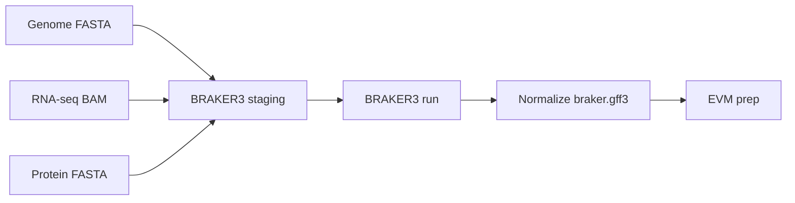

# BRAKER3

## Purpose

Generate ab initio gene predictions to provide a core evidence source for consensus annotation.

## Input Data

- reference genome
- local user-provided RNA-seq BAM evidence and/or local user-provided protein FASTA evidence

## Output Data

- BRAKER3 prediction outputs
- `braker.gff3` as the key downstream consensus input described in the design notes
- a deterministic source-preserving normalized BRAKER3 GFF3 boundary for later EVM composition

## Key Inputs

- reference genome
- local user-provided RNA-seq BAM evidence and/or local user-provided protein FASTA evidence

Lightweight local fixture examples for milestone-scoped testing:

- `data/braker3/reference/genome.fa`
- `data/braker3/rnaseq/RNAseq.bam`
- `data/braker3/protein_data/fastas/proteins.fa`

## Key Outputs

- BRAKER3 prediction outputs
- `braker.gff3` as the key downstream consensus input described in the design notes
- a deterministic source-preserving normalized BRAKER3 GFF3 boundary for later EVM composition

## Pipeline Fit

- ab initio annotation stage before EVidenceModeler

## Official Documentation

- BRAKER User Guide and source repository: https://github.com/Gaius-Augustus/BRAKER
- BRAKER output and mode notes in the user guide: `braker.pl`, `braker.gff3`, RNA-seq and protein-supported modes

## Tutorial References

- GTN Braker3 tutorial: https://training.galaxyproject.org/training-material/topics/genome-annotation/tutorials/braker3/tutorial.html
- GTN Braker3 workflow: https://training.galaxyproject.org/training-material/topics/genome-annotation/tutorials/braker3/workflows/braker.html
- GTN Braker3 topic tag: https://training.galaxyproject.org/training-material/tags/braker3/

## Code Reference

- [`src/flytetest/tasks/annotation.py`](src/flytetest/tasks/annotation.py)
- that module stages the ab initio inputs, runs `braker.pl`, normalizes `braker.gff3`, and collects the reviewable BRAKER3 bundle

## Native Command Context

- BRAKER is driven by `braker.pl` in the upstream user guide.
- This repo treats the local-first inputs as masked genome plus local RNA-seq BAM and/or local protein FASTA evidence.
- The key handoff for this repo is `braker.gff3`, which feeds the later EVM prep and consensus annotation stages.
- Repo policy keeps normalization narrow: preserve upstream source-column values, emit a canonical GFF3 header, and stage a stable downstream filename.

```bash
braker.pl --genome=genome.fa --bam=RNAseq.bam --prot_seq=proteins.fa --gff3
```

## Apptainer Command Context

- Use Apptainer when the BRAKER runtime is containerized, but keep the data flow local and explicit.
- Bind the working directory and input directories into the container so `braker.pl` can read and write repo-local artifacts.
- The repo-local smoke image is `data/images/braker3.sif`.
- Image provenance from `apptainer inspect`:
  - `org.label-schema.usage.singularity.deffile.from: teambraker/braker3:latest`
- Apptainer bind-mount reference: https://apptainer.org/user-docs/3.7/bind_paths_and_mounts.html

```bash
apptainer exec --bind "$PWD:$PWD" data/images/braker3.sif braker.pl --genome=genome.fa --bam=RNAseq.bam --prot_seq=proteins.fa --gff3
```

## Prompt Template

```text
Use docs/tool_refs/braker3.md as the reference for the BRAKER3 stage.

Goal:
Run or refine `braker3_predict` for ab initio evidence generation.

Inputs:
- genome FASTA such as `data/braker3/reference/genome.fa`
- RNA-seq BAM such as `data/braker3/rnaseq/RNAseq.bam`
- protein FASTA such as `data/braker3/protein_data/fastas/proteins.fa`
- optional `braker3_sif` container image

Constraints:
- keep the core handoff focused on `braker.gff3`
- prefer tutorial-backed BRAKER3 behavior over undocumented repo-specific invention
- preserve upstream BRAKER source-column values during normalization unless a later reviewed policy says otherwise
- preserve local-first deterministic execution

Deliver:
- the BRAKER3 command pattern or task change
- expected output directory and `braker.gff3` handoff
- any assumptions inferred from GTN or upstream docs
```

## Notes And Caveats

- BRAKER3 is implemented in FLyteTest as a local-input ab initio annotation milestone, not as a full manual reproduction of every upstream option.
- The working Markdown companion is the source of truth for the downstream contract: `braker.gff3` is the notes-backed EVM input boundary.
- The GTN tutorial/workflow are the concrete training references for this milestone's runtime model: masked genome input, RNA-seq BAM and/or protein FASTA evidence, GFF3 output, and tutorial-style BRAKER3 parameterization.
- This workflow records that tutorial-backed BRAKER3 boundary explicitly rather than describing it as an unbounded inference.
- Repo-local normalization policy preserves upstream BRAKER source-column values instead of rewriting them to `BRAKER3`, so later EVM weights can stay aligned with the staged sources.
- The local fixture paths above are intended for lightweight smoke testing only, not for production-scale annotation benchmarks.
- This BRAKER3-only workflow preserves raw BRAKER3 outputs and produces a deterministic later-EVM-ready normalized GFF3.
- The repo now implements EVM, PASA post-EVM refinement, repeat filtering, functional annotation, and submission-prep stages elsewhere; this reference stays focused on the BRAKER3 boundary rather than those later milestones.

## At A Glance


