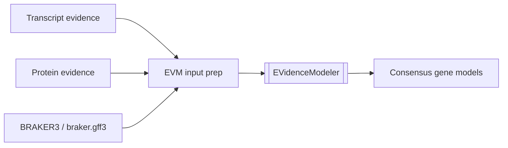

# EVidenceModeler

## Purpose

Combine ab initio predictions, transcript evidence, and protein evidence into consensus gene models.

## Key Inputs

- ab initio predictions such as BRAKER3 GFF3
- transcript-alignment-derived evidence GFF3
- protein evidence GFF3
- evidence weights and partition settings

Current local fixture roots for upstream smoke-test generation:

- `data/genome.fa`
- `data/RNAseq.bam`
- `data/proteins.fa`

## Key Outputs

- partitioned EVM work products
- recombined consensus annotation GFF3

## Pipeline Fit

- central consensus annotation stage after transcript, protein, and ab initio evidence generation

## Official Documentation

- [EVidenceModeler wiki home](https://github.com/EVidenceModeler/EVidenceModeler/wiki) covers the core model, input formats, weights, running, and outputs.
- [EVM_docker_and_singularity](https://github.com/EVidenceModeler/EVidenceModeler/wiki/EVM_docker_and_singularity) is the upstream container-oriented run page and includes the small example command shape.
- The upstream README says to build ParaFly with `make` and points readers to the wiki for documentation.

## Tutorial / Training References

- The upstream README says `make large_sample_data` downloads `EVM_sample_data/` with `runMe.sh` examples.
- The wiki's container page includes a small test invocation and a link to small sample data for that example.
- Tutorial coverage is still thin: the primary sources are wiki pages plus sample data, not a maintained step-by-step training guide.

## Native Command Context

- The wiki documents the native launch shape as `$EVM_HOME/EVidenceModeler --sample_id ... --genome ... --gene_predictions ... --protein_alignments ... --transcript_alignments ... --segmentSize ... --overlapSize ...`.
- The upstream install notes assume a release unpacked at `$EVM_HOME` and `make` run in the software base directory to compile ParaFly.
- This repo treats that direct command as the non-container execution boundary; weights staging and pre-EVM file concatenation stay explicit and separate.

## Apptainer Command Context

- Apptainer uses the same `exec <container> <command>` style as the upstream Singularity example and supports `.sif` images and bind mounts.
- A repo-local wrapper would therefore be an inferred `apptainer exec <image.sif> EVidenceModeler ...` call with the same input contract as the native command.
- Exact image naming, bind paths, and environment modules are deployment-specific and are not defined by the EVM docs.

## At A Glance



## Prompt Template

```text
Use docs/tool_refs/evidencemodeler.md as the reference for the EVM consensus stage.

Goal:
Plan or implement the explicit EVM execution boundary using prepared transcript, protein, and ab initio evidence.

Inputs:
- genome FASTA
- transcript evidence GFF3
- protein evidence GFF3
- BRAKER3-derived `braker.gff3` or normalized ab initio input
- weights file and partitioning outputs
- optional `evidencemodeler_sif` container image

Constraints:
- keep preparation, partitioning, execution, and recombination as visible boundaries
- do not claim the consensus stage is complete unless the real evidence contract is satisfied
- state any inferred weights or runtime defaults explicitly

Deliver:
- the EVM command plan or task/workflow change
- expected partition, command-list, and recombined GFF3 outputs
- any assumptions that remain inferred from official docs or local notes
```

## Notes And Caveats

- EVidenceModeler is now implemented in FLyteTest as a deterministic downstream stage that consumes the existing pre-EVM bundle.
- The current workflow keeps EVM input staging, partitioning, command generation, sequential execution, and recombination explicit rather than folding them into one opaque task.
- When no explicit `evm_weights_text` is provided, the repo writes an inferred weights file adapted from the notes example to the normalized source-column values present in this codebase. That mapping is documented as an assumption, not presented as authoritative.
- Fixture-backed validation for this milestone focuses on exact pre-EVM contract assembly plus synthetic partitioning, command generation, execution-order, and final GFF3 collection checks.
- That validation is synthetic and fixture-backed; it checks the execution boundary and file contract, not biological correctness of the consensus models.
- The design notes describe weighting categories such as `ABINITIO_PREDICTION`, `PROTEIN`, `TRANSCRIPT`, and `OTHER_PREDICTION`.
- The figure and notes place PASA updates, repeat filtering, eggNOG-mapper, and AGAT after EVM, so those stages remain out of scope for this milestone.
